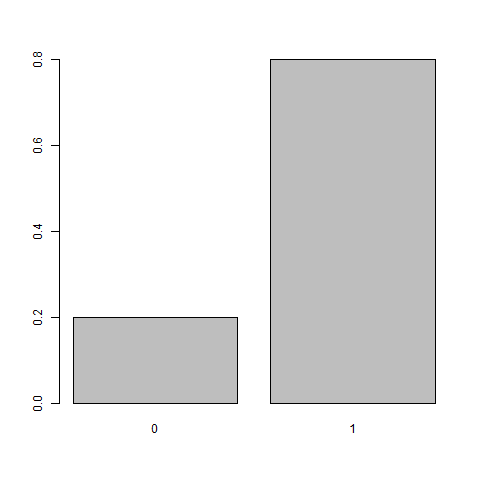
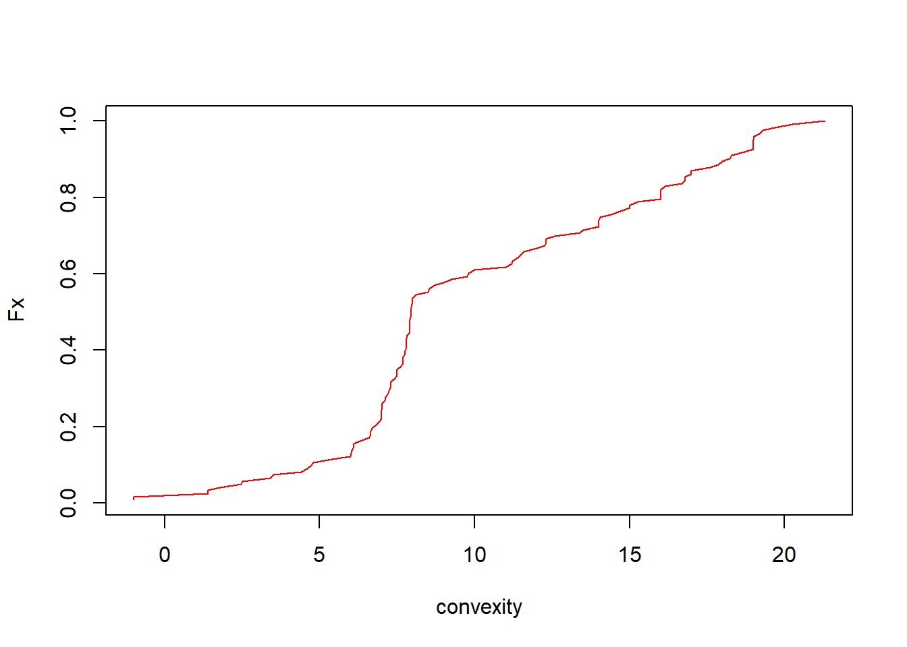

---
output:
  html_document: default
  pdf_document: default
---

#### Name and Surname: 

<br>
<br>

### SDA Exam Stats Module

- **Clearly mark** the most appropriate answer to each question.
- You may leave unanswered questions.
- Each correct question **adds** 0.4 points to the final grade
- Each incorrect question **substracts** 0.1 point to the final grade 


#### Questions:

**1)** From the following bar plot, we can say that the average of the data is at

**$\qquad$a:** $1$; **$\qquad {\color{red}b}$:** $0.8$; 


**$\qquad$c:** $0.5$; **$\qquad$d:**  $0$

</br> 


**2)** In the following cumulative frequency plot from the misophonic data, we can say that  

**$\qquad$a:** most of the misophonics have jaws with convexity angles higher than $15$; 

**$\qquad {\color{red}b}$:** most of the misophonics have jaws with convexity angles between $5$ and $15$; 

**$\qquad$c:** most of the misophonics have jaws with convexity angles lower than $5$ ; 

**$\qquad$d:** we do not know which convexity angles are the most frequent

</br> 


**3)** If the relative frequencies of a random experiment with outcomes $\{1,2,3,4\}$ are: 

$$f_1=0.15, \qquad f_2=0.60, \qquad  f_3=0.05, \qquad f_4=0.2$$ 

Then the cumulative relative frequency for outcome $3$ is

**$\qquad {\color{red}a}$:** $0.8$; **$\qquad$b:** $0.05$; 

**$\qquad$c:** $0.2$; **$\qquad$d:** $0.75$    


**4)** In a sample of size $10$ of a random experiment we obtained the following data: 

$$3,\qquad 3,\qquad  10,\qquad  2,\qquad  6,\qquad  5,\qquad  4,\qquad 9,\qquad  9,\qquad  10$$ 

The third quartile of the data is:

**$\qquad$a:** $0.75$; **$\qquad$b:** $7.5$; 

**$\qquad {\color{red}c}$:** $9$;  **$\qquad$d:** $6$ 


**5)** A pie chart illustrates

**$\qquad {\color{red}a}$:** the relative frequency

**$\qquad$b:** the absolute frequency

**$\qquad$c:** the absolute cumulative frequency

**$\qquad$d:**  the relative cumulative frequency

<br>
<br>

#### For questions **6-9)** consider the following:

In the leptin knock out experiment, researchers analyzed the weight of male and female mice in three conditions (control: normal mice, KOplus: leptin knock out mice and supplemented with leptin injection, leptinKO: leptin knock out mice). The contingency table for sex and conditions is  

|  |  $Female$ | $Male$  |
|:---------:|:---------:|:--------:| 
| $control$  | $24$ | $16$ |
| $KOplus$ | $12$ | $10$ |
| $leptinKO$ | $10$ | $7$ |

**6)** What is the relative frequency that a mouse is a knock out?

**$\qquad$a:** $17/79$; **$\qquad$b:** $17/22$; 

**$\qquad {\color{red}c}$:** $39/79$; **$\qquad$d:** $17/39$    


**7)**  What is the relative frequency that the mouse is a control?

**$\qquad {\color{red}a}$:** $40/79$; **$\qquad$b:** $24/40$; 

**$\qquad$c:** $40/100$; **$\qquad$d:** $24/79$


**8)**  What is the estimated probability that the mouse has supplemented leptin injection if it is a knock out mouse?

**$\qquad {\color{red}a}$:** $22/39$; **$\qquad$b:** $22/79$;    

**$\qquad$c:** $22/40$; **$\qquad$d:** $39/79$;    


**9)**  What is the estimated probability that the mouse is female or control?

**$\qquad {\color{red}a}$:**$62/79$; **$\qquad$b:** $24/79$; 

**$\qquad$c:** $17/79$; **$\qquad$d:** $46/79$

\newpage

**10)** When we applied the Bayes theorem on the PCRs for COVID19 detection, our main interest was to estimate 


**$\qquad {\color{red}a}$:** the probability of having the infection if testing positive; 

**$\qquad$b:** the probability of testing positive if having the infection; 

**$\qquad$c:** the probability of having the infection; 

**$\qquad$d:** the probability of testing positive; 


**11)** I have 15 minutes to take a taxi so I don't miss the train. If in the taxi stop where I am standing, one taxi arrives every 5 minutes on average, what is the probability that I miss the train?

**a:**

<code> poisson.pmf(x=0, lambda=1/3)=0.7</code>;

**b:**

<code>1- poisson.pmf(x=0, lambda=3)=0.95</code>; 

**$\qquad {\color{red}c}$:**

<code> poisson.pmf(x=0, lambda=3)=0.05</code>; 

**d:**

<code>1- poisson.pmf(x=0, lambda=1/3)=0.3</code> 


**12)** Alzheimer's disease occurs in 1 out of 9 people over 65 years of age. What is the probability that, in a registry of 100 retired people over 65 years of age, we find at most 10 individuals with Alzheimer's disease?

**$\qquad {\color{red}a}$:**

<code> binom.cdf(10, 100, 1/9)=0.43</code>; 

**b:**  

<code> binom.pmf(10, 100, 1/9)=0.12</code>; 

**c:**  

<code>1- binom.cdf(10, 100, 1/9)=0.56</code>; 

**d:**

<code>1- binom.pmf(10, 100, 1/9)=0.87</code>; 


**13)** A radioactive particle has an expected decay of 2 seconds. The probability that a particle decays in less than 10 seconds is better computed with 

**$\qquad$a:** the probability mass function of a Poissson model with parameter $\lambda=2$; 

**$\qquad$b:** the probability distribution of a Poissson model with parameter $\lambda=2$; 

**$\qquad {\color{red}c}$:** the probability distribution of an exponential model with parameter $\lambda=2$; 

**$\qquad$d:** the probability density of an exponential model with parameter $\lambda=2$
  
\newpage

**14)** In the lepting knockout experiment, control mice have a mean weight of $23gr$ and variance of $9gr^2$. If weight is a normal random variable, how do you calculate the weight that defines the top $95\%$ of the weights? 

**$\qquad {\color{red}a}$:** <code>norm.ppf(0.95, 23, 3)</code>;    

**$\qquad$b:** <code>norm.ppf(0.95, 23, 9)</code>;

**$\qquad$c:** <code>norm.ppf(0.05, 23, 9)</code>;

**$\qquad$d:** <code>norm.ppf(0.05, 23, 3)</code>;    


**15)** From the exponential probability distribution in the figure below, what is the most likely value of the first quartile

**$\qquad$a:** $0.25$; **$\qquad {\color{red}b}$:** $1$; 

**$\qquad$c:** $2$; **$\qquad$d:** $3$ 

</br> 


**16)** What is the probability that a standard normal variable is between $-2.57$ and $2.57$

**$\qquad {\color{red}a}$:** $0.99$; **$\qquad$b:** $0.75$; 

**$\qquad$c:** $0.5$; **$\qquad$b:** $0.01$    


**17)** The probability for the number of tails when tossing $100$ times a coin can be computed with the normal distribution using the central limit theorem. If the number of tails is a binomial variable with mean $100*1/2$ and variance $100*1/2*1/2$. What is the probability that we obtain between $45$ and $55$ tails


**a:**

<code>norm.cdf(50, 55, 5)-norm.cdf(50, 45, 5)</code>; 


**b:**

<code>norm.cdf(50, 45, 5)-norm.cdf(50, 55, 5)</code>; 

**c:**

<code>norm.cdf(45, 50, 5)-norm.cdf(55, 50, 5)</code>; 

**$\qquad {\color{red}d}$:**

<code>norm.cdf(55, 50, 5)-norm.cdf(45, 50, 5)</code>


**18)** The $95\%$ margin of error for the mean  is 


**$\qquad$a:** The upper $95\%$ quantile of $\bar{X}$ 

**$\qquad$b:** The distance at which $\mu$ falls from $\bar{X}$ with a probability of $95\%$; 

**$\qquad {\color{red}c}$:** The distance at which $\bar{X}$ falls from $\mu$ with a probability of $95\%$; 

**$\qquad$d:** The upper $95\%$ quantile of $\mu$ 


**19)** The $95\%$ confidence interval for the mean weight of a control mouse is $(22.25, 24.35)$. We can therefore claim that 

**$\qquad$a:** we can be $95\%$ confident that mean weight is not $22$; 

**$\qquad$b:** the mean weight is between $(22.25, 24.35)$  with probability of $95\%$;    

**$\qquad {\color{red}c}$:** we can be $95\%$ confident that the mean weight is between  $(22.25, 24.35)$; 

**$\qquad$d:** we are $95\%$ confident that the mean is $23.3gr$;    


**20)** How would you calculate the confidence interval above

**$\qquad$a:** with a paired t-test; **$\qquad {\color{red}b}$:** with one sample t-test; 

**$\qquad$c:** with a proportion test;  **$\qquad$d:** with a paired proportion test; 

<br>
<br>

#### For questions **20-25)** consider the following:

You work at the meteorological office and have collected data relating to ozone levels in the atmosphere for each day from May to September (153 days). You want to determine which variables can predict ozone pollution levels to inform health agencies.

Here are the first six days of your data

```{r, echo=FALSE}
data(airquality)
airquality$"Day.week" <- rep(c("Wed", "Thr", "Fry", "Sat", "Sun", "Mon", "Tue"), 153)[1:153]
airquality$Ozone <- log(airquality$Ozone)
airquality$Alarm <- airquality$Ozone > 4
head(airquality)

```

Here is the illustration of the data in histograms and barplots

```{r, echo=FALSE, fig.dim = c(8, 4)}

par(mfrow = c(2, 4))

hist(airquality$Ozone, main="Ozone levels", xlab="")
barplot(table(airquality$Alarm), main="Alarms for contamination",xlab="")
hist(airquality$Solar.R, main="Solar Radiation",xlab="")
hist(airquality$Wind, main="Wind",xlab="")
hist(airquality$Temp, main="Tamperature",xlab="")
barplot(table(airquality$Month), main="Month",xlab="")
barplot(table(airquality$Day.week), main="Day of the week",xlab="")

plot(0,type='n',axes=FALSE,ann=FALSE)
```

\newpage

**21)** If you want to know whether the mean ozone levels are different between spring (months: 5,6) and summer (months:7,8,9), what is the best hypothesis contrast? 

**$\qquad {\color{red}a}$:**

$\qquad H_0: \mu_{5\cap6}=\mu_{7\cap8\cap9}$

$\qquad H_1: \mu_{5\cap6}\neq\mu_{7\cap8\cap9}$

**b:**

$\qquad H_0: \mu_{5\cap6}\lt\mu_{7\cap8\cap9}$

$\qquad H_1: \mu_{5\cap6}\geq \mu_{7\cap8\cap9}$

**c:**

$\qquad H_0: \mu_{5}=\mu_{6}=\mu_{7}=\mu_{8}=\mu_{9}$

$\qquad H_1:$ At least one $\mu_i \neq 0$

**d:**

$\qquad H_0: p_{5\cap6}=p_{7\cap8\cap9}$

$\qquad H_1: p_{5\cap6}\neq p_{7\cap8\cap9}$

**22)** You hire a statistician who runs a group t-test of Ozone pollution between spring and summer and shows you the following results (x:spring, y:summer)

```{r, echo=FALSE}
spring <- airquality$Ozone[airquality$Month%in%c(5,6)]
summer <- airquality$Ozone[airquality$Month%in%c(7,8,9)]

t.test(spring, summer)

```

We say that a result is significant when we reject the null hypothesis. In the previous test you, therefore, conclude that 

**$\qquad$a:** The mean ozone levels in spring are significantly higher than the mean ozone levels in summer

**$\qquad {\color{red}b}$:** The mean ozone levels in summer are significantly higher than the mean ozone levels in spring 

**$\qquad$c:** The mean ozone levels in summer are not significantly higher than the mean ozone levels in spring 

**$\qquad$d:** The mean ozone levels in spring are not significantly higher than the mean ozone levels in summer 

\newpage

**23)** You tell your statistician that you are interested on the relationship between ozone levels and Temperature, therefore she runs a regression model of Ozone on Temperature, adjusted by Solar Radiation, Wind and Month. These are the results

```{r, echo=FALSE}
summary(lm(Ozone ~ Temp + Solar.R + Wind + Month, data=airquality))
```

Why do you think that the statistician ran this test?

**$\qquad$a:** To show you the interaction between Temperature with other variables

**$\qquad$b:** To show you that Ozone depends on other variables in addition to Temperature

**$\qquad {\color{red}c}$:** To show you the statistical dependence between Ozone and Temperature adjusting by the effects of other variables 

**$\qquad$d:** To show you that Wind is more important predictor of Ozone than Temperature. 


**24)** We say that a result is significant when we reject the null hypothesis. Therefore, in the previous analysis you can conclude that

**$\qquad$a:** Ozone decreases with Temperature but not significantly

**$\qquad$b:** Ozone increases with Temperature but not significantly

**$\qquad$c:**  Ozone significantly decreases with Temperature

**$\qquad {\color{red}d}$:** Ozone significantly increases with Temperature


**25)** You  are finally interested on testing whether the probability of sending an alarm of Ozone pollution depends on the day of the week. Therefore, the best way to test the statistical dependence between Alarms for for contamination and Day of the week is


**$\qquad$a:**  a two sample t-test

**$\qquad$b:**  an ANOVA

**$\qquad {\color{red}c}$:**  a Chi-squared test

**$\qquad$d:**  a 2-way ANOVA

