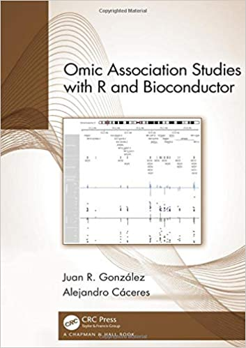

##Google scholar
Aquí hay una lista de mis publicaciones en [google scholar](https://scholar.google.es/citations?user=s1D-6WAAAAAJ&hl=es)

##Libro

2019. González JR and Cáceres A. Omic Association Studies with R Bioconductor. CRC Press. ISBN-10: 1138340561. [Amazon](https://www.amazon.es/Omic-Association-Studies-R-Bioconductor/dp/1138340561) 

##Artículos científicos recientes

- González JR, Ruiz-Arenas C, **Cáceres A**, et al. Polymorphic inversions underlie the shared genetic susceptibility of obesity-related diseases. American Journal of Human Genetics, Mayo 2020. DOI: 10.1016/j.ajhg.2020.04.017

- 2019. **Cáceres A** et al. Extreme down-regulation of chromosome Y and cancer in men. Journal of the National Cancer Institute. doi: 10.1093/jnci/djz232

- 2019 **Cáceres A** and González JR. Extreme-downregulation of chromsome Y associates with Alzheimer’s disease in men. Neurobiology of aging. DOI: 10.1016/j.neurobiolaging.2020.02.003. 

- 2019. **Cáceres A** and González JR. A measure of agreement across numerous conditions: assessing when changes in network structures are tissue-specific. BMC Genomics. 20 (1), 26.

- 2019. Ruiz-Arenas C, **Cáceres A**, et al. Common polymorphic inversions at 17q21.3 and 8p2.1 associate with cancer prognosis. Human Genomics. 13 (1), 57.	

- 2019. Ruiz-Arenas C, **Cáceres A**, et al. scoreInvHap: Inversion genotyping for genome-wide association studies. Plos Genetics. 15 (7).

- 2018. **Cáceres A** and González JR. When pitch adds to volume: coregulation of transcript diversity predicts gene function. BMC Genomics.19 (1), 926.

- 2017. **Cáceres A** et al. APOE and MS4A6A interact with GnRH signaling in Alzheimer's disease: Enrichment of epistatic effects. Alzheimer's & Dementia.13 (4), 493-497. 
