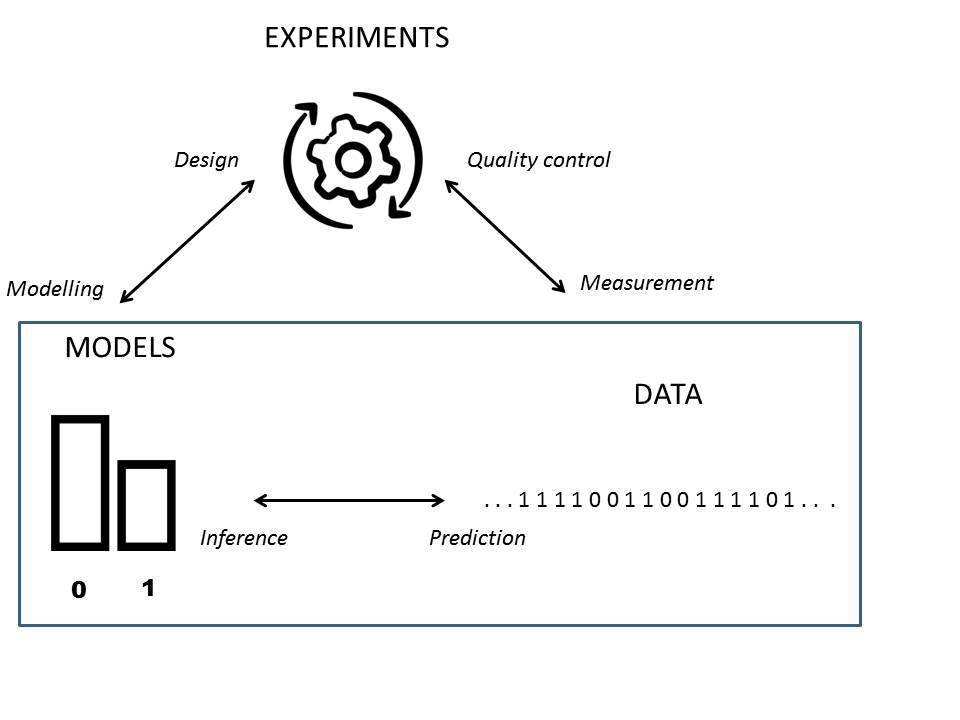
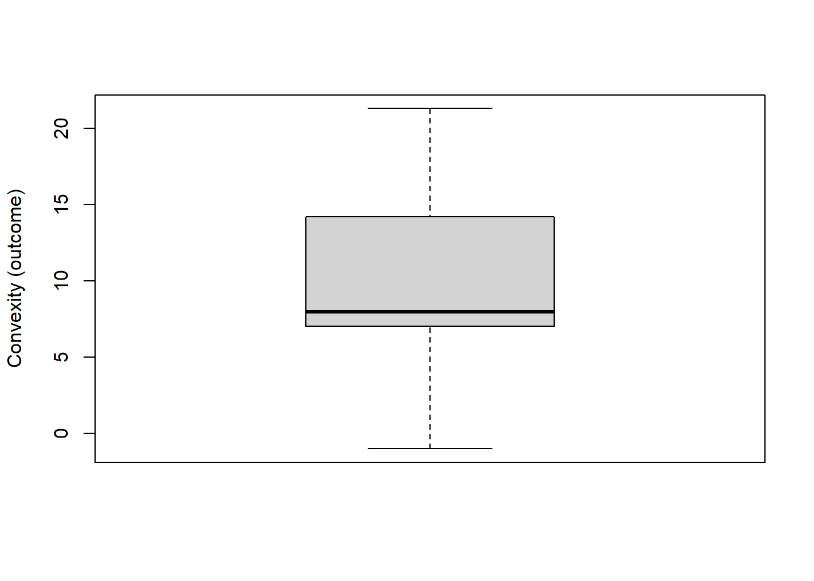

# Descripción de datos


En este capítulo, presentaremos herramientas para describir datos.

Lo haremos utilizando tablas, figuras y estadísticos descriptivos de tendencia central y dispersión.

También presentaremos conceptos clave en estadística como experimentos aleatorios, observaciones, resultados y frecuencias absolutas y relativas.


## Método científico

Uno de los objetivos del método científico es proporcionar un marco para resolver los problemas que surgen en el estudio de los fenómenos naturales o en el diseño de nuevas tecnologías.

Los humanos modernos han desarrollado un **método** durante miles de años que todavía está en desarrollo.

El método tiene tres actividades humanas principales:

- *Observación* caracterizada por la adquisición de **datos**
- *Razón* caracterizada por el desarrollo de **modelos** matemáticos
- *Acción* caracterizada por el desarrollo de nuevos **experimentos** (tecnología)

Su compleja interacción y resultados son la base de la *actividad científica*.





## Estadística

La estadística se ocupa de la interacción entre *modelos* y *datos* (la parte inferior de la figura).

Las preguntas de tipo estadístico son:

- ¿Cuál es el mejor modelo para mis datos (inferencia)?
- ¿Cuáles son los datos que produciría un determinado modelo (predicción)?

## Datos

Los datos se presentan en forma de observaciones.

Una **Observación** o *Realización* es la adquisición de un número o una característica de un experimento.

Por ejemplo, tomemos la serie de números que se producen por la repetición de un experimento (1: éxito, 0: fracaso)

... 1 0 0 1 0 **1** 0 1 1 ...
 
El número en negrita es **una observación** en una repetición del experimento

Un **resultado** es una **posible** observación que es el resultado de un experimento.

**1** es un resultado, **0** es el otro resultado del experimento.

Recuerda que la observación es **concreta** es el número que obtienes un día en el laboratorio. El resultado **abstracto** es una de las características del tipo de experimento que estás realizando.


## Tipos de resultado

En estadística nos interesan principalmente dos tipos de resultados.

- **Categóricos**: Si el resultado de un experimento es una cualidad. Pueden ser nominales (binario: sí, no; múltiple: colores) u ordinales cuando las cualidades pueden jerarquizarse (gravedad de una enfermedad).

- **Numéricos**: Si el resultado de un experimento es un número. El número puede ser discreto (número de correos electrónicos recibidos en una hora, número de leucocitos en sangre) o continuo (estado de carga de la batería, temperatura del motor).

## Experimentos aleatorios

Se puede decir que el tema de estudio de la estadística son los experimentos aleatorios, el medio por el cual producimos datos.

**Definición:**

Un **experimento aleatorio** es un experimento que da diferentes resultados cuando se repite de la misma manera.


Los experimentos aleatorios son de diferentes tipos, dependiendo de cómo se realicen:

- en el mismo objeto (persona): temperatura, niveles de azúcar.
- sobre objetos diferentes pero de la misma medida: el peso de un animal.
- sobre eventos: el número de huracanes por año.


## Frecuencias absolutas


Cuando repetimos un experimento aleatorio con resultados **categóricos**, registramos una lista de resultados.

Resumimos las observaciones contando cuántas veces vimos un resultado particular.

**Frecuencia absoluta**:

$$n_i$$

es el número de veces que observamos el resultado $i$.

**Ejemplo (leucocitos)**

Extraigamos un leucocito de **un** donante y anotemos su tipo. Repitamos el experimento $N=119$ veces.

```
(célula T, célula T, neutrófilo, ..., célula B)
```

La segunda **célula T** en negrita es la segunda observación. La última **célula B** es la observación número 119.

Podemos listar los **resultados** (categorías) en una **tabla de frecuencia**:

```{r, echo=FALSE}
tb <- data.frame(outcome= c("T Cell", "B cell", "basophil",  "Monocyte", "Neutrophil"), ni= c(34, 50, 20, 5, 10))
tb
```

De la tabla, podemos decir que, por ejemplo, $n_1=34$ es el número total de células T observadas en la repetición del experimento. También notamos que el número total de repeticiones $N=\sum_i n_i=119$.
 

## Frecuencias relativas


También podemos resumir las observaciones calculando la **proporción** de cuántas veces vimos un resultado en particular.

$$f_i=n_i/N$$ donde $N$ es el número total de observaciones

En nuestro ejemplo se registraron $n_1=34$ células T, por lo que nos preguntamos por la proporción de células T del total de $119$. Podemos agregar estas proporciones $f_i$ en la tabla las frecuencias.


```{r, echo=FALSE}
tb2 <- prop.table(tb$ni)
df <- data.frame(outcome=tb$outcome, ni=tb$ni, fi=as.vector(tb2)) 
df
```

Las frecuencias relativas son **fundamentales** en estadística. Dan la proporción de un resultado en relación con los otros resultados. Más adelante las entenderemos como las observaciones de las probabilidades.

Para las frecuencias absolutas y relativas tenemos las propiedades

- $\sum_{i=1..M} n_i = N$
- $\sum_{i=1..M} f_i = 1$

donde $M$ es el número de resultados.

## Diagrama de barras

Cuando tenemos muchos resultados y queremos ver cuáles son los más probables, podemos usar un gráfico de barras que es una cifra de $n_i$ Vs los resultados.


```{r, echo=FALSE}
barplot(tb$ni,names.arg=tb$outcome)
```

## Gráfico de sectores (pie)

También podemos visualizar las frecuencias relativas con un gráfico de sectores.

El área del círculo representa el 100% de las observaciones (proporción = 1) y las secciones las frecuencias relativas de cada resultado.


```{r, echo=FALSE}
pie(tb$ni, labels=tb$outcome)
```


## Variables categóricas ordinales
    
El tipo de leucocito de los ejemplos anteriores es una variable nominal **categórica**. Cada observación pertenece a una categoría (cualidad). Las categorías no siempre tienen un orden determindado.

A veces, las variables **categóricas** se pueden **ordenar** cuando cumplen una clasificación natural. Esto permite introducir **frecuencias acumulativas**.

**Ejemplo (misofonía)**

Este es un estudio clínico en 123 pacientes que fueron examinados por su grado de misofonía. La misofnía es ansiedad/ira descontrolada producida por ciertos sonidos.

Cada paciente fue evaluado con un cuestionario (AMISO) y se clasificaron en 4 grupos diferentes según la gravedad.

Los resultados del estudio son


```{r, echo=FALSE}
data <- read.delim("./data/data_0.txt")
data$Misofonia.dic
```


Cada observación es el resultado de un experimento aleatorio: medición del nivel de misofonía en un paciente. Esta serie de datos se puede resumir en términos de los resultados en la tabla de frecuencia

```{r, echo=FALSE}
tb <- table(data$Misofonia.dic)
tb2 <- data.frame(outcome =0:4, ni=as.vector(tb) , fi=as.vector(prop.table(tb)))
tb2

```


## Frecuencias acumuladas absolutas y relativas

La gravedad de la misofonía es **categórica** **ordinal** porque sus resultados pueden ordenarse en relación con su grado.

Cuando los resultados se pueden ordenar, es útil preguntar cuántas observaciones se obtuvieron hasta un resultado dado. Llamamos a este número la **frecuencia acumulada absoluta** hasta el resultado $i$:
$$N_i=\sum_{k=1..i} n_k$$
También es útil para calcular la **proporción** de las observaciones que se obtuvo hasta un resultado dado

$$F_i=\sum_{k=1..i} f_k$$

Podemos agregar estas frecuencias en la **tabla de frecuencias**

```{r, echo=FALSE}
tb3 <- data.frame(outcome =0:4, ni=as.vector(tb) , fi=as.vector(prop.table(tb)), Ni=cumsum(tb), Fi=cumsum(prop.table(tb)))
tb3
```


Por lo tanto, el **67 %** de los pacientes tenían misofonía hasta la gravedad **2** y el **37 %** de los pacientes tenían una gravedad inferior o igual a **1**.


## Gráfica de frecuencia acumulada

$F_i$ es una cantidad importante porque nos permite definir la acumulación de probabilidades hasta niveles intermedios.

La probabilidad de un nivel intermedio $x$ ($i\leq x< i+1$) es solo la acumulación hasta el nivel inferior $F_x=F_i$.

$F_x$ es por lo tanto una función de rango **continuo**. Podemos dibujarla con respecto a los resultados.


```{r, echo=FALSE}
plot(0:4, tb3$Fi, type="s", col="red", ylab="Fx", xlab="Severity")

points(1:4,tb3$Fi[-5],pch = 21, col="red", bg="white")

points(2.3,tb3$Fi[3],pch = 21, col="red", bg="red")

```


Por lo tanto, podemos decir que el **67 %** de los pacientes tenían misofonía hasta gravedad $2.3$, aunque $2.3$ no es un resultado observado.

## Variables numéricas

El resultado de un experimento aleatorio puede producir un número. Si el número es **discreto**, podemos generar una tabla de frecuencias, con frecuencias absolutas, relativas y acumulativas, e ilustrarlas con gráficos de barras, de sectores y acumulativos.

Cuando el número es **continuo** las frecuencias no son útiles, lo más probable es que observemos o no un número contínuo en particular.

**Ejemplo (misofonía)**

Los investigadores se preguntaron si la convexidad de la mandíbula afectaría la gravedad de la misofonía. La hipótesis científica es que el ángulo de convexidad de la mandíbula puede influir en el oído y su sensibilidad. Estos son los resultados de la convexidad de la mandíbula (grados) para cada paciente:


```{r, echo=FALSE}
data$Angulo_convexidad
```


## Transformando datos continuos


Como los resultados continuos no se pueden contar (de manera informativa), los transformamos en variables categóricas ordenadas.

1) Primero cubrimos el rango de las observaciones en intervalos regulares del mismo tamaño (contenedores)


```{r, echo=FALSE}
disangulo <- cut(data$Angulo_convexidad, 5, include.lowest=TRUE)
levels(disangulo)
```


2) Luego mapeamos cada observación a su intervalo: creando una variable categórica **ordenada**; en este caso con 5 resultados posibles

```{r, echo=FALSE}
as.character(disangulo)
```
 
 
Por tanto, en lugar de decir que el primer paciente tenía un ángulo de convexidad de $7.97$, decimos que su ángulo estaba entre el intervalo (o **bin**) $(7.92,12.4]$.

Ningún otro paciente tenía un ángulo de $7.97$, pero muchos tenían ángulos entre $(7.92,12.4]$.

## Tabla de frecuencias para una variable continua

Para una partición regular dada del intervalo de resultados en intervalos, podemos producir una tabla de frecuencias como antes


```{r, echo=FALSE}
tb <- table(disangulo)
df <- data.frame(outcome=names(tb), frequency=as.vector(tb)) 
rownames(df) <- paste0("n",1:length(tb))
tb2 <- prop.table(table(disangulo))
df <- data.frame(outcome=names(tb), ni=as.vector(tb), fi=as.vector(tb2), Ni= cumsum(as.vector(tb)), Fi=cumsum(as.vector(tb2))) 
df
```


## Histograma

El histograma es la gráfica de $n_i$ o $f_i$ Vs los resultados en intervalos (bins). El histograma depende del tamaño de los bins.


```{r, echo=FALSE}
h <- hist(data$Angulo_convexidad, xlab="convexity", ylab="ni", br=4, main="")
```

Este es un histograma con 20 bins.

```{r, echo=FALSE}
h <- hist(data$Angulo_convexidad, xlab="convexity", ylab="ni", br=20, main="")
```

Vemos que la mayoría de las personas tienen ángulos dentro de $(7, 8]$

## Gráfica de frecuencia acumulada

También podemos graficar $F_x$ contra los resultados. Como $F_x$ es de rango continuo, podemos ordenar las observaciones ($x_1 <... x_j < x_{j+1} < x_n$) y por lo tanto

$$F_x = \frac{k}{n}$$

para $x_{k} \leq x < x_{k+1}$.

$F_x$ se conoce como la **distribución** de los datos. $F_x$ no depende del tamaño del bin. Sin embargo, su **resolución** depende de la cantidad de datos.

 

```{r, echo=FALSE}
k <- 1:length(data$Angulo_convexidad)
Fx <- k/length(data$Angulo_convexidad)

convexity <- sort(data$Angulo_convexidad)
plot(convexity, Fx, type="l", col="red")
```

## Estadísticas de resumen

Las estadísticas de resumen son números calculados a partir de los datos que nos dicen características importantes de las variables numéricas (discretas o continuas).

Por ejemplo, tenemos estadísticas que describen los valores extremos:

- **mínimo**: el resultado mínimo observado
- **máximo**: el resultado máximo observado


## Promedio (media muestral)

Una estadística importante que describe el valor central de los resultados (dónde esperar la mayoría de las observaciones) es el **promedio**

$$\bar{x}=\frac{1}{N} \sum_{j=1..N} x_j$$

donde $x_j$ es la **observación** $j$ de un total de $N$.


**Ejemplo (Misofonía)** 

La convexidad promedio se puede calcular directamente a partir de las **observaciones**

$\bar{x}= \frac{1}{N}\sum_j x_j$

</br>
$= \frac{1}{N}(7.97 + 18.23 + 12.27... + 6.80) = 10.19894$


Para variables **categóricamente ordenadas**, podemos usar las frecuencias relativas para calcular el promedio

<br>
$\bar{x}=\frac{1}{N}\sum_{i=1...N} x_j=\frac{1}{N}\sum_{i=1...M} x_i*n_ {i}$
<br>
$$=\sum_{i=1...M} x_i*f_{i}$$

donde pasamos de sumar $N$ **observaciones** a sumar $M$ **resultados**.

La forma $\bar{x}= \sum_{i = 1...M} x_i f_i$ muestra que el promedio es el **centro de gravedad** de los resultados. Como si cada resultado tuviera una densidad de masa dada por $f_i$.

**Ejemplo (Misofonía)** 

La **severidad** promedio de la misofonía en el estudio se puede calcular a partir de las frecuencias relativas de los **resultados**


```{r, echo=FALSE}
tb <- table(data$Misofonia.dic)
tb2 <- data.frame(outcome =0:4, ni=as.vector(tb) , fi=as.vector(prop.table(tb)))
tb2
```

<br>
$\bar{x}=0*f_{0}+1*f_{1}+2*f_{2}+3*f_{3}+4*f_{4}=1.691057$


## Promedio

El promedio es también el centro de gravedad de las variables continuas. Ese es el punto donde las frecuencias reativas se equilibran.


```{r, echo=FALSE}
h <- hist(data$Angulo_convexidad, xlab="Convexity (outcome)", ylab="fi", freq=FALSE, main="", br=50)

mn <- mean(data$Angulo_convexidad)
lines(c(mn, mn), c(0,1), lty=2)
legend("topright", "Mean", lty=2)
points(mn,0, pch=2)
```

## mediana

Otra medida de centralidad es la mediana. La mediana $x_m$, o $q_{0.5}$, es el valor por debajo del cual encontramos la mitad de las observaciones. Cuando ordenamos las observaciones $x_1 <... x_j < x_{j+1} < x_N$, las contamos hasta encontrar la mitad de ellas. $x_m$ es tal que

$$\sum_{i\leq m} 1 = \frac{N}{2}$$
**Ejemplo (Misofonía)**  

Si ordenamos los ángulos de convexidad, vemos que $62$ observaciones (individuos) ($N/2 \sim 123/2$) están por debajo de $7.96$. La **convexidad mediana** es por lo tanto $q_{0.5}=x_{62}=7.96$


```{r, echo=FALSE}
ordered <- sort(data$Angulo_convexidad)
ordered[1:62]
```


```{r, echo=FALSE}
ordered[63:123]
median(ordered)
```

En términos de frecuencias, $q_{0.5}$ hace que la frecuencia acumulada $F_x$ sea igual a $0.5$

$$\sum_{i = 0, ... m} f_i =F_{q_{0.5}}=0.5$$
o

$$q_{0.5}=F^{-1}(0.5)$$

En el gráfico de distribución, la mediana es el valor de $x$ en el que se encuentra la mitad del máximo de $F$.
  

```{r, echo=FALSE}
k <- 1:length(data$Angulo_convexidad)
Fx <- k/length(data$Angulo_convexidad)

convexity <- sort(data$Angulo_convexidad)
plot(convexity, Fx, type="l", col="red")
lines(c(7.96,7.96), c(0,0.5), lty=2)
lines(c(-10,7.96), c(0.5,0.5), lty=2)
points(c(7.96,7.96), c(0,0), pch=16)

legend("topleft", legend = "Median", pch=16)
```


El promedio y la mediana no siempre son iguales.

```{r, echo=FALSE}
h <- hist(data$Angulo_convexidad, xlab="Convexity (outcome)", ylab="fi", freq=FALSE, main="", br=50)

cp <- data$Angulo_convexidad
mn <- mean(cp)
lines(c(mn, mn), c(0,1), lty=2)
points(mn,0, pch=2)

mn <- median(cp)
lines(c(mn, mn), c(0,100000), lty=2, col="red")
points(mn,0, pch=2, col="red")

legend("topright", c("Mean", "Median") , lty=2, col=c("black", "red"))

```


## Dispersión

Otras estadísticas de resumen importantes de las observaciones son las de **dispersión**.

Muchos experimentos pueden compartir su media, pero difieren en cuán **dispersos** son los valores.

La dispersión de las observaciones es una medida del **ruido**.

```{r, echo=FALSE}
hist(rnorm(100, 100, 7.5), xlab="outcome", ylab="N", br=seq(2.5,202.5,5), main="Low noise")
lines(c(100, 100), c(0,1000), lty=2, col="red")
points(100,0, pch=2, col="red")

hist(rnorm(100, 100, 20), xlab="outcome", ylab="N", br=seq(2.5,202.5,5), main="High noise")

lines(c(100, 100), c(0,1000), lty=2, col="red")
points(100,0, pch=2, col="red")

```

## Variación de la muestra

La dispersión sobre la media se mide con la varianza muestral

$$s^2=\frac{1}{N-1} \sum_{j=1..N} (x_j-\bar{x})^2$$

Este número, mide la distancia cuadrada promedio de las **observaciones** al promedio. La razón de $N-1$ se explicará cuando hablemos de inferencia, cuando estudiemos la dispersión de $\bar{x}$, además de la dispersión de las observaciones.

En términos de las frecuencias de las variables **categóricas y ordenadas**

$$s^2=\frac{N}{N-1} \sum_{i=1... M} (x_i-\bar{x})^2 f_i$$

$s^2$ se puede considerar como el **momento de inercia** de las observaciones.


La raíz cuadrada de la varianza de la muestra se denomina **desviación estándar** $s$.

**Ejemplo (Misofonía)**  

La desviación estándar del ángulo de convexidad es

</br>
$s= [\frac{1}{123-1}((7.97-10.19894)^2+ (18.23-10.19894)^2$
</br>$+ (12.27-10.19894)^2 + ...)]^{1/2} = 5.086707$

La convexidad de la mandíbula se desvía de su media en $5.086707$.


## Rango intercuartílico (IQR)


La dispersión de los datos también se puede medir con respecto a la mediana usando el **rango intercuartílico**:

1) Definimos el **primer** cuartil como el valor $x_m$ que hace que la frecuencia acumulada $F_{q_{0.25}}$ sea igual a $0.25$ ($x$ donde hemos acumulado una cuarta parte de las observaciones)

$$F_{q_{0.25}}=0.25$$


1) Definimos el **tercer** cuartil como el valor $x_m$ que hace que la frecuencia acumulada $F_{q_{0.75}}$ sea igual a $0.75$ ($x$ donde hemos acumulado tres cuartos de observaciones)

$$F_{q_{0.75}}=0.75$$

3) El **rango intercuartílico** (IQR) es $IQR=q_{0.75} - q_{0.25}$. Esa es la distancia entre el tercer y el primer cuartil y captura el $50\%$ central de las observaciones


```{r, echo=FALSE}
h <- hist(data$Angulo_convexidad, xlab="Convexity (outcome)", ylab="fi", freq=FALSE, main="", br=50)

cp <- data$Angulo_convexidad

q1 <- quantile(cp, 0.25)
lines(c(q1, q1), c(0,100000), lty=2, col="blue")
points(q1,0, pch=2, col="blue")

mn <- median(cp)
lines(c(mn, mn), c(0,100000), lty=2, col="red")
points(mn,0, pch=2, col="red")

q3 <- quantile(cp, 0.75)
lines(c(q3, q3), c(0,100000), lty=2, col="orange")
points(q3,0, pch=2, col="orange")

legend("topright", c("1st quartile", "2nd quartile (median)", "3nd quartile") , lty=2, col=c("blue", "red", "orange"))

```

## Diagrama de caja

El rango intercuartílico, la mediana y los $5\%$ y $95\%$ de los datos se pueden visualizar en un **diagrama de caja**.

En el diagrama de caja, los valores de los resultados están en el eje y. El IQR es la caja, la mediana es la línea del medio y los bigotes marcan los $5\%$ y $95\%$ de los datos.


```{r, echo=FALSE}
boxplot(data$Angulo_convexidad, ylab="Convexity (outcome)")
```

## Preguntas


**1)** En el siguiente diagrama de caja, el primer cuartil y el segundo cuartil de los datos son:

**$\qquad$a:** $(-1.00, 21.30)$; **$\qquad$b:** $(-1.00, 7.02)$; **$\qquad$c:** $(7.02, 7.96)$; **$\qquad$d:** $(7.02, 14.22)$



**2)** La principal desventaja de un histograma es que:

**$\qquad$a:** Depende del tamaño del bin; **$\qquad$b:** No se puede utilizar para variables categóricas;
**$\qquad$c:** No se puede usar cuando el tamaño del bin es pequeño;
**$\qquad$d:** Se usa solo para frecuencias relativas;


**3)** Si las frecuencias acumuladas relativas de un experimento aleatorio con resultados $\{1,2,3,4\}$ son: $F(1)=0.15, \qquad F(2)=0.60, \qquad F(3)=0.85, \qquad F(4)=1$.

Entonces la frecuencia relativa para el resultado $3$ es

**$\qquad$a:** $0.15$; **$\qquad$b:** $0.85$; **$\qquad$c:** $0.45$; **$\qquad$d:** $0.25$


**4)** En una muestra de tamaño $10$ de un experimento aleatorio obtuvimos los siguientes datos:

$8,\qquad 3,\qquad 3,\qquad 7,\qquad 3,\qquad 6,\qquad 5,\qquad 10,\qquad 3,\qquad 8$.

El primer cuartil de los datos es:

**$\qquad$a:** $3.5$; **$\qquad$b:** $4$; **$\qquad$c:** $5$; **$\qquad$d:** $3$


**5)** Imaginemos que recopilamos datos para dos cantidades que no son mutuamente excluyentes, por ejemplo, el sexo y la nacionalidad de los pasajeros de un vuelo. Si queremos hacer un solo gráfico circular para los datos, ¿cuál de estas afirmaciones es verdadera?

**$\qquad$a:** Solo podemos hacer un gráfico circular de nacionalidad porque tiene más de dos resultados posibles; **$\qquad$b:** Podemos hacer un gráfico circular para una variable nueva que marca el sexo **y** la nacionalidad; **$\qquad$c:** Podemos hacer un gráfico circular para la variale sexo o la variable nacionalidad; **$\qquad$d:** Solo podemos elegir si hacemos un gráfico circular para el sexo o un gráfico circular para la nacionalidad.


## Ejercicios

#### Ejercicio 1


Hemos realizado un experimento 8 veces con los siguientes resultados


```{r, echo=FALSE}
set.seed(123)
outcomes <- sample(1:12, 8, replace=TRUE)
outcomes
```


Responde las siguientes cuestiones:

- Calcula las frecuencias relativas de cada resultado.
- Calcula las frecuencias acumuladas de cada resultado.
- ¿Cuál es el promedio de las observaciones?
- ¿Cuál es la mediana?
- ¿Cuál es el tercer cuartil?
- ¿Cuál es el primer cuartil?


#### Ejercicio 2

Hemos realizado un experimento 10 veces con los siguientes resultados

```{r, echo=FALSE}
set.seed(123)
outcomes <- runif(10, 0, 10)
outcomes
```


Considera 10 bins de tamaño 1: [0,1], (1,2]...(9,10).

Responde las siguientes cuestiones:

- Calcula las frecuencias relativas de cada resultado y dibuja el histograma

- Calcula las frecuencias acumulativas de cada resultado y dibuja la gráfica acumulativa.

- Dibuja un diagrama de caja .
