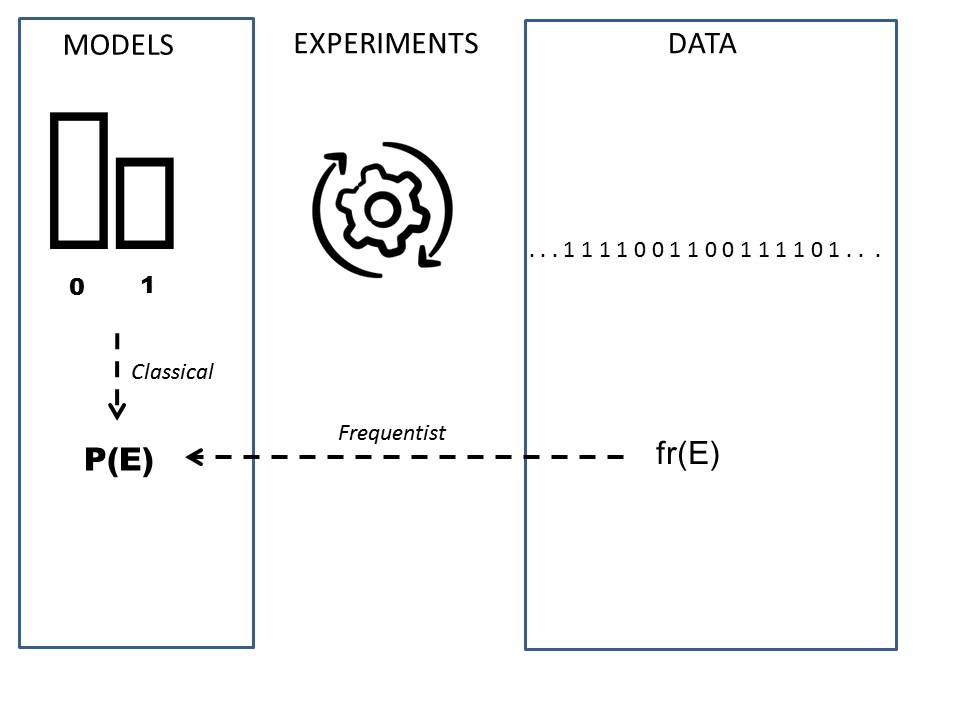
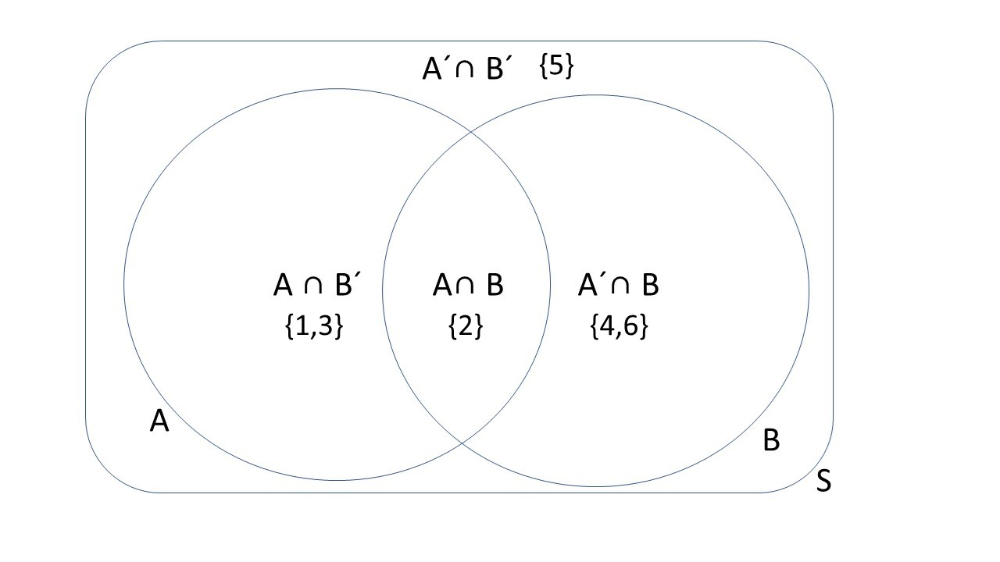

# Probabilidad

En este capítulo introduciremos el concepto de probabilidad a partir de frecuencias relativas.

Definiremos los eventos como los elementos sobre los que se aplica la probabilidad. Los eventos compuestos se definirán usando álgebra de conjuntos.

Luego discutiremos el concepto de probabilidad condicional derivado de la probabilidad conjunta de dos eventos.


## Experimentos aleatorios

Recordemos el objetivo básico de la estadística. La estadística se ocupa de los datos que se presentan en forma de observaciones.

- Una **observación** es la adquisición de un número o una característica de un experimento

Las observaciones son realizaciones de **resultados**.

- Un **resultado** es una posible observación que es el resultado de un experimento.

Al realizar experimentos, a menudo obtenemos resultados diferentes. La descripción de la variabilidad de los resultados es uno de los objetivos de la estadística.


- Un **experimento aleatorio** es un experimento que da diferentes resultados cuando se repite de la misma manera.

La pregunta filosófica detrás es ¿Cómo podemos conocer algo si cada vez que lo miramos cambia?

## Probabilidad de medición

Nos gustaría tener una medida para el resultado de un experimento aleatorio que nos diga **cuán seguros** estamos de observar el resultado cuando realicemos un **futuro** experimento aleatorio.

Llamaremos a esta medida la probabilidad del resultado y le asignaremos valores:

- 0, cuando estamos seguros de que la observación **no** ocurrirá.

- 1, cuando estamos seguros de que la observación sucederá.

## Probabilidad clásica

**Siempre que** un experimento aleatorio tenga $M$ resultados posibles que son todos **igualmente probables**, la probabilidad de cada resultado $i$ es $$P_i=\frac{1}{M}$$.

La probabilidad clásica fue defendida por Laplace (1814).

Dado que cada resultado es **igualmente probable** en este tipo de experimento, declaramos una completa ignorancia y lo mejor que podemos hacer es distribuir equitativamente la misma probabilidad para cada resultado.

- No observamos $P_i$
- Deducimos $P_i$ de nuestra razón y no necesitamos realizar ningún experimento para conocerla.


**Ejemplo (dado):** 

¿Cuál es la probabilidad de que obtengamos $2$ en el  lanzamiento de un dado?

$P_2=1/6=0.166666$.

## Frecuencias relativas

¿Qué sucede con los experimentos aleatorios cuyos posibles resultados **no** son igualmente probables?

¿Cómo podemos entonces definir las probabilidades de los resultados?

**Ejemplo (experimento aleatorio)**

Imaginemos que repetimos un experimento aleatorio $8$ veces y obtenemos las siguientes observaciones

8 4 12 7 10 7 9 12

- ¿Qué tan seguro estamos de obtener el resultado $12$ en la siguiente observación?

La tabla de frecuencias es

```{r, echo=FALSE}
set.seed(1234)
d1 <- sample(1:6,8, replace=TRUE)
d2 <- sample(1:6,8, replace=TRUE)
o <- d1+d2
tb <- table(o)
tb2 <- prop.table(tb) 

df <- data.frame(outcome=names(tb), ni=as.vector(tb), fi=as.vector(tb2)) 
df
```

```{r, echo=FALSE}
barplot(df$fi, names.arg = df$outcome)
```
La **frecuencia relativa** $f_i=\frac{n_i}{N}$ parece una medida de probabilidad razonable porque

- es un número entre $0$ y $1$.
- mide la proporción del total de observaciones que observamos de un resultado particular.

Como $f_{12}=0.25$ entonces estaríamos un cuarto seguros, una de cada 4 observaciones, de obtener $12$.

**Pregunta**: ¿Qué tan bueno es $f_i$ como medida de certeza del resultado $i$?

**Ejemplo (experimento aleatorio con mas repeticiones)**

Digamos que repetimos el experimento 100000 veces más:

La tabla de frecuencias es ahora

```{r, echo=FALSE}
set.seed(1234)
d1 <- sample(1:6,100000, replace=TRUE)
d2 <- sample(1:6,100000, replace=TRUE)
o <- d1+d2

tb <- table(o)
tb2 <- prop.table(tb) 

df <- data.frame(outcome=names(tb), ni=as.vector(tb), fi=as.vector(tb2)) 
df
```

y el gráfico de barras es

```{r, echo=FALSE}
barplot(df$fi, names.arg = df$outcome)
```

Aparecieron nuevos resultados y $f_{12}$ ahora es solo $0.027$, y entonces estamos sólo un $\sim 3\%$ seguros de obtener $12$ en el próximo experimento. Las probabilidades medidas por $f_i$ cambian con $N$.


## Frecuencias relativas en el infinito

Una observación crucial es que si medimos las probabilidades de $f_i$ en valores crecientes de $N$ ¡**convergen**!

En este gráfico cada sección vertical da la frecuencia relativa de cada observación. Vemos que después de $N=1000$ ($log10(N)=3$) las proporciones apenas varían con mas $N$.

```{r, echo=FALSE}

frdice <- lapply(c(100, 1000, 10000, 100000, 1000000 ), function(n) cumsum(prop.table(table(o[1:n]))))

frdice <- do.call(cbind, frdice)

plot(c(0,1), c(0,1), pch="", ylim=c(0,1), xlim=c(2,6), ylab=" ", xlab="log10(N)", main="Proportion of relative frequencies at a given N", axes=FALSE)

axis(1)

polygon(c(2:6,6:2), c(rep(0,5), rep(1,5)), col="white")

polygon(c(2:6,6:2), c(rep(0,5),frdice[1,5:1]), col="grey")
polygon(c(2:6,6:2), c(frdice[2,1:5],frdice[3,5:1]), col="grey")
polygon(c(2:6,6:2), c(frdice[4,1:5],frdice[5,5:1]), col="grey")
polygon(c(2:6,6:2), c(frdice[6,1:5],frdice[7,5:1]), col="grey")
polygon(c(2:6,6:2), c(frdice[8,1:5],frdice[9,5:1]), col="grey")
polygon(c(2:6,6:2), c(frdice[10,1:5],frdice[11,5:1]), col="grey")


d <- c(0,frdice[-11,5])

for(i in 1:11)
text(5.9,(frdice[i,5]+d[i])/2, paste0("f", i+1), cex=0.5)

```
Encontramos que cada una de las frecuencias relativas $f_i$ converge a un valor constante

$$lim_{N\rightarrow \infty} f_i = P_i$$

## Probabilidad frecuentista


Llamamos **Probabilidad** $P_i$ al límite cuando $N \rightarrow \infty$ de la **frecuencia relativa** de observar el resultado $i$ en un experimento aleatorio.


Defendida por Venn (1876), la definición frecuentista de probabilidad se deriva de datos/experiencia (empírica).

- No observamos $P_i$, observamos $f_i$
- **Estimamos** $P_i$ con $f_i$ (normalmente cuando $N$ es grande), escribimos: $$\hat{P_i}=f_i$$

Similar a la relación entre **observación** y **resultado**, tenemos la relación entre **frecuencia relativa** y **probabilidad** como un valor concreto de una cantidad abstracta.


## Probabilidades clásicas y frecuentistas

Tenemos situaciones en las que se puede usar la probabilidad clásica para encontrar el límite de frecuencias relativas.

- Si los resultados son **igualmente probables**, la probabilidad clásica nos da el límite:

$$P_i=lim_{N\rightarrow \infty} \frac{n_i}{N}=\frac{1}{M}$$


- Si los resultados en los que estamos interesados pueden derivarse de otros resultados **igualmente probables**; Veremos más sobre esto cuando estudiemos los modelos de probabilidad.


**Ejemplo (suma de dos dados)**

Nuestro ejemplo anterior se basa en la **suma de dos dados**.
Si bien realizamos el experimento muchas veces, anotamos los resultados y calculamos las **frecuencias relativas**, podemos conocer el valor exacto de probabilidad. 

Esta probabilidad **se deduce** del hecho de que el resultado de cada dado es **igualmente probable**. A partir de esta suposición, podemos encontrar que (Ejercicio 1)

\[
    P_i= 
\begin{cases}
   \frac{i-1}{36},& i \in \{2,3,4,5,6, 7\} \\
\frac{13-i}{36},& i \in \{8,9,10,11,12\} \\ 
\end{cases}
\]

La motivación de la definición frecuentista es **empírica** (datos) mientras que la de la definición clásica es **racional** (modelos). A menudo combinamos ambos enfoques (inferencia y deducción) para conocer las probabilidades de nuestro experimento aleatorio.



## Definición de probabilidad

Una probabilidad es un número que se asigna a cada resultado posible de un experimento aleatorio y satisface las siguientes propiedades o **axiomas**:

1) cuando los resultados $E_1$ y $E_2$ son mutuamente excluyentes; es decir, solo uno de ellos puede ocurrir, entonces la probabilidad de observar $E_1$ **o** $E_1$, escrito como $E_1\cup E_2$, es su suma: 
$$P(E_1\cup E_2) = P(E_1) + P(E_2)$$
2) cuando $S$ es el conjunto de todos los resultados posibles, entonces su probabilidad es $1$ (al menos se observa algo): $$P(S)=1$$
3) La probabilidad de cualquier resultado está entre 0 y 1 $$P(E) \in [0,1]$$

Propuesto por Kolmogorov's hace menos de 100 años (1933)

## Tabla de probabilidades

Las propiedades de Kolmogorov son las reglas básicas para construir una **tabla de probabilidad**, de manera similar a la tabla de frecuencia relativa.

**Ejemplo (Dado)**

La tabla de probabilidad para el lanzamiento de un dado

| resultado | Probabilidad |
|:--------------:|:-------------:|
| $1$ | 1/6 |
| $2$ | 1/6 |
| $3$ | 1/6 |
| $4$ | 1/6 |
| $5$ | 1/6 |
| $6$ | 1/6 |
| $P(1 \cup 2\cup ... \cup 6)$ | 1 |

Verifiquemos los axiomas:

1) Donde $1 \cup 2$ es, por ejemplo, el **evento** de lanzar un $1$ **o** un $2$. Entonces $$P(1 \cup 2)=P(1)+P(2)=2/6$$

2) Como $S=\{1,2,3,4,5,6\}$ se compone de resultados **mutuamente excluyentes**, entonces

$$P(S)=P(1\cup 2\cup ... \cup 6) = P(1)+P(2)+ ...+P(n)=1$$

3) Las probabilidades de cada uno de resultados están entre $0$ y $1$.


## Espacio muestral

El conjunto de todos los resultados posibles de un experimento aleatorio se denomina **espacio muestral** y se denota como $S$.

El espacio muestral puede estar formado por resultados categóricos o numéricos.

*Por ejemplo:*

- temperatura humana: $S = (36, 42)$ grados Celsius.
- niveles de azúcar en humanos: $S=(70-80) mg/dL$
- el tamaño de un tornillo de una línea de producción: $S=(70-72) mm$
- número de correos electrónicos recibidos en una hora: $S =\{1, ...\infty \}$
- el lanzamiento de un dado: $S=\{1, 2, 3, 4, 5, 6\}$

## Eventos

Un **evento** $A$ es un **subconjunto** del espacio muestral. Es una **colección** de resultados.

*Ejemplos de eventos:*

- El evento de una temperatura saludable: $A=37-38$ grados Celsius
- El evento de producir un tornillo con un tamaño: $A=71.5mm$
- El evento de recibir más de 4 emails en una hora: $A=\{4, \infty \}$
- El evento de obtener un número menor o igual a 3 en la tirada de a dice: $A=\{1,2,3\}$

Un evento se refiere a un posible conjunto de **resultados**.


## Álgebra de eventos

Para dos eventos $A$ y $B$, podemos construir los siguientes eventos derivados utilizando las operaciones básicas de conjuntos:

- Complemento $A'$: el evento de **no** $A$
- Unión $A \cup B$: el evento de $A$ **o** $B$
- Intersección $A \cap B$: el evento de $A$ **y** $B$


**Ejemplo (dado)**

Lancemos un dado y veamos los eventos (conjunto de resultados):

- un número menor o igual a tres $A:\{1,2,3\}$ 
- un número par $B:\{2,4,6\}$ 

Veamos como podemos construir nuevos eventos con las operaciones de conjuntos:

- un número no menor de tres: $A':\{4,5,6\}$
- un número menor o igual a tres **o** par: $A \cup B: \{1,2,3,4,6\}$
- un número menor o igual a tres **y** par $A \cap B: \{2\}$

## Resultados mutuamente excluyentes


Los resultados como tirar $1$ y $2$ en un dado son eventos que no pueden ocurrir al mismo tiempo. Decimos que son **mutuamente excluyentes**.

En general, dos eventos denotados como $E_1$ y $E_2$ son mutuamente excluyentes cuando

$$E_1\cap E_2=\emptyset$$


*Ejemplos:*

- El resultado de tener una gravedad de misofonía de $1$ y una gravedad de $4$.

- Los resultados de obtener $12$ y $5$ al sumar el lanzamiento de dos dados.


De acuerdo con las propiedades de Kolmogorov, solo los resultados **mutuamente excluyentes** se pueden organizar en **tablas de probabilidad**, como en las tablas de frecuencias relativas.

## Probabilidades conjuntas

La **probabilidad conjunta** de $A$ y $B$ es la probabilidad de $A$ y $B$. Eso es $$P(A \cap B)$$ o $P(A,B)$.

Para escribir probabilidades conjuntas de eventos no mutuamente excluyentes ($A \cap B \neq \emptyset$) en una tabla de probabilidad, notamos que siempre podemos descomponer el espacio muestral en conjuntos **mutuamente excluyentes** que involucran las intersecciones:

$S=\{A\cap B, A \cap B', A'\cap B, A'\cap B'\}$

**Consideremos el diagrama de Ven** para el ejemplo donde $A$ es el evento que corresponde a sacar número menor o igual que 3 y $B$ corresponde a un número par:



Las **marginales** de $A$ y $B$ son la probabilidad de $A$ y la probabilidad de $B$, respectivamente:

- $P(A)=P(A\cap B') + P(A \cap B)=2/6+1/6=3/6$
- $P(B)=P(A'\cap B) +P(A \cap B)=2/6+1/6=3/6$

Podemos ahora escribir la **tabla de probabilidad** para las probabilidades conjuntas

| Resultado | Probabilidad |
|:---:|:---:|
| $(A \cap B)$ | $P(A \cap B)=1/6$ |
| $(A\cap B')$ | $P(A \cap B')=2/6$ |
| $(A' \cap B)$ | $P(A' \cap B)=2/6$ |
| $(A' \cap B')$ | $P(A' \cap B')=1/6$ |
| suma | $1$ |

Cada resultado tiene $dos$ valores (uno para la característica del tipo $A$ y otro para el tipo $B$)


## Tabla de contingencia

La tabla de probabilidad conjunta también se puede escribir en una **tabla de contingencia**

| | $B$ | $B'$ | <b>suma</b> |
|:---------:|:---------:|:--------:|:--------:|
| $A$ | $P(A \cap B )$ | $P(A\cap B' )$ | $P(A)$ |
| $A'$ | $P(A'\cap B )$ | $P(A'\cap B' )$ |$P(A')$|
|<b>suma</b>| $P(B)$ |$P(B')$| 1|

Donde las marginales son las sumas en las márgenes de la tabla, por ejemplo:

- $P(A)=P(A \cap B') + P(A \cap B)$
- $P(B)=P(A' \cap B) +P(A \cap B)$

En nuestro ejemplo, la tabla de contingencia es

| | $B$ | $B'$ | <b>suma</b> |
|:---------:|:---------:|:--------:|:--------:|
| $A$ | $1/6$ | $2/6$ | $3/6$ |
| $A'$ | $2/6$ | $1/6$ |$3/6$|
|<b>suma</b>| $3/6$ |$3/6$| 1|


## La regla de la suma:

La regla de la suma nos permite calcular la probabilidad de $A$ o $B$, $P(A \cup B)$, en términos de la probabilidad de $A$ y $B$, $P(A \cap B)$. Podemos hacer esto de tres maneras equivalentes:

1) Usando las marginales y la probabilidad conjunta
$$P(A \cup B)=P(A) + P(B) - P(A\cap B)$$

2) Usando solo probabilidades conjuntas
$$P(A \cup B)=P(A \cap B)+P(A\cap B')+P(A'\cap B)$$
3) Usando el complemento de la probabilidad conjunta
$$P(A \cup B)=1-P(A'\cap B')$$

**Ejemplo (dado)**

Tomemos los eventos $A:\{1,2,3\}$, sacar un número menor o igual que $3$, y $B:\{2,4,6\}$, sacar un número par en el lanzamiento de un dado.

Por lo tanto:

1) $P(A \cup B)=P(A) + P(B) - P(A\cap B)=3/6+3/6-1/6=5/6$

2) $P(A \cup B)=P(A \cap B)+P(A\cap B')+P(A'\cap B)=1/6+2/6+2/6=5/6$

3) $P(A \cup B)=1-P(A'\cap B')= 1-1/6=5/6$


En la tabla de contingencia $P(A \cup B)$ corresponde a las casillas en negrita (método 2 arriba), o  todas menos el 1/6 de abajo a la derecha (método 3).

| | $B$ | $B'$ |
|:---------:|:---------:|:--------:|
| $A$ | **1/6** | **2/6** |
| $A'$ | **2/6** | *1/6* |


## Preguntas

Recopilamos la edad y categoría de 100 deportistas en una competición

| | $edad:junior$ | $edad:senior$ |
|:---------:|:---------:|:--------:|
| $categoria:1ra$ | $14$ | $12$ |
| $categoria:2a$ | $21$ | $18$ |
| $categoria:3a$ | $22$ | $13$ |

**1)** ¿Cuál es la probabilidad estimada de que un deportista sea de 2ª categoría y senior?

**$\qquad$a:** $18/100$; **$\qquad$b:** $18/43$; **$\qquad$c:** $18$; **$\qquad$d:** $18/39$


**2)** ¿Cuál es la probabilidad estimada de que el atleta no esté en la tercera categoría y sea senior?

**$\qquad$a:** $35/100$; **$\qquad$b:** $30/100$; **$\qquad$c:** $22/100$; **$\qquad$d:** $13/100$

**3)** ¿Cuál es la probabilidad marginal de la tercera categoría?

**$\qquad$a:** $13/100$; **$\qquad$b:** $35/100$; **$\qquad$c:** $22/100$; **$\qquad$d:** $13/22$

**4)** ¿Cuál es la probabilidad marginal de ser senior?

**$\qquad$a:** $13/100$; **$\qquad$b:** $43/100$; **$\qquad$c:** $43/57$; **$\qquad$d:** $57/100$


**5)** ¿Cuál es la probabilidad de ser senior o de tercera categoría?

**$\qquad$a:** $65/100$; **$\qquad$b:** $86/100$; **$\qquad$c:** $78/100$; **$\qquad$d:** $13/100$


## Ejercicios

#### Probabilidad clásica: Ejercicio 1

- Escribe la tabla de **probabilidad conjunta** para los **resultados** de lanzar dos dados; en las filas escribe los resultados del primer dado y en las columnas los resultados del segundo dado.

- ¿Cuál es la probabilidad de sacar $(3,4)$? (R:1/36)

- ¿Cuál es la probabilidad de tirar $3$ y $4$ con cualquiera de los dos dados? (R:2/36)

- ¿Cuál es la probabilidad de tirar $3$ en el primer dado o $4$ en el segundo? (A:11/36)

- ¿Cuál es la probabilidad de tirar $3$ o $4$ con cualquier dado? (R:20/36)

- Escribe la **tabla de probabilidad** para el resultado de la **suma** de dos dados. Supon que el resultado de cada dado es **igualmente probable**. Verifica que es:

\[
    P_i= 
\begin{cases}
   \frac{i-1}{36},& i \in \{2,3,4,5,6, 7\} \\
\frac{13-i}{36},& i \in \{8,9,10,11,12\} \\ 
\end{cases}
\]


#### Probabilidad frecuentista: Ejercicio 2

El resultado de un experimento aleatorio es medir la gravedad de la misofonía **y** el estado de depresión de un paciente.

- Gravedad de la misofonía: $S_M:\{M_0,M_1,M_2,M_3,M_4\}$
- Depresión: $S_D:\{D', D\}$)

Escribe la tabla de contingencia para las frecuencias absolutas ($n_{M,D}$) para un estudio sobre un total de 123 pacientes en el que se observó


- 100 individuos no tuvieron depresión.
- Ningún individuo con misofonía 4 y sin depresión.
- 5 individuos con misofonía de grado 1 y sin depresión.
- El mismo número que el caso anterior para individuos con depresión y sin misofonía.
- 25 individuos sin depresión y grado 3 de misofonía. 
- El número de misofónicos sin depresión para los grados 2 y 0 se repartieron a cantiaddes iguales.
- El número de individuos con depresión y misofonía incrementó progresivamente 
en múltiplos de tres, empezando en 0 individuos para grado 1. 


```{r, echo=FALSE, eval=FALSE}
data <- read.delim("./data/data_0.txt")

#modificar datos para que la descripción del ejercicio salga
data[3,"Misofonia.dic"] <- 2

tb <- table(data$"Misofonia.dic", data$"depresion.dic")[5:1,]

colnames(tb) <- paste("Depression:", colnames(tb), sep="")
rownames(tb) <- paste("Misophonia:", rownames(tb),  sep="")

tb
```

Reponde las siguientes preguntas:

- ¿Cuantos individuos tuvieron misofonía? (R:83)
- ¿Cuantos individuos tuvieron misofonía de grado 3? (R:31)
- ¿Cuantos individuos tuvieron misofonía de grado 2 sin depresión? (R:35)


```{r, echo=FALSE, eval=FALSE}
pt <- table(data$"Misofonia.dic", data$"depresion.dic")[5:1,]

colnames(pt) <- paste("Depression:", colnames(pt), sep="")
rownames(pt) <- paste("Misophonia:", rownames(pt),  sep="")

prop.table(pt)
```

Escribe las tabla de consingencia para frecuencias relativas $f_{M,D}$. Supongamos que $N$ es grande y que las frecuencias absolutas **estiman** las probabilidades $f_{M,D}=\hat{P}(M \cap D)$. Responde las siguientes preguntas: 

- ¿Cuál es la probabilidad marginal de misofonía de gravedad 2? (R: 0.3)
- ¿Cuál es la probabilidad de no ser misofónico **y** no estar deprimido? (R:0.284)
- ¿Cuál es la probabilidad de ser misofónico **o** estar deprimido? (R: 0.715)
- ¿Cuál es la probabilidad de ser misofónico **y** estar deprimido? (R: 0.146)
- Describir en lenguaje hablado los resultados con probabilidad 0.


#### Ejercicio 3

Hemos realizado un experimento aleatorio $10$ veces, que consiste en anotar el sexo y el estado vital de pacientes con algún tipo de cáncer después de 10 años del diagnóstico. Obtuvimos los siguientes resultados 

```{r, echo=FALSE}
set.seed(123)
A <- sample(c("male", "female"), 10, replace = TRUE)

B <- sample(c("alive", "dead"), 10, replace = TRUE)

outcomes <- data.frame(A,B)

outcomes
```
- Crea la tabla de contingencia para el número ($n_{i,j}$) de observaciones de cada resultado ($A,B$)
- Crea la tabla de contingencia para la frecuencia relativa ($f_{i,j}$) de los resultados
- ¿Cuál es la frecuencia marginal de ser hombre? (R/0.6)
- ¿Cuál es la frecuencia marginal de estar vivo? (R/0.5)
- ¿Cuál es la frecuencia de estar vivo **o** ser mujer? (R/0.6)

#### Teoría: Ejercicio 4

- De la segunda forma de la regla de la suma, obtener la primera y la tercera forma.

- ¿Cuál es la regla de la suma de la tercera forma para la probabilidad de tres eventos $P(A \cup B \cup C)$?
