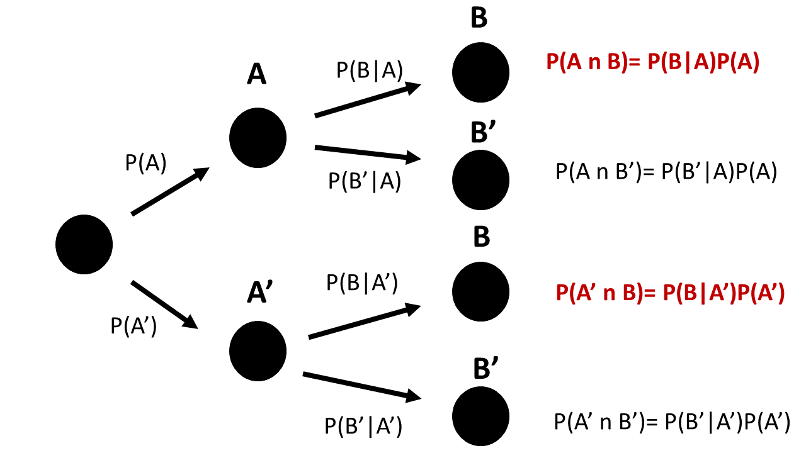

# Probabilidad condicional

En este capítulo, introduciremos la probabilidad condicional.

Usaremos la probabilidad condicional para definir la independencia estadística.

Discutiremos el teorema de Bayes y discutiremos una de sus principales aplicaciones, que es la eficacia de predicción de una herramienta de diagnóstico.

## Probabilidad conjunta

Recordemos que la probabilidad conjunta de dos eventos $A$ y $B$ se define como su intersección

$$P( A,B )=P(A \cap B)$$

Ahora, imagina experimentos aleatorios que miden dos tipos diferentes de resultados.

- altura y peso de un individuo: $(h, w)$

-  tiempo y posición de una carga eléctrica: $(p, t)$

-  el lanzamiento de dos dados: ($n_1$,$n_2$)

- cruzar dos semáforos en verde: ($\bar{R_ 1}$ , $\bar{R_2}$)

A menudo nos interesa saber si los valores de un resultado **condicionan** los valores del otro.

## Independencia estadística

En muchos casos, estamos interesados en saber si dos eventos a menudo tienden a ocurrir juntos. Queremos poder discernir entre dos casos.

- **Independencia** entre eventos. Por ejemplo, sacar un 1 en un dado no hace más probable sacar otro 1 en un segundo dado.

- **Correlación** entre eventos. Por ejemplo, si un hombre es alto, probablemente sea pesado.

**Ejemplo (conductor)**

Realizamos un experimento para averiguar si observar fallas estructurales en un material afecta su conductividad.

Los datos se verían como

| Conductor | Estructura | Conductividad |
|:-------------:|:-------------------:|:----------:|
| $c_1$ | con fallas | defectuosa |
| $c_2$ | sin fallas | sin defectos |
| $c_3$ | con fallas | defectuosa |
|... | ... | ... |
| $c_i$ | sin fallas | defectuosa* |
|... | ... | ... |
|... | ... | ... |
| $c_n$ | con fallas | sin defectos* |

Podemos esperar que la conductividad defectuosa ocurra más a menudo con fallas que sin fallas si las fallas afectan la conductividad.

Imaginemos que a partir de los datos obtenemos la siguiente tabla de contingencia de **probabilidades conjuntas** estimadas

| | con fallas (F) | sin fallas (F') | suma |
|:---------:|:---------:|:--------:|:--------:|
| <b>defectuoso (D) </b> | $0.005$ | $0.045$ | $0.05$ |
| <b>sin defectos (D') </b> | $0.095$ | $0.855$ | $0.95$|
| <b>suma</b> | $0.1$ | $0.9$| 1 |

donde, por ejemplo, la probabilidad conjunta de $F$ y $D$ es

- $P(D,F)=0.005$

y las probabilidades marginales son

- $P(D)=P(D, F) + P(D, F')=0.05$
- $P(F)=P(D, F) + P(D', F)= 0.1$.

## La probabilidad condicional

La conductividad defectuosa es **independiente** de tener fallas estructurales en el material si la probabilidad de tener conductividad defectuosa ($D$) es la misma **ya sea** que tenga fallas ($F$) o no ($F'$) .

Consideremos primero solamente los materiales que tienen fallas.

Dentro de aquellos materiales que tienen fallas ($F$), ¿cuál es la probabilidad estimada de que sean defectuosos?

$\hat{P}(D|F)=\frac{n_{F,D}}{n_{F}}=\frac{n_{F,D}/n}{n_{F}/n}= \frac{f_{F,D}}{f_{F}}$
$$= \frac{\hat{P}(F,D)}{\hat{P}(F)}$$
Por lo tanto, en el límite cuando $N \rightarrow \infty$, tenemos

$$P(D|F)=\frac{P(F, D)}{P(D)}=\frac{P(F \cap D)}{P(D)}$$
**Definición:**

La *probabilidad condicional* de un evento $B$ dado un evento $A$, indicado como $P(A|B)$, es
$$P(A|B) = \frac{P(A\cap B)}{P(B)}$$
Podemos probar que la probabilidad condicional satisface los axiomas de probabilidad. La probabilidad condicional se puede entender como una probabilidad con un espacio muestral dado por $B$: $S_B$. En nuestro ejemplo, los materiales con fallas.

## Tabla de contingencia condicional

Si dividimos las columnas de la tabla de probabilidad conjunta por las probabilidades marginales de los efectos condicionantes ($F$ y $F'$), podemos escribir **una tabla de contingencia condicional**

| | F | F' |
|:---------:|:---------:|:--------:|
| <b>D</b> | P(D &#124; F) | P(D &#124; F') |
| <b>D'</b> | P(D' &#124; F) | P(D' &#124; F') |
| <b>suma</b> | 1 | 1 |

Donde las probabilidades por columnas suman uno. La primera columna muestra las probabilidades de ser defectuoso o no solo de que los materiales que tienen fallas (primera condición: $F$). La segunda columna muestra las probabilidades solo para los materiales que no tienen fallas (segunda condición: $F'$).

Las probabilidades condicionales son las probabilidades del evento dentro de cada condición. Las leemos como:

- $P(D|F)$: Probabilidad de tener conductividad defectuosa **si** tiene fallas
- $P(D'|F)$: Probabilidad de no tener conductividad defectuosa **si** tiene fallas

- $P(D|F')$: Probabilidad de tener conductividad defectuosa **si** no tiene fallas
- $P(D'|F')$ Probabilidad de no tener conductividad defectuosa **si** no tiene fallas

## Independencia estadística

En nuestro ejemplo, la tabla de contingencia condicional es

| | F | F'
|:---------:|:---------:|:--------:|
| <b> D </b> | P(D&#124;F) = 0.05 | P(D&#124;F')=0.05 |
| <b> D' </b> | P(D'&#124;F)=0.95 | P(D'&#124;F')=0.95 |
| <b>suma</b> | 1 | 1 |

¡Observamos que las probabilidades marginales y condicionales son las mismas!

- $P(D|F)=P(D|F')=P(D)$
- $P(D'|F)=P(D'|F')=P(D')$

Esto quiere decir que la probabilidad de observar un conductor defectuoso **no** depende tener una falla estructural o no.

Concluimos que la conductividad defectuosa no se ve afectada por tener una falla estructural.

**Definición**

Dos eventos $A$ y $B$ son estadísticamente independientes si ocurre cualquiera de los casos equivalentes

1) $P(A|B)=P(A)$; $A$ es independiente de $B$
2) $P(B|A)=P(B)$; $B$ es independiente de $A$

y por la definición de probabilidad condicional

3) $P(A\cap B)=P(A|B)P(B)=P(A)P(B)$

Esta tercera forma es un enunciado sobre las probabilidades conjuntas. Dice que podemos obtener probabilidades conjuntas por la multiplicación de las marginales.

En nuestra tabla de probabilidad conjunta original

| | F | F' | suma |
|:---------:|:---------:|:--------:|:--------:|
| <b> D </b> | $0.005$ | $0.045$ | $0.05$ |
| <b> D' </b> | $0.095$ | $0.855$ | $0.95$|
| <b>suma</b> | $0.1$ | $0.9$| 1 |

podemos confirmar que todas las entradas de la matriz son el producto de las marginales. Por ejemplo: $P(F)P(D)= P(D \cap F)$ y $P(D')P(F')=P(D' \cap F')$. Por lo tanto, ser defectuoso es independiente de tener un defecto.

**Ejemplo (Monedas)**

Queremos confirmar que los resultados de lanzar dos monedas son independientes. Consideramos que todos los resultados son igualmente probables:

| resultado | Probabilidad |
|:--------------:|:-------------:|
| $(H,T)$ | 1/4 |
| $(H,H)$ | 1/4 |
| $(T,T)$ | 1/4 |
| $(T,H)$ | 1/4 |
| suma | 1 |

donde $(H,T)$ es, por ejemplo, el evento de cara en la primera moneda y cruz en la segunda moneda. La tabla de contingencia para las probabilidades conjuntas es:

| | H | T | suma |
|:---------:|:---------:|:--------:|:--------:|
| <b> H </b> | $1/4$ | $1/4$ | $1/2$ |
| <b> T </b> | $1/4$ | $1/4$ | $1/2$|
| <b>suma</b> | $1/2$ | $1/2$| 1 |

De esta tabla vemos que la probabilidad de obtener una cara y luego una cruz es el producto de las marginales $P(H, T)=P(H)*P(T)=1/4$. Por lo tanto, el evento de cara en la primera moneda y cruz en la segunda son independientes.

Si elaboramos la tabla de contingencia condicional sobre el lanzamiento de la primera moneda veremos que obtener cruz en la segunda moneda no está condicionado por haber obtenido cara en la primera moneda: $P(T|H)=P(T) =1/2$

## Dependencia estadística

Un ejemplo importante de dependencia estadística se encuentra en el desempeño de **herramientas de diagnóstico**, donde queremos determinar el estado de un sistema (s) con resultados

- inadecuado (si)
- adecuado (no)

con una prueba (t) con resultados

- positivo
- negativo

Por ejemplo, probamos una batería para saber cuánto tiempo puede durar. Tensamos un cable para saber si resiste llevar cierta carga. Realizamos una PCR para ver si alguien está infectado.

## Prueba de diagnóstico

Consideremos diagnosticar una infección con una nueva prueba. Estado de infección:

- si (infectado)
- no (no infectado)

Prueba:

- positivo
- negativo

La **tabla de contingencia condicional** es lo que obtenemos en un ambiente controlado (laboratorio)

| | Infección: si | Infección: No |
|:---------:|:---------:|:--------:|
| <b>Test: positivo</b> | P(positivo &#124; si) | P(positivo &#124; no) |
| <b>Test: negativo</b> | P(negativo &#124; si) | P(negativo &#124; no) |
| <b>suma</b> | 1 | 1 |

Miremos las entradas de la tabla
1) Tasa de verdaderos positivos (Sensibilidad): La probabilidad de dar positivo **si** tiene la enfermedad $P(positivo|si)$

2) Tasa de verdaderos negativos (Especificidad): La probabilidad de dar negativo **si** no tiene la enfermedad $P(negativo|no)$

3) Tasa de falsos positivos: la probabilidad de dar positivo **si** no tiene la enfermedad $P(positivo|no)$

4) Tasa de falsos negativos: la probabilidad de dar negativo **si** tiene la enfermedad $P(negativo|si)$

Alta correlación (dependencia estadística) entre la prueba y la infección significa valores altos de las probabilidades 1 y 2 **y** valores bajos para las probabilidades 3 y 4.

**Ejemplo (COVID)**

Ahora consideremos una situación real. En los días iniciales de la pandemia de coronavirus no había una medida de la eficacia de las PCR para detectar el virus. Uno de los primeros estudios publicados (https://www.nejm.org/doi/full/10.1056/NEJMp2015897) encontró que

- Las PCR tuvieron una sensibilidad del 70%, en condición de infección.
- Las PCR tuvieron una especificidad del 94%, en condición de no infección.

La tabla de contingencia condicional es

| | Infección: si | Infección: No|
|:---------:|:---------:|:--------:|
| <b>Test: positivo</b> | P(positivo&#124;si)=0.7 | P(positivo&#124;no)=0.06 |
| <b>Test: negativo</b> | P(negativo&#124;si)=0.3 | P(negativo&#124;no)=0.94 |
| <b>suma</b> | 1 | 1 |

Por lo tanto, los errores en las pruebas de diagnóstico fueron:

- La tasa de falsos positivos es $P(positivo|no)=0.06$
- La tasa de falsos negativos es $P(negativo|si)=0.3$

## Probabilidades inversas

Nos interesa encontrar la probabilidad de estar infectado si la prueba da positivo: $$P(si|positivo)$$

Para eso:

1. Recuperamos la tabla de contingencia para probabilidades conjuntas, multiplicando por las marginales

| | Infección: si | Infección: No | <b>suma</b> |
|:---------:|:---------:|:--------:|:--------:|
| <b>Test: positivo</b> | P(positivo &#124; si)P(si) | P(positivo &#124; no)P(no) | P(positivo) |
| <b>Test: negativo</b> | P(negativo &#124; si)P(si) | P(negativo &#124; no) P(no) | P(negativo) |
| <b>suma</b> | P(si) | P(no) | 1 |

2. Usamos la definición de probabilidades condicionales para filas en lugar de columnas (dividimos por la marginal de los resultados de la prueba)

| | Infección: si | Infección: No | suma |
|:---------:|:---------:|:--------:|:--------:|
| <b>Test: positivo</b> | P(si&#124;positivo) | P(sin&#124;positivo) | 1 |
| <b>Test: negativo</b> | P(si&#124;negativo) | P(sin&#124;negativo) | 1 |

 
 

Por ejemplo:

$$P(si|positivo)=\frac{P(positivo|si)P(si)}{P(positivo)}$$

Para aplicar esta fórmula necesitamos las marginales $P(si)$ (incidencia) y $P(positivo)$.

- Para encontrar $P(si)$, necesitamos un nuevo estudio: el primer estudio de prevalencia en España mostró que durante el confinamiento $P(si)=0.05$, $P(no)=0.95$, antes del verano de 2020.

- Para encontrar $P(positivo)$, podemos usar la definición de probabilidad marginal y condicional:

$P(positivo)=P(positivo \cap si) + P(positivo \cap no)$
$$= P(positivo|si)P(si)+P(positivo|no)P(no)$$
Esta última relación de las marginales se llama **regla de probabilidad total**.

## Teorema de Bayes

Después de sustituir la regla de probabilidad total en $P(si|positivo)$, tenemos

$$P(si|positivo)=\frac{P(positivo|si)P(si)}{P(positivo|si)P(si)+P(positivo|no)P(no)}$$
Esta expresión se conoce como **teorema de Bayes**. Nos permite invertir los condicionales:

$$P(positivo|si) \rightarrow P(si|positivo)$$
O **evaluar** una prueba en una condición controlada (infección) y luego usarla para **inferir** la probabilidad de la condición cuando la prueba es positiva.

**Ejemplo (COVID)**:

El rendimiento de la prueba fue:

- Sensibilidad: $P(positivo|si)=0.70$

- Tasa de falsos positivos: $P(positivo|no)=1- P(negativo|no)=0.06$

El estudio en población española dio:

- $P(si)=0.05$
- $P(no)=1-P(si)=0.95$.

Por lo tanto, la probabilidad de estar infectado en caso de dar positivo era:

$$P(si|positivo)=0.38$$

Concluimos que en ese momento las PCR no eran muy buenas para **confirmar** infecciones.

Sin embargo, apliquemos ahora el teorema de Bayes a la probabilidad de no estar infectado si la prueba fue negativa.

$$P(no|negativo) = \frac{P(negativo|no) P(no)}{P(negativo|no) P(no)+P(negativo|si)P(si)}$$

La sustitución de todos los valores da

$$P(no|negativo)=0.98$$

Por lo tanto, las pruebas eran buenas para **descartar** infecciones y un requisito justo para viajar.

**Teorema de Bayes**

En general, podemos tener más de dos eventos condicionantes. Por lo tanto, el teorema de Baye dice:

Si $E1, E2, ..., Ek$ son $k$ eventos mutuamente excluyentes y exhaustivos y $B$ es cualquier evento, entonces la probabilidad inversa $P(Ei|B)$ es

$$P(Ei|B)=\frac{P(B|Ei)P(Ei)}{P(B|E1)P(E1) +...+ P(B|Ek)P(Ek)} $$
El denominador es la regla de probabilidad total para la marginal $P(B)$, en términos de las marginales $P(E1), P(E2), ... P(Ek)$.

$$P(B)=P(B|E1)P(E1) +...+ P(B|Ek)P(Ek)$$

**Árbol condicional**

La regla de probabilidad total también se puede ilustrar usando un árbol **condicional**.

**Regla de probabilidad total** para la marginal de $B$: ¿De cuántas maneras puedo obtener el resultado $B$?

$P(B)=P(B|A)P(A)+P(B|A')P(A')$

## Preguntas

Recopilamos la edad y categoría de 100 deportistas en una competición

| | $junior$ | $senior$ |
|:---------:|:---------:|:--------:|
| $1er$ | $14$ | $12$ |
| $2do$ | $21$ | $18$ |
| $3er$ | $22$ | $13$ |

**1)** ¿Cuál es la probabilidad estimada de que el atleta esté en la tercera categoría si el atleta es junior?

**$\qquad$a:** $22$; **$\qquad$b:** $22/100$; **$\qquad$c:** $22/57$; **$\qquad$d:** $22/35$;

**2)** ¿Cuál es la probabilidad estimada de que el atleta sea junior y esté en 1ra categoría si el atleta no está en 3ra categoría?

**$\qquad$a:** $14/35$; **$\qquad$b:** $14/65$; **$\qquad$c:** $14/100$; **$\qquad$d:** $14/26$

**3)** Una prueba diagnóstica tiene una probabilidad de $8/9$ de detectar una enfermedad si los pacientes están enfermos y una probabilidad de $3/9$ de detectar la enfermedad si los pacientes están sanos. Si la probabilidad de estar enfermo es $1/9$. ¿Cuál es la probabilidad de que un paciente esté enfermo si una prueba detecta la enfermedad?

**$\qquad$a:** $\frac{8/9}{8/9+3/9}*1/9$; **$\qquad$b:** $\frac{3/9}{8/9+3/9}*1/9$; **$\qquad$c:** $\frac{3/9*8/9}{8/9*1/9+3/9*8/9}$; **$\qquad$d:** $\frac{8/9*1/9}{8/9*1/9+3/9*8/9}$;

**4)** Como se comenta en las notas, una prueba PCR para coronavirus tenía una sensibilidad del 70 % y una especificidad del 94 % y en España durante el confinamiento hubo una incidencia del 5 %. Con estos datos, ¿cuál era la probabilidad de dar positivo en España ($P(positivo)$)

**$\qquad$a:** $0.035$; **$\qquad$b:** $0.092$; **$\qquad$c:** $0.908$; **$\qquad$d:** $0.95$

**5)** Con los mismos datos que en la pregunta 4, dar positivo en la PCR y estar infectado no son eventos  independientes porque:

**$\qquad$a:** La sensibilidad es del 70%; **$\qquad$b:** La sensibilidad y la tasa de falsos positivos son diferentes; **$\qquad$c:** La tasa de falsos positivos es del 0.06%; **$\qquad$d:** la especificidad es del 96%

## Ejercicios

#### Ejercicio 1

Se prueba el rendimiento de una máquina para producir varillas de torneado de alta calidad. Estos son los resultados de las pruebas

| | Redondeado: si | Redondeado: No |
|:---------:|:---------:|:--------:|
| <b>superficie lisa: si</b> | 200 | 1 |
| <b>superficie lisa: no</b> | 4 | 2 |

- ¿Cuál es la probabilidad estimada de que la máquina produzca una varilla que no satisfaga ningún control de calidad? (R: 2/207)

- ¿Cuál es la probabilidad estimada de que la máquina produzca una varilla que no satisfaga al menos un control de calidad? (R: 7/207)

- ¿Cuál es la probabilidad estimada de que la máquina produzca varillas de superficie redondeada y alisada? (R: 200/207)

- ¿Cuál es la probabilidad estimada de que la barra sea redondeada si la barra es lisa? (R: 200/201)

- ¿Cuál es la probabilidad estimada de que la varilla sea lisa si es redondeada? (R: 200/204)

- ¿Cuál es la probabilidad estimada de que la varilla no sea ni lisa ni redondeada si no satisface al menos un control de calidad? (R: 2/7)

- ¿Son eventos independientes la lisa y la redondez? (No)

#### Ejercicio 2

Desarrollamos un test para detectar la presencia de bacterias en un lago. Encontramos que si el lago contiene la bacteria, la prueba es positiva el 70% de las veces. Si no hay bacterias, la prueba es negativa el 60% de las veces. Implementamos la prueba en una región donde sabemos que el 20% de los lagos tienen bacterias.

- ¿Cuál es la probabilidad de que un lago que dé positivo esté contaminado con bacterias? (R: 0.30)

#### Ejercicio 3

Se prueba el rendimiento de dos máquinas para producir varillas de torneado de alta calidad. Estos son los resultados de las pruebas

**Máquina 1**

| | Redondeado: si | Redondeado: No |
|:---------:|:---------:|:--------:|
| <b>superficie lisa: si</b> | 200 | 1 |
| <b>superficie lisa: no</b> | 4 | 2 |

**Máquina 2**

| | Redondeado: si | Redondeado: No |
|:---------:|:---------:|:--------:|
| <b>superficie lisa: si</b> | 145 | 4 |
| <b>superficie lisa: no</b> | 8 | 6 |

- ¿Cuál es la probabilidad de que la barra sea redondeada? (R: 357/370)
- ¿Cuál es la probabilidad de que la varilla haya sido producida por la máquina 1? (R: 207/370)
- ¿Cuál es la probabilidad de que la varilla no sea lisa? (R: 20/370)
- ¿Cuál es la probabilidad de que la varilla sea lisa o redondeada o producida por la máquina 1? (R: 364/370)
- ¿Cuál es la probabilidad de que la varilla quede redondeada si es alisada y de la máquina 1? (R: 200/201)
- ¿Cuál es la probabilidad de que la varilla no esté redondeada si no está alisada y es de la máquina 2? (R:  6/14)
- ¿Cuál es la probabilidad de que la varilla haya salido de la máquina 1 si está alisada y redondeada? (R: 200/345)
- ¿Cuál es la probabilidad de que la varilla haya venido de la máquina 2 si no pasa al menos uno de los controles de calidad? (R:0.72)

#### Ejercicio 4
Queremos cruzar una avenida con dos semáforos. La probabilidad de encontrar el primer semáforo en rojo es 0.6. Si paramos en el primer semáforo, la probabilidad de parar en el segundo es 0.15. Mientras que la probabilidad de detenernos en el segundo si no nos detenemos en el primero es 0.25.

Cuando intentamos cruzar ambos semáforos:

- ¿Cuál es la probabilidad de tener que detenerse en cada semáforo? (R:0.09)
- ¿Cuál es la probabilidad de tener que parar en al menos un semáforo? (R:0.7)
- ¿Cuál es la probabilidad de tener que detenerse en un solo semáforo? (R:0.61)
- Si paré en el segundo semáforo, ¿cuál es la probabilidad de que tuviera que parar en el primero? (R: 0.47)
- Si tuviera que parar en cualquier semáforo, ¿cuál es la probabilidad de que tuviera que hacerlo dos veces? (R: 0.12)
- ¿Parar en el primer semáforo es un evento independiente de detenerse en el segundo semáforo? (No)

Ahora, deseamos cruzar una avenida con tres semáforos. La probabilidad de encontrarnos con el primer semáforo en rojo es del 0.6, y la probabilidad de encontrar el segundo semáforo en rojo depende únicamente de la probabilidad del primer semáforo. De manera similar, la probabilidad de encontrar un semáforo en rojo en el tercer semáforo depende solo de las probabilidades del segundo. Como antes, la probabilidad de detenernos en un semáforo es del 0.15 si nos detuvimos en el semáforo anterior. Si no nos detuvimos en el semáforo anterior, la probabilidad de detenernos en el siguiente semáforo es del 0.25.

- ¿Cuál es la probabilidad de tener que parar en cada semáforo? (R:0.013)
- ¿Cuál es la probabilidad de tener que parar en al menos un semáforo? (R:0.775)
- ¿Cuál es la probabilidad de tener que detenerse en un solo semáforo? (R:0.5425)

consejos:

- Si la probabilidad de que un semáforo esté en rojo depende únicamente del anterior, entonces
$P(R_3|R_2,R_1)=P(R_3|R_2,\bar{R}_1)=P(R_3|R_2)$ y $P(R_3|\bar{R}_2,R_1)=P(R_3 |\bar{R}_2,\bar{R}_1)=P(R_3|\bar{R}_2)$

- La probabilidad conjunta de encontrar tres semáforos en rojo se puede escribir como:
$P(R_1,R_2,R_3)=P(R_3|R_2)P(R_2|R_1)P(R_1)$

#### Ejercicio 5

Una prueba de calidad en un ladrillo aleatorio se define por los eventos:

- Pasar la prueba de calidad: $E$, no pasar la prueba de calidad: $\bar{E}$
- Defectuoso: $D$, no defectuoso: $\bar{D}$

Si la prueba diagnóstica tiene sensibilidad $P(E|\bar{D})=0.99$ y especificidad $P(\bar{E}|D)=0.98$, y la probabilidad de pasar la prueba es $P(E) =0.893$ entonces

- ¿Cuál es la probabilidad de que un ladrillo elegido al azar sea defectuoso $P(D)$? (R:0.1)

- ¿Cuál es la probabilidad de que un ladrillo que ha pasado la prueba sea realmente defectuoso? (R:0.022)

- La probabilidad de que un ladrillo no sea defectuoso **y** que no pase la prueba (R:0.009)

- ¿Son $D$ y $\bar{E}$ estadísticamente independientes? (No)

