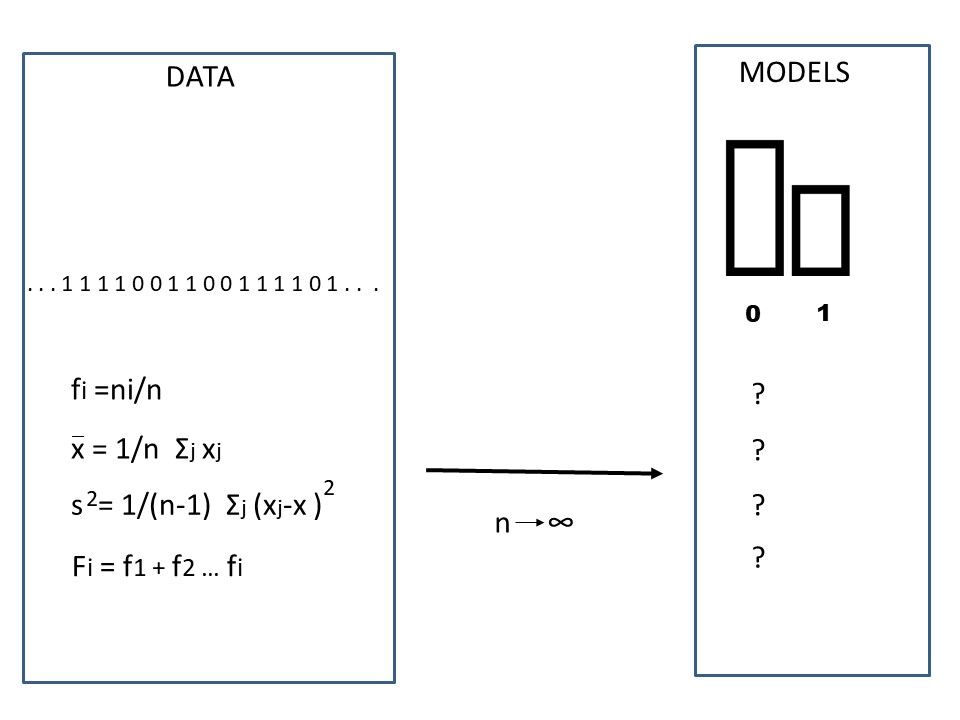
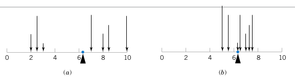
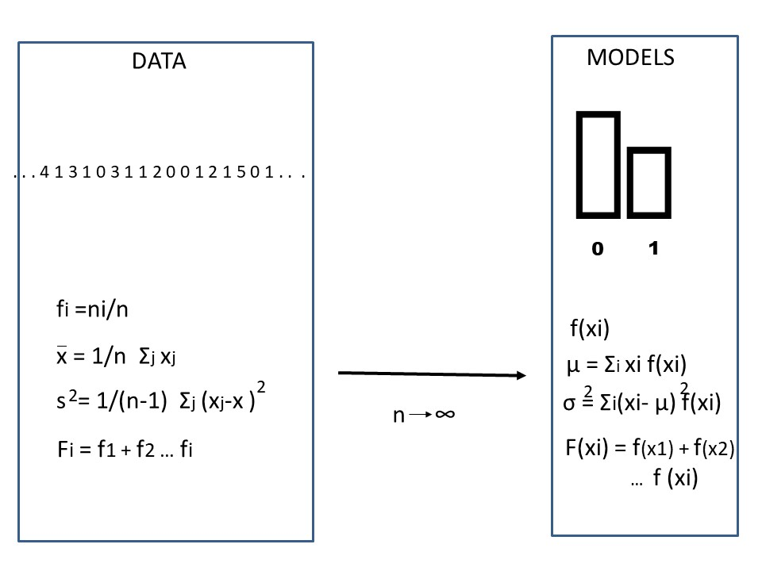

# Variables aleatorias discretas

## Objetivo


En este capítulo definiremos las variables aleatorias y estudiaremos variables aleatorias **discretas**.

Definiremos la función de masa de probabilidad y sus principales propiedades de media y varianza. Siguiendo el proceso de abstracción de las frecuencias relativas en probabilidades, también definimos la distribución de probabilidad como el caso límite de la frecuencia relativa acumulada.


## Frecuencias relativas

Las frecuencias relativas de los resultados de un experimento aleatorio son una medida de su propensión. Podemos usarlos como estimadores de sus probabilidades, cuando repetimos el experimento aleatorio muchas veces ($n \rightarrow \infty$).

Definimos tendencia central (promedio), dispersión (varianza muestral) y la distribución de frecuencias de los datos ($F_i$).

En términos de probabilidades, ¿cómo se definen estas cantidades?



## Variable aleatoria

Definimos las frecuencias relativas sobre las **observaciones** de los experimentos. Ahora definimos las cantidades equivalentes para las probabilidades en términos de los **resultados** de los experimentos. Nos ocuparemos únicamente de resultados de tipo numérico.

Una **variable aleatoria** es un símbolo que representa un **resultado numérico** de un experimento aleatorio. Escribimos la variable aleatoria en **mayúsculas** (es decir, $X$).


**Definición:**

Una **variable aleatoria** es una función que asigna un **número** real a un **evento** del espacio muestral de un experimento aleatorio.

Recuerda que un evento puede ser un resultado o una colección de resultados.

Cuando la variable aleatoria toma un **valor**, indica la realización de un **evento** de un experimento aleatorio.

*Ejemplo:*

Si $X \in \{0,1\}$, entonces decimos que $X$ es una variable aleatoria que puede tomar los valores $0$ o $1$.


## Eventos de observar una variable aleatoria

Hacemos la distinción entre variables en el espacio modelo con letras mayúsculas, como entidades abstractas, y la realización de un evento o resultado particular. Por ejemplo:

- $X=1$ es el **evento** de observar la variable aleatoria $X$ con valor $1$
- $X=2$ es el **evento** de observar la variable aleatoria $X$ con valor $2$

...

**En general:**

- $X=x$ es el **evento** de observar la variable aleatoria $X$ ($X$ mayúscula) con valor $x$ ($x$ pequeño).


## Probabilidad de variables aleatorias

Nos interesa asignar probabilidades a los eventos de observar un valor particular de una variable aleatoria.

Por ejemplo, para los dados escribiremos la tabla de probabilidad como

| $X$ | Probabilidad |
|:--------:|:------------------:|
| $1$ | $P(X=1)=1/6$ |
| $2$ | $P(X=2)=1/6$ |
| $3$ | $P(X=3)=1/6$ |
| $4$ | $P(X=4)=1/6$ |
| $5$ | $P(X=5)=1/6$ |
| $6$ | $P(X=6)=1/6$ |

donde hacemos explícitos los eventos de que la variable toma un resultado dado $X=x$.


## Funciones de probabilidad

Debido a que $x$  (minúscula) es una variable numérica, las probabilidades de la variable aleatoria se pueden dibujar

```{r, echo=FALSE}
x <- 1:6
P <- rep(1,6)/6
plot(x, P, pch=16,col="red", ylab="f(x)=P(X=x)")
for(i in 1:length(x))
{lines(c(x[i], x[i]), c(0, P[i]), col="red")}
{lines(c(x[i], x[i]), c(0, P[i]), col="red")}


```


o escrir como una función 

$$f(x)=P(X=x)=1/6$$

## Funciones de probabilidad

Podemos **crear** cualquier tipo de función de probabilidad si satisfacemos las reglas de probabilidad de Kolmogorov:

Para una variable aleatoria discreta $X \in \{x_1 , x_2 , .. , x_M\}$, una **función de masa de probabilidad** que se usa para calcular probabilidades

- $f(x_i)=P(X=x_i)$

siempre es positiva

- $f(x_i)\geq 0$

y su suma sobre todos los valores de la variable es $1$:

- $\sum_{i=1}^M f(x_i)=1$

Donde $M$ es el número de resultados posibles.

Ten en cuenta que la definición de $X$ y su función de masa de probabilidad es general **sin referencia** a ningún experimento. Las funciones viven en el espacio modelo (abstracto).

Aquí tenemos un ejemplo


```{r, echo=FALSE}
x <- 1:6
P <- prop.table(table(sample(1:6, 50, prob = c(1,2,3,1,4,1), replace=TRUE)))
names(P) <- NULL
plot(x, P, pch=16,col="red", ylab="f(x)=P(X=x)")
for(i in 1:length(x))
{lines(c(x[i], x[i]), c(0, P[i]), col="red")}
{lines(c(x[i], x[i]), c(0, P[i]), col="red")}
```

$X$ y $f(x)$ son objetos abstractos que pueden corresponder o no a un experimento. Tenemos la libertad de construirlos como queramos siempre que respetemos su definición.

Las funciones de masa de probabilidad tienen algunas **propiedades** que se derivan exclusivamente de su definición.


## Probabilidades y frecuencias relativas


**Considera el ejemplo**

Haz el siguiente experimento: En una urna pon $8$ bolas y:

- marca $1$ bola con el número  $-2$
- marca $2$ bolas con el número $-1$
- marca $2$ bolas con el número $0$
- marca $2$ bolas con el número $1$
- marca $1$ bolas con el número $2$

Y considere realizar el siguiente **experimento aleatorio:** Tome una bola y lea el número.

A partir de la probabilidad clásica, podemos escribir la tabla de probabilidades, para lo cual no necesitamos realizar ningún experimento

| $X$ | $P(X=x)$ |
|:--------:|:------------------:|
| $-2$ | $1/8=0.125$ |
| $-1$ | $2/8=0.25$ |
| $0$ | $2/8=0.25$ |
| $1$ | $2/8=0.25$ |
| $2$ | $1/8=0.125$ |


Ahora, realicemos el experimento $30$ veces y escribamos la tabla de frecuencia

| $X$ | $f_i$ |
|:--------:|:------------------:|
| $-2$ | $0.132$ |
| $-1$ | $0.262$ |
| $0$ | $0.240$ |
| $1$ | $0.248$ |
| $2$ | $0.118$ |

La probabilidad frecuentista nos dice
$$lim_{N \rightarrow \infty} f_i = f(x_i)=P(X=x_i)$$
Entonces, si no conocíamos el montaje del experimento (caja negra), lo mejor que podemos hacer es **estimar** las probabilidades con las frecuencias, obtenidas de $N$ repeticiones del experimento aleatorio:

$$f_i = \hat{P}_i$$


```{r, echo=FALSE}
set.seed(123)
x <- seq(-2,2)
P <- c(1/8,2/8,2/8,2/8,1/8)
  
par(mfrow=c(2,4))

for(i in 1:4)
{  
tb <- prop.table(table(sample(x, 30, P, replace=TRUE)))

b <- barplot(tb, ylim=c(0,0.5), main="N=30")
xplot <- as.vector(b)

points(xplot, P, pch=16,col="red", ylab="f(x)=P(X=x)")
for(i in 1:length(x))
{lines(c(xplot[i], xplot[i]), c(0, P[i]), col="red")}
{lines(c(xplot[i], xplot[i]), c(0, P[i]), col="red")}
legend("topleft", legend = c("f(xi)=P(X=xi)", "fi"),pch=c(16,16), col=c("red", "grey"))
}


for(i in 1:4)
{  
tb <- prop.table(table(sample(x, 1000, P, replace=TRUE)))

b <- barplot(tb, ylim=c(0,0.5), main="N=1000")
xplot <- as.vector(b)

points(xplot, P, pch=16,col="red", ylab="f(x)=P(X=x)", ylim=c(0,0.5))
for(i in 1:length(x))
{lines(c(xplot[i], xplot[i]), c(0, P[i]), col="red")}
{lines(c(xplot[i], xplot[i]), c(0, P[i]), col="red")}
legend("topleft", legend = c("f(xi)=P(X=xi)", "fi"),pch=c(16,16), col=c("red", "grey"))

}

```

Cada vez que estimamos las probabilidades, nuestras estimaciones $\hat{P}_i=f_i$ cambian. Pero $P_i$ es una cantidad abstracta que nunca cambia. A medida que aumenta $N$, nos acercamos más a ella.


## La media o el valor esperado

Cuando discutimos las estadísticas de resumen de los datos, definimos el **centro** de las observaciones como un valor alrededor del cual se concentran las frecuencias de los resultados.

Usamos el **promedio** para medir el centro de gravedad de los **datos**. En términos de las frecuencias relativas de los valores de los resultados discretos, escribimos el promedio como


$\bar{x}= \sum_{i=1}^M x_i \frac{n_i}{N}=$ $$\sum_{i=1}^M x_i f_i$$

**Definición**

La **media** ($\mu$) o valor esperado de una variable aleatoria discreta $X$, $E(X)$, con función de masa $f(x)$ está dada por

$$ \mu = E(X)= \sum_{i=1}^M x_i f(x_i) $$




Es el centro de gravedad de las **probabilidades**: El punto donde se equilibran las cargas de probabilidad.

De la definición tenemos

$$\bar{x} \rightarrow \mu$$ en el **límite** cuando
$N \rightarrow \infty$ como la frecuencia tiende a la función de masa de probabilidad $f_i \rightarrow f(x_i)$.


**Ejemplo**

¿Cuál es la media de $X$ si su función de masa de probabilidad $f(x)$ está dada por

| $X$ | $f(x)=P(X=x)$ |
|:--------:|:------------------:|
| $0$ | $1/16$ |
| $1$ | $4/16$ |
| $2$ | $6/16$ |
| $3$ | $4/16$ |
| $4$ | $1/16$ |


```{r, echo=FALSE}

X <- 0:4
P <- c(1,4,6,4,1)/16
plot(X, P, pch=16,col="red", ylim=c(0,0.4), ylab="f(x)=P(X=x)")
for(i in 1:length(X))
{lines(c(X[i], X[i]), c(0, P[i]), col="red")}

```

$$ \mu =E(X)=\sum_{i=1}^m x_i f(x_i) $$

$E(X)=$**0** \* 1/16 + **1** \* 4/16 + **2** \* 6/16 + **3** \* 4/16 + **4** \* 1/16 =2

La media $\mu$ es el centro de gravedad de la función de masa de probabilidad y **no cambia**. Sin embargo, el promedio  $\bar{x}$ es el centro de gravedad de las observaciones (frecuencias relativas) **cambia** con diferentes datos.


## Varianza

Cuando discutimos los estadísticos de resumen, también definimos la dispersión de las observaciones como una distancia promedio de los datos al promedio.

**Definición**

La varianza, escrita como $\sigma^2$ o $V(X)$, de una variable aleatoria discreta $X$ con función de masa $f(x)$ viene dada por

$$\sigma^2 = V(X)= \sum_{i=1}^M (x_i-\mu)^2 f(x_i)$$
$\sigma=\sqrt{V(X)}$ se llama la **desviación estándar** de la variable aleatoria.

La varianza es la dispersión de las **probabilidades** con respecto a la media: El momento de inercia de las probabilidades sobre la media.

**Ejemplo**

¿Cuál es la varianza de $X$ si su función de masa de probabilidad $f(x)$ está dada por

| $X$ | $f(x)=P(X=x)$ |
|:--------:|:------------------:|
| $0$ | $1/16$ |
| $1$ | $4/16$ |
| $2$ | $6/16$ |
| $3$ | $4/16$ |
| $4$ | $1/16$ |


$$\sigma^2 =V(X)=\sum_{i=1}^m (x_i-\mu)^2 f(x_i)$$


$V(X)=$**(0-2)**$^2$\* 1/16 + **(1-2)**$^2$\* 4/16 + **(2- 2)**$^2$\* 6/16 + **(3-2)**$^2$\* 4/16 + **(4-2)**$^2$\* 1/ 16 = 1


$$V(X)=\sigma^2=1$$
$$\sigma=1$$


## Funciones de probabilidad para funciones de $X$

En muchas ocasiones, estaremos interesados en resultados que sean función de las variables aleatorias. Quizás nos interese el cuadrado del número de contagios de gripe, o la raíz cuadrada del número de correos electrónicos en una hora.

**Definición**

Para cualquier función $h$ de una variable aleatoria $X$, con función de masa $f(x)$, su valor esperado viene dado por

$$ E[h(X)]= \sum_{i=1}^M h(x_i) f(x_i) $$

Esta es una definición importante que nos permite probar tres propiedades de la media y la varianza que se usan con frecuencia:

1) La media de una función lineal es la función lineal de la media: $$E(a\times X +b)= a\times E(X) +b$$ para $a$ y $b$ escalares (números ).


2) La varianza de una función lineal de $X$ es:$$V(a\times X +b)= a^2\times V(X)$$

3) La varianza **con respecto al origen** es la varianza **con respecto a la media** más la media al cuadrado: $$E(X^2)=V(X)+E(X)^2$$


**Ejemplo**


¿Cuál es la varianza $X$ con respecto al origen, $E(X^2)$, si su función de masa de probabilidad $f(x)$ está dada por

| $X$ | $f(x)=P(X=x)$ |
|:--------:|:------------------:|
| $0$ | $1/16$ |
| $1$ | $4/16$ |
| $2$ | $6/16$ |
| $3$ | $4/16$ |
| $4$ | $1/16$ |

$$E(X^2) =\sum_{i=1}^m x_i^2 f(x_i)$$

$E(X^2)=$**(0)**$^2$\* 1/16 + **(1)**$^2$\* 4/16 + **(2)** $^2$\* 6/16 + **(3)**$^2$\* 4/16 + **(4)**$^2$\* 1/16 =5

También podemos verificar:

$$E(X^2)=V(X)+E(X)^2$$

$5=1+2^2$


## Distribución de probabilidad

Cuando discutimos las estadísticas de resumen, también definimos la **distribución** de frecuencias (o la frecuencia acumulada relativa) $F_i$. $F_i$ es una cantidad importante porque es una función continua $F_x$ es por lo tanto una función de rango **continuo**, incluso si los resultados son discretos.


**Definición:**

La función de **distribución de probabilidad** se define como

$$F(x)=P(X\leq x)=\sum_{x_i\leq x} f(x_i) $$

Esa es la probabilidad acumulada hasta un valor dado $x$

$F(x)$ satisface por lo tanto satisface:

1) $0\leq F(x) \leq 1$
2) Si $x \leq y$, entonces $F(x) \leq F(y)$


Para la función de masa de probabilidad:

| $X$ | $f(x)=P(X=x)$ |
|:--------:|:------------------:|
| $0$ | $1/16$ |
| $1$ | $4/16$ |
| $2$ | $6/16$ |
| $3$ | $4/16$ |
| $4$ | $1/16$ |

La distribución de probabilidad es:

\[
    F(x)=
\begin{cases}
    1/16,& \text{if } 0 \leq x < 1\\
    5/16,& 1\leq x < 2\\
    11/16,& 2\leq x < 3\\
    15/16,& 4\leq x < 5\\
    16/16,&  x \leq 5\\
\end{cases}
\]

Para $X \in \mathbb{Z}$


```{r, echo=FALSE}
F <- cumsum(P)
plot(X, F, pch=16,col="red", type="s")
```

## Función de probabilidad y distribución de probabilidad

La función de probabilidad y la distribución son equivalentes. Podemos obtener uno del otro y viceversa.

$$f(x_i)=F(x_i)-F(x_{i-1})$$

con

$$f(x_1)=F(x_1)$$


para $X$ tomando valores en $x_1 \leq x_2 \leq ... \leq x_n$


**Ejemplo**

De la distribución de probabilidad:

\[
    F(x)=
\begin{cases}
    1/16,& \text{if } 0 \leq x < 1\\
    5/16,& 1\leq x < 2\\
    11/16,& 2\leq x < 3\\
    15/16,& 4\leq x < 5\\
    16/16,&  x \leq 5\\
\end{cases}
\]

Podemos obtener la función masa de probabilidad.

$f(0)=F(0)=1/16$ 
</br>$f(1)=F(1)-f(0)=5/32-1/32=4/16$ 
</br>$f(2)=F(2)-f(1)-f(0)=F(2)-F(1)=6/16$ 
</br>$f(3)=F(3)-f(2)-f(1)-f(0)=F(3)-F(2)=4/16$ 
</br>$f(4)=F(4)-F(3)=1/16$ 


## Cuantiles

Finalmente, podemos usar la distribución de probabilidad $F(x)$ para definir la mediana y los cuartiles de la variable aleatoria $X$.

En general, definimos el **q-cuantil** como el valor $x_{p}$ **bajo** el cual hemos acumulado q*100% de la probabilidad


$$q=\sum_{i=1}^pf(x_i) = F (x_p)$$

- La **mediana** es valor $x_m$ tal que $q=0.5$

$$F(x_{m})=0.5$$

- El cuantil $0.05$ es el valor $x_{r}$ tal que $q=0.05$

$$F(x_{r})=0.05$$

- El cuantil de $0,25$ es el **primer cuartil** el valor $x_{s}$ tal que $q=0.25$

$$F(x_{s})=0.25$$


## Resumen




| nombres de cantidades | modelo (no observado) | datos (observados) |
|:--------:|:-----:|:----:|
| función de masa de probabilidad // frecuencia relativa | $f(x_i)=P(X=x_i)$ | $f_i=\frac{n_i}{N}$ |
| distribución de probabilidad // frecuencia relativa acumulada | $F(x_i)=P(X \leq x_i)$ | $F_i=\sum_{k\leq i} f_k$ |
| media // promedio | $\mu=E(X)=\sum_{i=1}^M x_i f(x_i)$ | $\bar{x}=\sum_{j=1}^N x_j/N$ |
| varianza // varianza de la muestra |$\sigma^2=V(X)=\sum_{i=1}^M (x_i-\mu)^2 f(x_i)$ | $s^2=\sum_{j=1}^N (x_j-\bar{x})^2/(N-1)$ |
| desviación estándar // muestra sd | $\sigma=\sqrt{V(X)}$ | $s$ |
| varianza con respecto al origen // 2º momento muestral | $E(X^2)=\sum_{i=1}^M x_i^2 f(x_i)$ | $m_2= \sum_{j=1}^N x_j^2/n$|

Ten en cuenta: 

- $i=1...M$ es un **resultado** de la variable aleatoria $X$.
- $j=1...N$ es una **observación** de la variable aleatoria $X$.

Propiedades:

- $\sum_{i=1...N} f(x_i)=1$
- $f(x_i)=F(x_i)-F(x_{i-1})$
- $E(a\times X +b)= a\times E(X) +b$; for $a$ and $b$ scalars.
- $V(a\times X +b)= a^2\times V(X)$
- $E(X^2)=V(X)+E(X)^2$


## Preguntas

**1)** Para una función de masa de probabilidad no es cierto que

**$\qquad$a:** la suma de los valores de su imagen es 1; **$\qquad$b:** sus valores pueden interpretarse como probabilidades de eventos;
**$\qquad$c:** siempre es positiva;
**$\qquad$d:** no puede tomar el valor 1;

**2)** El valor de una variable aleatoria representa

**$\qquad$a:** una observación de un experimento aleatorio; **$\qquad$b:** la frecuencia de un resultado de un experimento aleatorio;
**$\qquad$c:** un resultado de un experimento aleatorio;
**$\qquad$d:** una probabilidad de un resultado;

**3)** El valor estimado de una probabilidad $\hat{P_i}$ es igual a la probabilidad $P_i$ cuando el número de repeticiones del experimento aleatorio es

**$\qquad$a:** grande; **$\qquad$b:** infinito;
**$\qquad$c:** pequeño
**$\qquad$d:** cero;


**4)** Si una función de masa de probabilidad es simétrica alrededor de $x=0$

**$\qquad$a:** La media es menor que la mediana; **$\qquad$b:** La media es mayor que la mediana;
**$\qquad$c:** La media y la mediana son iguales;
**$\qquad$d:** La media y la mediana son diferentes de 0;

**5)** La media y la varianza

**$\qquad$a:** son inversamente proporcionales; **$\qquad$b:** son valores esperados de funciones de $X$;
**$\qquad$c:** de una función lineal son la función lineal de la media y la función lineal de la varianza;
**$\qquad$d:** cambia cuando repetimos el experimento aleatorio;


## Ejercicios

#### Ejercicio 1

Ponemos en una urna papeletas con letras de la a la f. Considera el sorteo que da $0$ euros a las dos primeras letras del abecedario, $1.5$ euros a las dos siguientes, y $2$ y $3$ euros a las siguientes. 


a) ¿cuál es la función de masa de probabilidad y función de distribución de probabilidad de para los premios en dinero del juego?

b) ¿cuál es el valor esperado del premio? (R:1.3)

c) ¿cuál es la varianza del premio? (R:1.13)

d) ¿cuál es la probabilidad de ganar 2 o mas euros? (R:2/6)


#### Ejercicio 2

Dada la función de masa de probabilidad

| $x$ | $f(x)=P(X=x)$ |
|:-----:|:---------:|
|10|0.1|
|12|0.3|
|14|0.25|
|15|0.15|
|17| ? |
|20|0.15|

- ¿Cuál es su valor esperado y su desviación estándar? (R: 14,2; 2,95)


#### Ejercicio 3

Dada la distribución de probabilidad para una variable discreta $X$

\[
    F(x)= 
\begin{cases}
0, & x < -1 \\
0.2,& x \in [-1,0)\\
0.35,& x \in [0,1)\\
0.45,& x \in [1,2)\\
1,& x \geq 2\\
\end{cases}
\]


- encuentra $f(x)$
- encuentra $E(X)$ y $V(X)$ (R:1; 1.5)
- cuál es el valor esperado y la varianza de $Y=2X+3$ (R:5, 6)
- ¿Cuál es la mediana y el primer y tercer cuartil de $X$? (R:2,0,2)


#### Ejercicio 4

Estamos probando un sistema para transmitir imágenes digitales. Primero consideramos el experimento de enviar $3$ píxeles y tener como resultados **posibles** eventos como $(0,1,1)$. Este es el evento de recibir el primer píxel sin error, el segundo con error y el tercero con error.

- Enumera en una columna el espacio muestral del experimento aleatorio.

- En la segunda columna asigna la variable aleatoria que cuenta el número de errores transmitidos para cada resultado

Considera que tenemos un canal totalmente ruidoso, es decir, cualquier resultado de tres píxeles es igualmente probable.

- ¿Cuál es la probabilidad de recibir errores de $0$, $1$, $2$ o $3$ en la transmisión de $3$ píxeles? (R: 1/8; 3/8; 3/8; 1/8)

- Dibuja la función de masa de probabilidad para el número de errores

- ¿Cuál es el valor esperado para el número de errores? (R:1.5)

- ¿Cuál es su varianza? (R: 0,75)

- Dibuja la distribución de probabilidad

- ¿Cuál es la probabilidad de transmitir al menos 1 error? (R:7/8)

