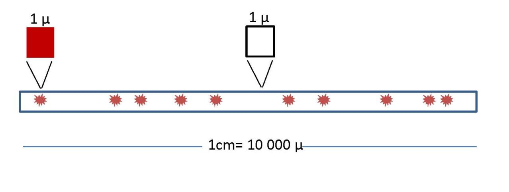
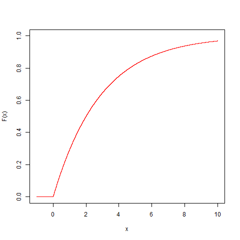

# Modelos de Poisson y Exponencial

## Objetivo

En este capítulo veremos dos modelos de probabilidad estrechamente relacionados: los modelos **Poisson** y **exponencial**.

El modelo de Poisson es para variables aleatorias discretas, mientras que la función exponencial es para variables aleatorias **continuas**

## Modelos de probabilidad para variables discretas

En el capítulo anterior construimos modelos complejos a partir de modelos simples. En cada etapa, introdujimos algún concepto novedoso:

**Uniforme**: interpretación clásica de la probabilidad
</br>$\downarrow$ 
</br>**Bernoulli**: Introducción de un **parámetro** $p$ (familia de modelos)
</br>$\downarrow$ 
</br>**Binomial**: Introducción a la **Repetición** de un experimento aleatorio ($n$ ensayos de Bernoulli)
</br>$\downarrow$ 
</br>**Poisson**: Repetición de un experimento aleatorio dentro de un intervalo continuo, sin **control** sobre cuándo/dónde ocurre el ensayo de Bernoulli.  

El último modelo es para procesos de Poisson que describen la repetición de un experimento aleatorio con la aleatoriedad adicional del momento en que la repeticiones se producen.


## Experimento de Poissson

Imagina que estamos observando eventos que **dependen** de **intervalos** de tiempo o distancia.

Por ejemplo:

- coches que llegan a un semáforo
- mensajes que recibimos en el teléfono móvil
- impurezas que ocurren al azar en un alambre de cobre

Supongamos que los eventos son resultados de ensayos de Bernoulli **independientes**, cada uno de los cuales aparece aleatoriamente en un intervalo continuo, y queremos **contarlos**.

¿Cuál es la probabilidad de observar $X$ eventos en una unidad de intervalo (tiempo o distancia)?

**Ejemplo (Impurezas en un alambre):**

Imaginemos que algunas impurezas se depositan al azar a lo largo de un cable de cobre. Quieremos contar el número de impurezas en un centímetro de alambre ($X$).

Considera que sabemos que en promedio hay $10$ impurezas por centímetro $\lambda=10/cm$.

¿Cuál es la probabilidad de observar $X=5$ impurezas en una muestra de un centímetro en particular?

## Función de masa de probabilidad de Poisson

Para calcular la función masa de probabilidad $f(x)=P(X=x)$ del ejemplo anterior dividimos el centímetro en micrómetros ($0.0001cm$).

Los micrómetros son lo suficientemente pequeños como para

1) que hay ao no haya una impureza en cada micrómetro

2) cada micrómetro se pueda considerar como un **ensayo de Bernoulli**





**De la función binomial a la función de probabilidad de Poisson**

La probabilidad de observar $X$ impurezas en $n=10,000\mu$ (1cm) sigue aproximadamente una distribución binomial

$$f(x) \sim \binom nxp^x(1-p)^{nx}$$

donde $p$ es la probabilidad de encontrar una impureza en un micrómetro.

Dado que el valor esperado de una variable Binomial es $E(X)=np$. Este es el número promedio de impurezas por 1 cm o $\lambda=np$. Por lo tanto, sustituimos $p=\lambda/n$

$$f(x) \sim \binom nx \big(\frac{\lambda}{n}\big)^x(1-\frac{\lambda}{n})^{nx}$$


Dado que **podría** haber todavía dos impurezas en un micrómetro, necesitamos aumentar la partición del alambre y $n \rightarrow \infty$.

Luego en el límite:

$$f(x)= \frac{e^{-\lambda}\lambda^x}{x!}$$


Donde $\lambda$ es constante porque es la densidad de impurezas por centímetro, una **propiedad física** del sistema. $\lambda$ es por lo tanto el **parámetro** del modelo de probabilidad.

**Detalles de la derivación:**

Para $f(x) \sim \binom nx \big(\frac{\lambda}{n}\big)^x(1-\frac{\lambda}{n})^{nx}$

en el límite ($n \rightarrow \infty$)

1) $\frac{1}{n^x}\binom n x =\frac{1}{n^x}\frac{n!}{x! (n-x)!}=\frac{(n-x)!(n-x+1)...(n-1)n}{n^x x! (n-x)!}=\frac{n(n-1)..(n-x+1)}{n^x x!} \rightarrow \frac{1}{x!}$
2) $(1-\frac{\lambda}{n})^{n} \rightarrow e^{-\lambda}$ (definition of exponential)
3) $(1-\frac{\lambda}{n})^{-x} \rightarrow 1$

Poniendo todo junto entonces:

$f(x)= \frac{e^{-\lambda}\lambda^x}{x!}$

**Definición**

Dado

1) un intervalo en los números reales
2) hay eventos que ocurren al azar en el intervalo
3) se conoce el número promedio de eventos en el intervalo ($\lambda$)
4) si se puede encontrar una pequeña partición regular del intervalo tal que en cada partición la podamos considerar como un ensayo de Bernoulli.

Entonces, la variable aleatoria $X$ que cuenta eventos a lo largo del intervalo es una variable **Poisson** con función de masa de probabilidad
$$f(x)= \frac{e^{-\lambda}\lambda^x}{x!}, \lambda>0$$

**Propiedades:**
Cuando $X \rightarrow Poiss(\lambda)$ tiene

1) media $$E(X)= \lambda$$
2) y varianza $$V(X)= \lambda$$


**Ejemplos**

1) ¿Cuál es la probabilidad de recibir 4 correos electrónicos en una hora, cuando el promedio de correos electrónicos en una hora es de $1$?

Tenemos que la varible es de Poisson: $X \rightarrow Poiss(\lambda)$ con $\lambda=1$ y su función de masa de probabilidad es:

$$f(x)= \frac{e^{-1}1^x}{x!}$$
Por lo tanto la probabilidad de que la variable tome valor 4 es $P(X=4)$:

$f(4; \lambda=1)= \frac{e^{-1}1^4}{4!}=0.01532831$


in R <code>dpois(4,1)</code>


2) ¿Cuál es la probabilidad de recibir 4 correos electrónicos en **tres horas**, cuando el promedio de correos electrónicos en una hora es de $1$?


La unidad sobre la cual hacemos los conteos ha cambiado de 1 hora a 2 horas, por lo tanto tenemos que **re-escalar** $\lambda$. Si antes el promedio de correos era $\lambda=1$ en una hora, el promedio de correos en tres horas es ahora 3: $\lambda_{3h}=3\lambda_{1h}=3*1=3$

Tenemos que la varible es de Poisson: $X \rightarrow Poiss(\lambda_{3h})$ con $\lambda_{3h}=3$ y su función de masa de probabilidad es:

$$f(x)= \frac{e^{-3}3^x}{x!}$$
Por lo tanto la probabilidad de que la variable tome valor 4 es $P(X=4)$:

$f(4; \lambda=3)= \frac{e^{-3}3^4}{4!}=0.1680314$


in R <code>dpois(4,3)</code>

3) ¿Cuál es la probabilidad de contar **al menos** $10$ automóviles que llegan a un peaje en un minuto, cuando el promedio de automóviles que llegan a un peaje en un minuto es de $5$;

Tenemos que la varible es de Poisson: $X \rightarrow Poiss(\lambda)$ con $\lambda=5$ y su función de masa de probabilidad es:

$$f(x)= \frac{e^{-5}5^x}{x!}$$

$P(X\geq 10)=1-P(X < 10)=1-P(X \leq 9)=1-F(9; \lambda=5)=1-\sum_{x=0, ...10}f(x; \lambda=5)=0.03182806$

en R  <code>1-ppois(9,5)</code>


Veamos algunas funciones de masa de probabilidad en la familia de modelos paramétricos de Poisson:

```{r, echo=FALSE}
par(mfrow=c(1,2))
outcome <- 0:10
probability <- dpois(outcome,0.5)
plot(outcome, probability, pch=16,col="red", main="Poiss(lambda=0.5)")
for(i in 1:length(outcome))
{lines(c(outcome[i], outcome[i]), c(0, probability[i]), col="red")}

outcome <- 0:20
probability <- dpois(outcome,5)
plot(outcome, probability, pch=16,col="red", main="Poiss(lambda=5)")
for(i in 1:length(outcome))
{lines(c(outcome[i], outcome[i]), c(0, probability[i]), col="red")}
```

## Modelos de probabilidad para variables continuas

Los modelos de probabilidad para variables continuas son **funciones de densidad** de probabilidad $f(x)$ que **creemos** describen experimentos aleatorios reales.

La función de densidad de probabilidad $f(x)$

1) es positiva

$$f(x) \geq 0$$

2) nos permite calcular probabilidades usando el área bajo la curva:


$$P(a\leq X \leq b)=\int_{a}^{b} f(x) dx$$

3) es tal que la probabilidad de que obtengamos cualquier resultado es $1$:

$$\int_{-\infty}^{\infty} f(x) dx = 1$$

## Experimento exponencial


Volvamos a un **proceso de Poisson** definido por la probabilidad

$$f(k)=\frac{e^{-\lambda}\lambda^k}{k!}, \lambda>0$$

para el número de eventos ($k$) en un intervalo.

Consideremos ahora que estamos interesados en la duración/tiempo que debemos esperar hasta que ocurra el **primer** conteo.

Podemos preguntarnos por la probabilidad de que el primer evento ocurra después de la duración/tiempo $X$.


Por lo tanto, dado que $X$ es una variable aleatoria **continua**, buscamos su función de densidad de probabilidad $f(x)$.


## Densidad de probabilidad exponencial

La probabilidad de $0$ eventos **si** un intervalo tiene unidad $x$ (rescalando como en el ejemplo 2) es

$$f(0|x)=\frac{e^{-x\lambda}(x\lambda)^0}{0!}$$

o

$$f(0|x)=e^{-x\lambda}$$

Podemos tratar esto como la probabilidad condicional de $0$ eventos dada una distancia $x$: $f(K=0|X=x)$ y aplicar el teorema de Bayes para invertirlo:

$$f(x|0)=C f(0|x)=C e^{-x\lambda}$$

Esta es la **probabilidad de observar una distancia** $x$ para $0$ eventos. Esta es la distancia hasta el primer evento.


**Definición**

En un proceso de Poisson con parámetro $\lambda$ la probabilidad de esperar una distancia/tiempo $X$ entre dos conteos viene dada por la **densidad de probabilidad**

$$f(x)= C e^{-x\lambda}$$

- $C$ es una constante que asegura: $\int_{-\infty}^{\infty} f(x) dx =1$

- por integración $C=\lambda$

Por lo tanto:

$$f(x)=\lambda e^{-\lambda x}, x\geq 0$$

 $\lambda$ es el parámetro del modelo, también conocido como **tasa de decaimiento**.


**Propiedades:**

Cuando $X \rightarrow Exp(\lambda)$ entonces

1) tiene media

$$E(X)=\frac{1}{\lambda}$$

2) y varianza
$$V(Y)=\frac{1}{\lambda^2}$$

Veamos un par de densidades de probabilidad en la familia exponencial


```{r, echo=FALSE}
par(mfrow=c(1,2))

x <- seq(-1,10, 0.00001)
fx <- 0.5*exp(-0.5*(x))
fx[x<0] <- 0       
plot(x, fx, type="l", col="red", ylab="f(x)", xlab="x", main="f(lambda=0.5)")
lines(c(0, 0), c(0, 2), lty=2) 


x <- seq(-1,10, 0.00001)
fx <- 2*exp(-2*(x))
fx[x<0] <- 0       
plot(x, fx, type="l", col="red", ylab="f(x)", xlab="x", main="f(lambda=2)")
lines(c(0, 0), c(0, 2), lty=2) 
```

## Distribución exponencial

Consideremos las siguientes preguntas:

1) En un proceso de Poisson ¿Cuál es la probabilidad de observar un intervalo **menor** que $a$ hasta el primer evento?

Recuerda que esta probabilidad $F(a)=P(X \leq a)$ es la densidad de probabilidad

$$F(a)=\lambda\int_\infty^ae^{-x\lambda}dx=1-e^{-a\lambda}$$
2) En un proceso de Poisson ¿Cuál es la probabilidad de observar un intervalo **mayor** que $a$ hasta el primer evento?

$$P(X > a)=1- P(X \leq a)= 1- F(a) = e^{-a\lambda}$$


Veamos un par de distribuciones exponenciales de la familia exponencial


```{r, echo=FALSE}
par(mfrow=c(1,2))
x <- seq(-1,10, 0.00001)
Fx <- 1 -exp(-0.5*(x))
Fx[x < 0] <- 0 

plot(x, Fx, type="l", col="red", ylab="F(x)", xlab="x", main="F(lambda=0.5)", ylim=c(0,1))

lines(c(log(2)/0.5,log(2)/0.5), c(0,0.5), lty=2)
lines(c(-10,log(2)/0.5), c(0.5,0.5), lty=2)


x <- seq(-1,20, 0.001)
Fx <- 1 -exp(-0.2*(x))
Fx[x < 0] <- 0 

plot(x, Fx, type="l", col="red", ylab="F(x)", xlab="x", main="F(lambda=2)", ylim=c(0,1))

lines(c(log(2)/0.2,log(2)/0.2), c(0,0.5), lty=2)
lines(c(-10,log(2)/0.2), c(0.5,0.5), lty=2)

```


La mediana $x_m$ es tal que $F(x_m)=0.5$. Eso es $x_m=\frac{\log(2)}{\lambda}$


**Ejemplos**

1) ¿Cuál es la probabilidad de que tengamos que esperar un bus por más de $1$ hora cuando en promedio hay dos buses por hora?

$$P(X > 1)=1-P(X \le 1) = 1-F(1,\lambda=2)=0.1353353$$

En R <code>1-pexp(1,2)</code>


2) ¿Cuál es la probabilidad de tener que esperar menos de $2$ segundos para detectar una partícula cuando la tasa de desintegración radiactiva es de $2$ partículas por segundo; $F(2,\lambda=2)$

$$P(X\le 2)=F(2,\lambda=2)=0.9816844$$


En R <code>pexp(2,2)</code>


## Preguntas


**1)** Durante la Segunda Guerra Mundial, en un día de bombardeo sobre Londres, el valor  eperado de que cayera una bomba en $1.5km^2$ era de $0.92$. La probabilidad de que en Hyde Park, de área aproximadamente $1.5km^2$, cayeran como mucho dos bombas era de

**$\qquad$a:**<code>1-ppois(x=2, lambda=0.92)</code>;
**$\qquad$b:**<code>ppois(x=2, lambda=0.92)</code>; **$\qquad$c:**<code>1-dpois(x=2, lambda=0.92)</code>; **$\qquad$d:**<code>dpois(x=2, lambda=0.92)</code> 


**2)** La probabilidad de que un pasajero tenga que esperar menos de 20 minutos hasta que llegue el próximo taxi a su parada está mejor descrita por

**$\qquad$a:** Un modelo de Poisson sobre el número de taxis que pasan cada 20 minutos;
**$\qquad$b:** Una distribución exponencial con $\lambda=1/20$ ;
**$\qquad$c:** Un modelo binomial que cuenta el número de taxis cada 20 minutos
**$\qquad$d:** Una distribución uniforme entre 0 y 20 minutos;

**3)** A partir de la distribución de probabilidad exponencial de la siguiente figura, ¿cuál es el valor más posible de la mediana?

**$\qquad$a:** $2$; **$\qquad$b:** $3$; **$\qquad$c:** $4$; **$\qquad$d:** $5$





## Ejercicios

#### Ejercicio 1

El promedio de llamadas telefónicas por hora que ingresan a la centralita de una empresa es de $150$. Encuentra la probabilidad de que durante un minuto en particular haya

- 0 llamadas telefónicas (R:0.082)
- 1 llamada telefónica (R:0.205)
- 4 o menos llamadas (R:0.891)
- más de 6 llamadas telefónicas (R:0.0141)

#### Ejercicio 2

La cantidad promedio de partículas radiactivas que golpean un contador Geiger en una planta de energía nuclear bajo control es de $2.3$ por minuto.

- ¿Cuál es la probabilidad de contar exactamente $2$ partículas en un minuto? (R:0.265)

- ¿Cuál es la probabilidad de detectar exactamente $10$ partículas en $5$ minutos? (R:0.112)

- ¿Cuál es la probabilidad de al menos un conteo en dos minutos? (R:0.9899)

- ¿Cuál es la probabilidad de tener que esperar menos de $1$ segundo  para detectar una partícula radiactiva, después de encender el detector? (R:0.037)

- Sospechamos que una planta nuclear tiene una fuga radiactiva si esperamos menos de $1$ segundo para detectar una partícula radiactiva, después de encender el detector. ¿Cuál es la probabilidad de que cuando visitemos $5$ plantas que están bajo control, sospechemos que al menos una tiene una fuga? (R:0.1744).


