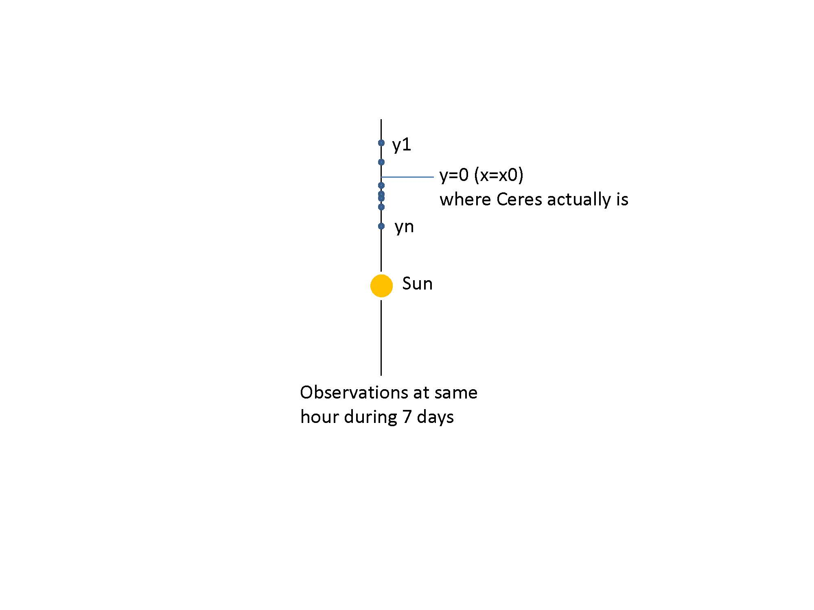
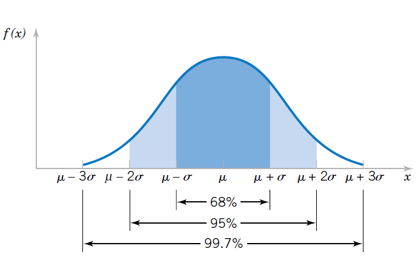
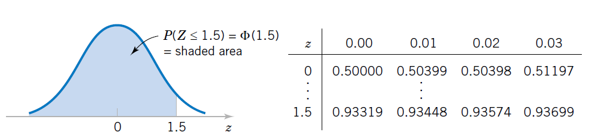
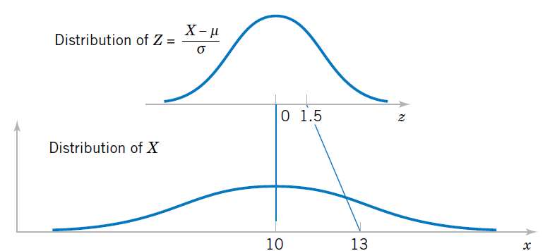

# Distribución normal

## Objetivo


En este capítulo introduciremos la distribución de probabilidad normal.

Hablaremos de su origen y de sus principales propiedades.

## Historia

En 1801, Gauss analizó los datos obtenidos sobre la posición de Ceres, un gran asteroide entre Marte y Júpiter.

En ese momento, la gente sospechaba que era un nuevo planeta, ya que se movía día a día contra las estrellas fijas. En enero, se podía ver en el horizonte justo antes del amanecer. Sin embargo, a medida que pasaban los días, Ceres salía cada vez más tarde hasta que ya no se pudo ver más debido a la salida del Sol.

Gauss entendió que las medidas para la posición de Ceres tenían errores.

Por lo tanto, estaba interesado en descubrir cómo se **distribuían** las observaciones para poder encontrar la órbita más **probable**. Con la órbita, podía derivar la masa del objeto y luego decidir si era un planeta o sólo un gran asteroide.

Los datos estaban disponibles sólo para el mes de enero. Después de lo cual Ceres desaparecería. Quería **predecir** hacia dónde deberían apuntar los astrónomos sus telescopios para encontrarlo seis meses después al anochecer, una vez que hubiera pasado por detrás del Sol.


Gauss tuvo que dar cuenta de los errores en la posición de ceres en un día determinado debido a la medición




Gauss supuso que

1) los errores pequeños eran más probables que los errores grandes

2) el error a una distancia $-\epsilon$ del varlor en la posición de Ceres era igualmente probable que una distancia $\epsilon$ 

3) la pisición más **verosimil** (que nos creemos más) de Ceres en un momento dado en el cielo era el **promedio** de múltiples mediciones de altitud en esa latitud.


Eso fue suficiente para mostrar que las desviaciones de las observaciones $y$ **de la órbita** satisfacian la ecuación

$$\frac{df(y)}{dy}=-Cyf(y)$$
con $C$ una costante positiva. La solución de esta ecuación diferencial es:

$$f(y)=\frac{\sqrt{C}}{\sqrt{2\pi}}e^{-\frac{Cy^2}{2}}$$

*The evolution of the normal distribution, Saul Stahl, Mathemetics Magazine, 2006.


## Densidad normal

Densidad de probabilidad de Gauss da la distribución de los errores de medición desde la posición **real** pero **desconocida** de Ceres en el cielo. Hagamos un par de cambios en la función.

1- Escribamos la densidad de errores desde el horizonte usando la variable aleatoria $X$, o sea $y=x-\mu$. $\mu$ es la posición **real** pero **desconocida** de Ceres desde el horizonte. Después de un cambio de variable encontramos la función de densidad de probabilidad:

$$f(x)=\frac{\sqrt{C}}{\sqrt{2\pi}}e^{-C(x-\mu)^2}$$

2) Cambiemos de nombre la variable $C$ por $\frac{1}{\sigma^2}$

Entonces, llegamos a la siguente definición.


## Definición

Una variable aleatoria $X$ definida en los números reales tiene una densidad **Normal** si toma la forma

$$f(x; \mu, \sigma^2)=\frac{1}{\sqrt{2\pi}\sigma}e^{-\frac{(x-\mu)^2}{2\sigma^2}}, x \in {\mathbb R}$$


La variable tiene

1) media

$$E(X) = \mu$$


que para Gauss representaba la posición real de Ceres.


2) y varianza
$$V (X) = \sigma^2$$


que representaba la dispersión del error en las observaciones, que depende de la calidad del telescopio.

$\mu$ y $\sigma$ son los **dos parámetros** que describen completamente la función de densidad normal y su **interpretación** depende del experimento aleatorio.

Cuando $X$ sigue una densidad Normal, es decir, se distribuye normalmente, escribimos

$$X\rightarrow N(\mu,\sigma^2)$$


Veamos algunas densidades de probabilidad en el modelo paramétrico normal


```{r, echo=FALSE}
outcome <- seq(0,25,0.01)
probability <- dnorm(outcome,10, 1)
plot(outcome, probability, pch=16,col="red",type="l")
probability <- dnorm(outcome,10, 4)
lines(outcome, probability, pch=16,col="blue")
probability <- dnorm(outcome,20, 1)
lines(outcome, probability, pch=16,col="orange")
legend("topleft", legend=c("N(mu=10, sigma=1)","N(mu=10, sigma=4)","N(mu=20, sigma=1)"), col=c("red", "blue", "orange"), lty=1, bty="n")
```

## Distribución de probabilidad

La distribución de probabilidad de la densidad Normal:


$$F(a)=P(Z \leq a)$$

es la función de **error** definida por el área bajo la curva de $-\infty$ a $a$

$$F(a)=\int_{-\infty}^{a}\frac{1}{\sqrt{2\pi}\sigma}e^{-\frac{(x-\mu) ^2}{2\sigma^2}} dx$$
La función se encuentra en la mayoría de los programas de computadora y no tiene una forma cerrada de funciones conocidas.


**Ejemplo (altura de mujeres)**

1) ¿Cuál es la probabilidad de que una mujer de la población tenga una altura máxima de $150 cm$ si las mujeres tienen una altura media de $165 cm$ con una desviación estándar de $8 cm$?

$P(X\le 150)=F(150, \mu=165, \sigma=8)=0.03039636$

en R <code>pnorm(150, 165, 8)</code>


2) ¿Cuál es la probabilidad de que la altura de una mujer en la población esté entre $165cm$ y $170cm$?

$P(165 \le X \le 170)=F(170, \mu=165, \sigma=8)-F(165, \mu=165, \sigma=8)=0.2340145$

en R <code>pnorm(170, 165, 8)-pnorm(165, 165, 8)</code>

Veamos la función de distribución de probabilidad


```{r, echo=FALSE}
outcome <- seq(130,185,0.01)
probability <- pnorm(outcome,165, 8)
plot(outcome, probability, pch=16,col="red",type="s", ylab="F(a)", xlab="a")


lines(c(150, 150), c(0,pnorm(150,165, 8)), lty=2, col="blue")
lines(c(0, 150), c(pnorm(150,165, 8),pnorm(150,165, 8)), lty=2, col="blue")


lines(c(165,165), c(0,pnorm(165,165, 8)), lty=2, col="green")
lines(c(0, 165), c(pnorm(165,165, 8),pnorm(165,165, 8)), lty=2, col="green")


lines(c(170, 170), c(0,pnorm(170,165, 8)), lty=2, col="green")
lines(c(0, 170), c(pnorm(170,165, 8),pnorm(170,165, 8)), lty=2, col="green")

lines(c(129, 129), c(0,pnorm(150,165, 8)), col="blue", lwd=2)

lines(c(129, 129), c(pnorm(165,165, 8),pnorm(170,165, 8)), col="green", lwd=2)


```


3) ¿Cuál es el primer cuartíl para altura de las mujeres?

El primer cuartíl se define como:

$F(x_{0.25}, \mu=165, \sigma=8)=0.25$

o

$x_{0.25}=F^{-1}(0.25, \mu=165, \sigma=8)=159.6041$


en R <code>qnorm(0.25, 165, 8)</code>


**Propiedades de la distribución Normal**

1) la media $\mu$ es también la mediana ya que divide las medidas en dos

2) Los valores de $x$ que caen más allá de 2$\sigma$ se consideran **raros** $5\%$

3) Los valores de $x$ que caen más allá de 3$\sigma$ se consideran **extremadamente raros** $0.2\%$




**Ejemplo (altura de mujeres)**

Podemos definir los límites de **observaciones comunes** para la distribución de la altura de las mujeres en la población.

1) a una distancia de una desviación estándar de la media, encontramos $68\%$ de la población

$$P(165-8 \leq X \leq 165+8)=P(157 \leq X \leq 173)=F(173)-F(157)=0.68$$


2) a una distancia de dos desviaciones estándar de la media, encontramos $95\%$ de la población

$$P(165-2 \times 8 \leq X \leq 165+2\times 8)=F(181)-F(149)=0.95$$

3) a una distancia de tres desviaciones estándar de la media, encontramos $99.7\%$ de la población


$$P(165-3 \times 8 \leq X \leq 165+3\times 8)=F(189)-F(141)=0.997$$


```{r, echo=FALSE}
outcome <- seq(130,195,0.01)
probability <- pnorm(outcome,165, 8)
plot(outcome, probability, pch=16,col="red",type="s", ylab="F(a)", xlab="a", xlim=c(130, 200))


text(140, 0.55, "mu")

lines(c(165, 165), c(0,0.5), lty=2)
lines(c(0, 165), c(0.5,0.5), lty=2)


zzi <- pnorm(165-8, 165, 8)

lines(c(165-8,165-8), c(0,zzi), lty=2, col="green")
lines(c(0, 165-8), c(zzi, zzi), lty=2, col="green")


zzs <- pnorm(165+8, 165, 8)

lines(c(165+8,165+8), c(0,zzs), lty=2, col="green")
lines(c(0, 165+8), c(zzs, zzs), lty=2, col="green")

lines(c(129, 129), c(zzi, zzs), col="green", lwd=2)


zzi <- pnorm(165-16, 165, 8)

lines(c(165-16,165-16), c(0,zzi), lty=2, col="blue")
lines(c(0, 165-16), c(zzi, zzi), lty=2, col="blue")


zzs <- pnorm(165+16, 165, 8)

lines(c(165+16,165+16), c(0,zzs), lty=2, col="blue")
lines(c(0, 165+16), c(zzs, zzs), lty=2, col="blue")

lines(c(130, 130), c(zzi, zzs), col="blue", lwd=2)


zzi <- pnorm(165-24, 165, 8)

lines(c(165-24,165-24), c(0,zzi), lty=2, col="orange")
lines(c(0, 165-24), c(zzi, zzi), lty=2, col="orange")


zzs <- pnorm(165+24, 165, 8)

lines(c(165+24,165+24), c(0,zzs), lty=2, col="orange")
lines(c(0, 165+24), c(zzs, zzs), lty=2, col="orange")

lines(c(131, 131), c(zzi, zzs), col="orange", lwd=2)

legend(187, 0.7, c("68%", "95%", "99.7%"), lwd=2, col=c("green", "blue", "orange"))


```


## Densidad normal estándar

La densidad normal estándar es la densidad particular de la familia normal


$$f(x; \mu, \sigma^2)=\frac{1}{\sqrt{2\pi}\sigma}e^{-\frac{(x-\mu)^2}{2\sigma^2}}, x \in {\mathbb R}$$


Por lo tanto, es la densidad con

1) media

$$E(X)= \mu = 0$$

2) y varianza

$$V (X)= \sigma^2 =1$$

Cuando una variable aleatoria sigue una densidad de probabilidad normal, decimos que se distribuye normalmente y escribimos

$$X \rightarrow N(0,1)$$

## Distribución estándar


La distribución estándar es:


$$\phi(a)=F_{N(0,1)}(a)=P(Z \leq a)$$

es la función **error** definida por

$$\phi(a)=\int_{-\infty}^{a} \frac{1}{\sqrt{2\pi}}e^{-\frac{z^2}{2}} dz$$

Debido a que la distribución estándar es especial y aparecerá con frecuencia, usamos la letra $\phi$ para ello.



Puedes encontrarla en la mayoría de los programas de computadora. En R es <code>pnorm(x)</code> con los parámetros predeterminados, 0 y 1.


Normalmente definimos los límites de las **observaciones más comunes** para la variable estándar


1) El rango intercuartílico $$P(-0.67 \leq X \leq 0.67)=0.50$$

en R: <code>c(qnorm(0.25), qnorm(0.75))</code>

2) El rango del $95\%$  $$P(-1.96 \leq X \leq 1.96)=0.95$$

en R: <code>c(qnorm(0.025), qnorm(0.975))</code>

3) El rango del  $99\%$ $$P(-2.58 \leq X \leq 2.58)=0.99$$

en R: <code>c(qnorm(0.005), qnorm(0.995))</code>


```{r, echo=FALSE}
outcome <- seq(-3,3,0.01)
probability <- pnorm(outcome,0, 1)
plot(outcome, probability, pch=16,col="red",type="s", ylab="phi(a)", xlab="a", xaxt = "n")

axis(1, at = round(c(-qnorm(0.995), -qnorm(0.975), 0, qnorm(0.975), qnorm(0.995)),2), cex.axis=1)


lines(c(0, 0), c(0,0.5), lty=2)
lines(c(-4, 0), c(0.5,0.5), lty=2)


zi <- qnorm(0.975)
qi <- 0.975

lines(c(-zi,-zi), c(0,1-qi), lwd=1.5 )
lines(c(-4,-zi), c(1-qi,1-qi),  lwd=1.5)


lines(c(zi,zi), c(0,qi),  lwd=1.5 )
lines(c(-4,zi), c(qi,qi),  lwd=1.5)


zi <- qnorm(0.995)
qi <- 0.995

lines(c(-zi,-zi), c(0,1-qi), lwd=2 )
lines(c(-4,-zi), c(1-qi,1-qi), lwd=2)


lines(c(zi,zi), c(0,qi),  lwd=2 )
lines(c(-4,zi), c(qi,qi), lwd=2)

```


## Estandarización


Todas las variables normales se pueden **estandarizar**. Esto significa que si $X \rightarrow N(\mu, \sigma^2)$, entonces podemos transformar la variable a
una **variable estandarizada**

$$Z=\frac{X-\mu}{\sigma}$$

que tendrá densidad:

$$f(z)=\frac{1}{ \sqrt{2\pi}}e^{-\frac{z^2}{2}}$$
Por lo tanto, para cualquier $X \rightarrow N(\mu, \sigma^2)$

$$Z=\frac{X-\mu}{\sigma} \rightarrow N(0, 1) $$




Puedes demostrar esto reemplazando $x=\sigma z+\mu$ y $dx=\sigma dz$ en la expresión de probabilidad que tenemos

$P(x\leq X \leq x +dx)=P(z\leq Z \leq z +dz)$
$$=\frac{1}{\sqrt{2\pi}\sigma}e^{-\frac{(x-\mu)^2}{2\sigma^2}}dx$$ $$=\frac{1}{ \sqrt{2\pi}}e^{-\frac{z^2}{2}} dz$$


La probabilidad de **cualquier variable normal** $X\rightarrow N(\mu, \sigma^2)$ se puede calcular usando la distribución estándar

$F(a)=P(X<a)=P(\frac{X-\mu}{\sigma}<\frac{a-\mu}{\sigma})$
$$=P(Z < \frac{a-\mu}{\sigma})= \phi \big(\frac{a-\mu}{\sigma}\big)$$


Para calcular $P(a\leq X \leq b)$, usamos la propiedad de las distribuciones de probabilidad

$F(b)-F(a)=P(X\leq b)-P(X\leq a)$

$$=\phi \big(\frac{b-\mu}{\sigma}\big)-\phi \big(\frac{a-\mu}{\sigma}\big)$$


## Resumen de modelos de probabilidad

| Modelo | X | rango de x | f(x) | E(X) | V(X) |
|:-----:|:------:|:------:|:-----:|:----:|:----:|
| Uniforme | número entero o real | $[a,b]$| $\frac{1}{n}$ |$\frac{b+a}{2}$ | $\frac{(b-a+1)^2-1}{12}$ |
| Bernoulli | evento A (1) | 0,1 | $(1-p)^{1-x}p^x$ | $p$ | $p(1-p)$ |
| Binomial | \# de eventos A en $n$ repeticiones de ensayos de Bernoulli| 0,1,...| $\binom nx (1-p)^{nx}p^x$ | $np$ | $np(1-p)$ |
| Binomial negativo para eventos | \# de eventos B (0) en repeticiones de Bernoulli antes de $r$ eventos A (1) | 0,1,.. |$\binom {x+r-1} x (1-p)^xp^r$ | $\frac{r(1-p)}{p}$ | $\frac{r(1-p)}{p^2}$ |
| Hipergeométrico | \# de eventos A en una muestra $n$ de la población $N$ con $K$ numero de As|$\max(0, n+KN)$, ... $\min(K, n)$ | $\frac{1}{\binom N n}\binom K x \binom {N-K} {n-x}$ | $n*\frac{N}{K}$ | $n \frac{N}{K} (1-\frac{N}{K})\frac{Nn}{N-1}$ |
| Poisson | \# de eventos A en un intervalo | 0,1, ..| $\frac{e^{-\lambda}\lambda^x}{x!}$ | $\lambda$ | $\lambda$ |
| Exponencial | Intervalo entre dos eventos A | $[0,\infty)$ | $\lambda e^{-\lambda x}$ | $\frac{1}{\lambda}$ | $\frac{1}{\lambda^2}$ |
| Normal | medida con errores simétricos cuyo valor más probable es la media | $(-\infty, \infty)$|$\frac{1}{\sqrt{2\pi}\sigma}e^{-\frac{(x-\mu)^2}{2\sigma^2 }}$ | $\mu$ |$\sigma^2$ |


## Funciones R de modelos de probabilidad

| modelo | R f(x) | R F(x) |
|:----- |:----:|:----:|
| Uniforme (continuo) | <code>dunif(x, a, b)</code>|<code>punif(x, a, b)</code>|
| Binomial | <code>dbinom(x,n,p)</code> | <code>pbimon(x,n,p)</code> |
| Binomial negativo para eventos |<code>dnbinom(x,r,p)</code> |<code>pnbinom(x,r,p)</code> |
| Hipergeométrico | <code>dhyper(x, K, N-K, n)</code> |<code>phyper(x, K, N-K, n)</code> |
| Poisson |<code>dpois(x, lambda)</code> |<code>ppois(x, lambda)</code> |
| Exponencial | <code>dexp(x, lambda)</code> |<code>pexp(x, lambda)</code> |
| normales | <code>dnorm(x, mu, sigma)</code> | <code>pnomr(x, mu, sigma)</code> |


## Preguntas


**1)** Para una variable normal estándar 

**$\qquad$a:** $50\%$ de sus observaciones están entre $(-0.67,0.67)$;
**$\qquad$b:** $2\%$ de sus observaciones son inferiores a $-2.58$;
**$\qquad$c:** $5\%$ de sus observaciones son superiores a $1.96$;
**$\qquad$d:** $25\%$ de sus observaciones están entre $(-1.96,-0.67)$

**2)** si sabemos que $\phi(-0.8416212)=0.2$ entonces que es $\phi(0.8416212)$

**$\qquad$a:** $0.1$;
**$\qquad$b:** $0.2$;
**$\qquad$c:** $0.8$;
**$\qquad$d:** $0.9$

**3)** el tercer cuartil de una variable normal con media $10$ y desviación estándar $2$ es


**$\qquad$a:** <code>qnorm(1/3, 10, 2)=9.138545</code>;
**$\qquad$b:** <code>qnorm(1-0.75, 10, 2)=8.65102 </code>;
**$\qquad$c:** <code>qnorm(1-1/3, 10, 2)=10.86145 </code>;
**$\qquad$d:** <code>qnorm(0.75, 10, 2)= 11.34898 </code>


**4)** la probabilidad de que una variable normal con media $10$ y desviación estándar $2$ esté en $(-\infty,10)$ es

**$\qquad$a:** 0.25;
**$\qquad$b:** 0.5;
**$\qquad$c:** 0.75;
**$\qquad$d:** 1:


**5)** No es cierto que para una variable normal estándar

**$\qquad$a:** su media y mediana son iguales; **$\qquad$b:** la distribución de probabilidad estándar se puede utilizar para calcular sus probabilidades; **$\qquad$c:** su rango intercuartílico es el doble de su desviación estándar; **$\qquad$d:** $5\%$ de sus observaciones están a una distancia desde $0$ mas grande que su desviación estándar 


## Ejercicios

#### Ejercicio 1

Encuentra el área bajo la curva normal estándar en los siguientes casos:

- Entre $z=0.81$ y $z=1.94$ (R:0.182)
- A la derecha de $z=-1.28$ (R:0.899)
- A la derecha de $z=2.05$ o a la izquierda de $z=-1.44$ (R:0.0951)

#### Ejercicio 2

- ¿Cuál es la probabilidad de que la altura de un hombre sea al menos
$165$cm si la media poblacional es $175$cm y la desviación estándar es $10$cm? (R:0.841)


- ¿Cuál es la probabilidad de que la altura de un hombre esté entre
$165$cm y $185$cm? (R:0.682)

- ¿Cuál es la altura que define el $5\%$ de los hombres más pequeños? (R:158.55)


