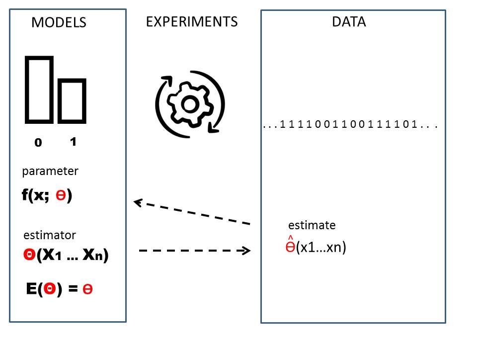
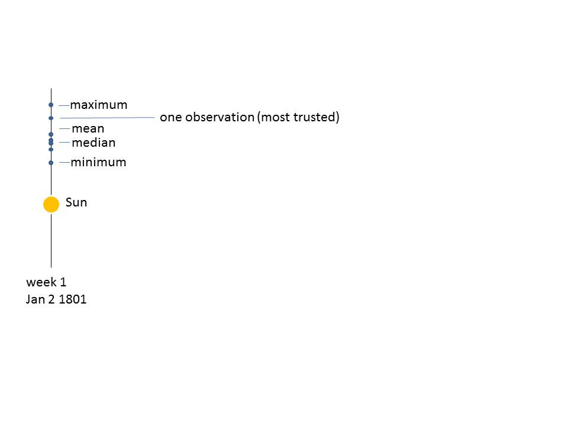
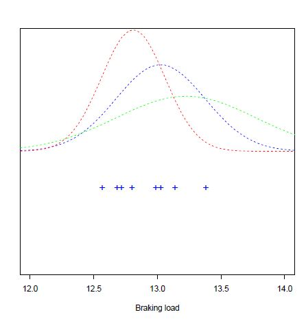

# Máxima verosimilitud y Método de los Momentos

## Objetivo


En este capítulo discutiremos qué es un **estimador** y daremos algunos ejemplos. Luego introduciremos dos métodos para obtener **estimadores** de los parámetros de los modelos de probabilidad.

Estos son la **máxima verosimilitud** y el **método de los momentos**.


## Estadística


**Definición**

Una **estadística** es cualquier función de una **muestra aleatoria**
$$T(X_1,X_2, ..., X_n)$$
 
Por lo general, devuelve un número.

Las estadísticas son **variables aleatorias** y sus **distribuciones de probabilidad** se llaman **distribuciones de muestreo**

Las estadísticas tienen diferentes funciones:

1. **Descripción** de los datos de una muestra
- ubicación: $\bar{X}$
- Mínimo: $\min\{X_i\}$
- Máximo: $\max\{X_i\}$

2. **Estimación** de los **parámetros** de un modelo de probabilidad

- media: $\bar{X}$ para $\mu$
- varianza: $S^2$ para $\sigma^2$

3. **Inferencia** para decir algo sobre los parámetros dados los datos

- media: $Z$, $T$
- varianza: $\chi^2$

Recuerda: Todas son variables aleatorias. Cada vez que tomamos otra muestra cambian su valor.


**Definición de estimadores**

Un **estimador** es un estadístico cuyos valores observados se utilizan para estimar los **parámetros** de la distribución de la población sobre la que se define la muestra.

Si escribimos la distribución de la población como

$$X \rightarrow f(x; \theta)$$

entonces $\theta$ es un parámetro y $\Theta$ es una variable aleatoria cuyas observaciones $\hat{\theta}$ tomamos como estimaciones de $\theta$

$$\hat{\theta} \sim \theta$$


Por lo tanto hay tres cantidades diferentes que debemos considerar:

1. $\theta$ es un **parámetro** de la distribución de la población $f(x; \theta)$
2. $\Theta$ es un **estimador** de $\theta$: Una variable aleatoria
3. $\hat{\theta}$ es la **estimación** de $\theta$: un valor realizado de $\Theta$





**Ejemplo (media de la muestra)**

Cuando tenemos una variable aleatoria normal

$$X \rightarrow N(\mu, \sigma^2)$$

identificamos las tres cantidades diferentes:

1. $\mu$ es un **parámetro** de la distribución de la **población**: $N(\mu, \sigma^2)$
2. $\bar{X}=\frac{1}{n} \sum_{i=1}^n X_i$ es un **estimador** de $\mu$
3. $\bar{x}=\hat{\mu}$ es la **estimación** de $\mu$

**Ejemplo (varianza de la muestra)**

Cuando tenemos una variable aleatoria normal

$$X \rightarrow N(\mu, \sigma^2)$$

1. $\sigma^2$ es un **parámetro** de la distribución de la población
2. $S^2=\frac{1}{n-1} \sum_{i=1}^n (X_i-\bar{X})^2$ es un **estimador** de $\sigma^2$
3. $s^2=\hat{\sigma}^2$ es la **estimación** de $\sigma^2$


## Propiedades

1. Un estimador es **insesgado** si su valor esperado es el parámetro

$$E(\Theta)=\theta$$

Por ejemplo:

- $\bar{X}$ es un estimador **insesgado** de $\mu$ porque $E(\bar{X})=\mu$

- $S^2$ es un estimador **insesgado** de $\sigma^2$ porque $E(S^2)=\sigma^2$

2. Un estimador es **consistente** cuando sus valores observados están cada vez menos dispersos al rededor de la medida a medida que el tamaño de la muestra crece

$$lim_{n\rightarrow \infty} V(\Theta) = 0$$

Por ejemplo:

- $\bar{X}$ es **consistente** porque $V(\bar{X})=\frac{\sigma^2}{n}\rightarrow 0$ cuando $n \rightarrow \infty$.


## Máxima verosimilitud

¿Cómo se pueden obtener **estimadores** de los parámetros de **cualquier** modelo de probabilidad?

**Ejemplo (Láser)**

Imagina que diseñamos un láser con un diámetro de $1 mm$ que queremos usar para aplicaciones clínicas.

Queremos caracterizar el diámetro de un piercing en un tejido realizado con láser y tomar una muestra aleatoria de $30$ cortes  realizados con láser. Aquí están los resultados


```{r, echo=FALSE}

x <- seq(-0.5, 1.5, 0.001) + 1

fx <- function(x, alpha)
{
  out <- (1/alpha)*(x-1)^(1/alpha-1) 
  out[x<=1] <- 0
  out[x>=2] <- 0
  out
}

set.seed(123)
xobs <- seq(0,1,0.01) +1

sm <- sample(xobs, 30, prob = fx(xobs, 2), replace=TRUE)
sm
```

y el histograma

```{r, echo=FALSE}
hist(sm,  br=seq(0.55,2.55,0.05), main="Laser piercings", xlab="mm")
```

¿Cuál sería una función de probabilidad que podría describir los datos?

Para ello seguimos el siguiente proceso:

1. Proponemos **un modelo** que depende de parámetros
2. Derivamos los **estimadores** para los parámetros, por máxima verosimilitud o el método de momentos.
3. Finalmente usamos el estimador para **estimar los parámetros** con los datos.

*Proponiendo una densidad de probabilidad*

En muchas aplicaciones, podemos proponer la forma de una densidad de probabilidad que depende de algunos parámetros. Proponer un modelo de probabilidad se hace siguiendo **propiedades generales** de las observaciones, o lo que esperamos observar. El modelado requiere experiencia, habilidad y conocimiento de varias funciones matemáticas. Sin embargo, en la mayoría de los casos se suelen aplicar **modelos bien conocidos**.


**Ejemplo (Láser)**

En nuestro ejemplo, podemos considerar, por ejemplo, que se debe dar la máxima probabilidad a los diámetros de $x=1 mm$, y que los diámetros deben disminuir como la potencia inversa de algún parámetro **desconocido** $\alpha$, con un límite de $2mm$ más allá del cual la probabilidad es de $0$.

Una distribución de densidad de probabilidad adecuada es


\[
    f(x)= 
\begin{cases}
\frac{1}{\alpha}(x-1)^{\frac{1}{\alpha}-1},& \text{if } x \in (1,2)\\
    0,& x \notin (1,2)\\
\end{cases}
\]

Donde $\alpha$ es un parámetro. Esta es una densidad de probabilidad porque se integra a uno y es positiva. En particular, para $\alpha=2$ podemos graficarlo

```{r, echo=FALSE}
plot(x, fx(x,2), type="l")
```

*Derivar los estimadores*

Si realizamos una muestra de tamaño $n$: $(X_1,...X_n)$, ¿Cómo debemos combinar los datos para obtener el mejor valor de $\alpha$?

Muchos valores de para el parámetro podrían explicar los datos. Nos interesa **un criterio** para elegir un valor en particular.


```{r, echo=FALSE}
hist(sm,  br=seq(0.55,2.55,0.05), main="Laser piercings", xlab="mm", freq = FALSE)

lines(x, fx(x,1.2), type="l", col="blue")
lines(x, fx(x,2), type="l", col="red")
lines(x, fx(x,5), type="l", col="orange")

legend("topright", legend = c("alpha=1.2", "alpha=2", "alpha=5"), col= c("blue", "red", "orange"), lty=1)
```


El método de **máxima verosimilitud** nos da un estimador para $\alpha$

$$\hat{\alpha}_{ml}$$


## Máxima verosimilitud

El objetivo es encontrar el valor del parámetro que **creemos** es el que **mejor** representa los datos.

El método de máxima verosimilitud se basa en la búsqueda del valor del parámetro que hace más **probable** la **observación** de la muestra.

**Máxima verosimilitud paso 1**

Calculamos la probabilidad de haber observado la muestra $n$: $x_1,...x_n$. Es el producto de probabilidades porque las observaciones son independientes entre sí:

$P(M=x_1,...x_n)=P(X=x_1)P(X=x_2)...P(X=x_n)$
$$=f(x_1;\alpha)f(x_2;\alpha) ...f(x_n;\alpha)$$

A esta función la llamamos **función de verosimilitud** y consideramos que:

- Una vez observados los datos estos son **fijos**
- La incógnita es $\alpha$

$$L(\alpha)= \Pi_{i=1..n} f(x_i; \alpha)$$

**Ejemplo (Láser)**

Para el experimento con láser la función de verosimilitud es

$L(\alpha;x_1,..x_n)= \frac{1}{\alpha^n} \Pi_{i=1..n} (x_i-1)^{\frac{1-\alpha}{ \alpha}}= \frac{1}{\alpha^n} \{(x_1-1)(x_2-1)...(x_n-1)\}^{\frac{1-\alpha}{\alpha}}$


**Máxima verosimilitud paso 2**

Entonces nos preguntamos: ¿cuál es el valor de $\alpha$ que hace que la muestra observada sea el evento más probable? Por lo tanto, queremos maximizar $L(\alpha)$ con respecto a $\alpha$. Como tenemos la multiplicación de muchos factores es más fácil maximizar el logaritmo de $L(\alpha)$. Esto se llama la función logaritmo de verosimilitud:

$$\ln L(\alpha;x_1,..x_n)$$

**Ejemplo (Láser)**

En el ejemplo del láser, tomamos el logaritmo y obtenemos la **Logaritmo de verosimilitud**

$$\ln L(\alpha;x_1,..x_n)= -n \ln(\alpha) + {\frac{1-\alpha}{\alpha}} \Sigma_{i=1...n} \ln (x_i-1)$$

**Máxima verosimilitud paso 3**

Finalmente **maximizamos** el logaritmo de verosimilitud con respecto al parámetro. Por lo tanto, diferenciamos el log-verosimilitud con respecto al parámetro $\alpha$, igualamos a cero y resolvemos para el máximo.

$$\frac{d \ln L(\alpha)}{d \alpha} \big|_{\hat{\alpha}}=0 $$
El valor máximo del parámetro se denomina **estimación de máxima verosimilitud** para el parámetro y se escribe con un sombrero $\hat{\alpha}$.


**Ejemplo (Láser)**

Derivamos la función log-verosimilitud

$$\frac{d \ln L(\alpha)}{d \alpha}= -\frac{n}{\alpha} - \frac{1}{\alpha^2} \Sigma_{i=1.. .n} \ln (x_i-1)$$
El máximo es donde la derivada es $0$. Este máximo es el valor de nuestro estimador $\hat{\alpha}_{ml}$.

$$\hat{\alpha}_{ml}=-\frac{1}{n}\sum_{i=1}^n \ln (x_i-1)$$


El estimador del parámetro es por lo tanto (nótese las letras mayúsculas)


$$A=-\frac{1}{n}\sum_{i=1}^n \ln (X_i-1)$$

Que es una variable aleatoria, función de la muestra aleatoria

$$(X_1, X_2, ... X_n)$$

*Estimando los parámetros con los datos*

En nuestro ejemplo, tenemos entonces la observación de la muestra aleatoria como un conjunto de 30 números $(x_1, x_2, ...x_{30})$, por lo tanto sustituimos los números en el estimador y esto nos dará su  valor observado.

$\hat{\alpha}_{ml}=-\frac{1}{30}\{ \ln (1.11-1)+ \ln (1.64-1)+...\ln (1.04-1)\}=1.320$

Por lo tanto, la estimación de máxima verosimilitud del parámetro es $1.320$. Si sustituimos este valor en la función de probabilidad y lo superponemos con el histograma, podemos ver que nos da una descripción adecuada de los datos.


```{r, echo=FALSE}
hist(sm,  br=seq(0.55,2.55,0.05), main="Laser piercings", xlab="mm", freq = FALSE)

lines(x, fx(x,1.32), type="l", col="blue")

legend("topright", legend = c("alpha=1.32"), col= "blue", lty=1)
```


Veamos la función del logaritmo de la verosimilitud para nuestros $30$ cortes láser. Recuerda, los datos son fijos para nuestro experimento y $\alpha$ varía. La función tiene un máximo. Sin embargo, si tomamos otra muestra, esta función cambia y también su lo hará su máximo.


```{r, echo=FALSE}
alpha <- seq(1,2.5, 0.05)

LogLike <- function(a) sum(log(fx(sm,a)))

plot(alpha, sapply(alpha, LogLike), pch=16, main="LogLikeihood=log{f(x1, alpha)f(x2, alpha)...f(xn, alpha)}", ylab="LogLike")
points(1.3, LogLike(1.3), pch=16, col="red")

```


**Máxima verosimilitud: Historia**


Para inferir la verdadera posición de Ceres en un momento dado, Gauss derivó la función de error

$$f(x; \mu, \sigma^2)= \frac{1}{\sigma \sqrt{2 \pi}} e^{-\frac{1}{2\sigma^2} (x- \mu)^2}$$

Donde la posición **verdadera** de Ceres era la media $\mu$. ¿Cómo podemos combinar los datos para tener la mejor estimación de la posición de Ceres?

¿Cuál es la estadística que mejor puede describir su posición?




Esta pregunta se puede formular como: ¿Cuál es la estimación de máxima verosimilitud de $\mu$ para una variable aleatoria normal?

**Máxima verosimilitud de la distribución normal**


Para una variable aleatoria normal

$$X \rightarrow N(\mu, \sigma^2)$$.

¿Cuáles son los estimadores de $\mu$ y $\sigma^2$ que maximizan la probabilidad de los datos observados?





Seguimos el método de máxima verosimilitud:

1. La función de verosimilitud, o la probabilidad de haber observado la muestra $(x_1, ....x_n)$ es

$L(\mu, \sigma^2)=\Pi_{i=1..n} f(x_i;\mu,\sigma)$

$$=\big( \frac{1}{\sigma \sqrt{2 \pi}}\big)^ne^{-\frac{1}{2\sigma^2} \sum_i(x_i-\mu) ^2}$$

2. Tomamos el logaritmo de $L$ y calculamos la función **log-verosimilitud**

$$\ln L(\mu, \sigma^2)=-n \ln(\sigma \sqrt{2 \pi})-\frac{1}{2\sigma^2} \Sigma_i(x_i-\mu )^2$$

Las estimaciones de $\mu$ y $\sigma^2$ son donde la probabilidad es máxima. Dan la probabilidad más alta para los datos de la muestra.

3. Diferenciamos con respecto a $\mu$ y $\sigma^2$. Estas dos derivadas nos dan dos ecuaciones, una para cada uno de los parámetros. Para derivar con respecto a $\sigma^2$, es más fácil hacer una sustitución $t=\sigma^2$.

a) $\frac{d \ln L(\mu, \sigma^2)}{d\mu}=\frac{1}{\sigma^2} \sum_i(x_i-\mu)$

b) $\frac{d \ln L(\mu, \sigma^2)}{d\sigma^2}=-\frac{n}{2 \sigma^2}+\frac{1}{2\sigma^4} \sum_i(x_i-\mu)^2$


Las derivadas son $0$ en el máximo

a) $\frac{1}{\hat{\sigma}^2} \sum_i(x_i-\hat{\mu})=0$
b) $-\frac{n}{2 \hat{\sigma}^2}+\frac{1}{2\hat{\sigma}^4} \sum_i(x_i-\hat{\mu})^ 2=0$

resolviendo ambas ecuaciones para los parámetros, encontramos para $\mu$

$$\hat{\mu}_{ml}=\frac{1}{n}\sum_i x_i=\bar{x}$$

y para $\sigma^2$

$$\hat{\sigma}^2_{ml}=\frac{1}{n}\sum_i(x_i-\bar{x})^2$$


Por lo tanto la **media mestral** o promedio $\bar{X}$ es el estimador de máxima verosimilitud de la media $\mu$ de la población. Gauss demostró que la estadística en la que más deberíamos confiar (la que tienen la mayor verosimilitud) para la posición real de Ceres era el **promedio**. Gauss, al resolvier la posición de Ceres, no solo descubrió la distribución normal, sino que también creó el análisis de regresión y mostró la importancia del promedio. Es debido a él que usamos el promedio para muchas cosas, y no otro tipo de estadísticas.

Además, el estimador de máxima verosimilitud de $\sigma^2$ es un estimador **sesgado** porque se puede demostrar que $$E(\hat{\sigma}^2_{ml})=\sigma^2+ \frac{\sigma^2}{n}\neq\sigma^2$$

Fue Fisher quien demostró que a pesar de ser sesgado este estimador es importante, ya que lo usó para generalizar el teorema del límite central, donde pierde su sesgo en $n\rightarrow \infty$.


## Método de los Momentos

El método de máxima verosimilitud tiene como objetivo producir los estimadores de distribuciones de probabilidad a partir de datos. Sin embargo, existe otra forma de producir esos estimadores, que se basa en la idea frecuentista de las probabilidades.

Hbíamos visto que las frecuancias relativas tienden a las probabilidades cuando $n$ es grande $f_i \rightarrow f(x_i)$, y como consequencia 

$$\bar{x} \rightarrow \mu$$
El centro de gravedad de los datos tiende al centro de gravedad de la probabilidad. 
El método de los momentos dice que podemos tomar el valor **observado** de la media meustral $\bar{X}$ como estimador de $E(X)=\mu$

$$E(X)\sim \bar{x}=\hat{\mu}$$

Es decir que la variable aleatoria que estima la media de la población es el promedio: 

$$\bar{X}= \frac{1}{n}\sum_i X_i$$

que también se denomina el primer **momento de muestra**

En general, si $X \rightarrow f(x, \theta)$ el estimador del parámetro $\theta$ se obtiene entonces de la ecuación:

$$E(X; \hat{\theta})=\bar{x}$$

debido a que el valor esperado de la variable aletoria siempre es función del parámetro $\theta$.

**Ejemplo (exponencial)**

Si una variable aleatoria sigue una distribución exponencial

$$X \hookrightarrow exp(\lambda)$$

entonces podemos usar el método de los momentos para estimar $\lambda$. El método consta de tres pasos:

1. Calcular el valor esperado de la variable $$E(X; \lambda)=\mu$$

2. Escribir la ecuación donde el valor esperado es igual al primer momento muestral $$\frac{1}{\hat{\lambda}}=\bar{x}$$

3. Resolver para el parámetro

$$\hat{\lambda}=\frac{1}{\bar{x}}$$
En términos de datos, esto es $\hat{\lambda}=(\frac{1}{n}\sum_i x_i)^{-1}$. Es decir que si queremos estimar el parámetro $\lambda$ de una variable exponencial de un experimento aleatorio, debemos tomar una muestra aleatoria, sacar su promedio y tomar su inversa. El resultado es el estimador de parámetro que después, junto al modelo, lo podemos usar para calcular las probabilidades de observaciones futuras. 

**Ejemplo (Baterías)**

Supongamos que tenemos varias baterías (nuevas y viejas) que cargamos durante el período de 1 hora. Medimos el estado de carga de la batería, siendo 1 un 100% de carga.

El estado de carga de una batería es una variable aleatoria que puede tener una distribución uniforme, donde no sabemos el valor mínimo que puede tomar $x$, pero sabemos que el máximo es 1 ($100\%$ de carga)

\[
f(x)=
\begin{cases}
    \frac{1}{1-a},& \text{if } x\in (a,1)\\
    0,& x\notin (a,1)
\end{cases}
\] 

¿Cuál es el estimador de $a$ (la carga mínima  después de una hora)?

Si ejecutamos un experimento y obtenemos $x_1,...x_n$, nos preguntamos ¿cómo podemos estimar $a$ a partir de los datos?

Seguimos los tres pasos del método de los momentos:

1. Calculamos el valor esperado de la variable aleatoria

$$E(X)=\frac{a+1}{2}$$

2. Obtenemos la ecuación para $\hat{a}$ donde igualamos el valor esperado al primer momento muestral

$$\frac{\hat{a}+1}{2}=\bar{x}$$


3. Resolvemos para el estimador $\hat{a}$

$$\hat{a}=2\bar{x}-1$$

Este es el estimador de la carga mínima que podemos observar.

Ten en cuenta si tomaramos el mínimo de las observaciones esto sería claramente subóptimo. El método nos dio una respuesta inteligente que también se puede resumir en los siguientes pasos

a) Podemos calcular $\bar{x}$ con precisión creciente dada por $n$
b) Sabemos que ninguna medida supera $b=1$
c) Luego calculamos la distancia entre $\bar{x}$ y $b$ que es $1-\bar{x}$
d) Esta distancia la restamos al promedio $\bar{x}$ para estimar el valor mínimo de carga:

$$\bar{x}-(1-\bar{x})=2\bar{x}-1$$

Esta debería ser nuestra mejor suposición para $\hat{a}$. Como tal llegamos a la misma estimación dada por el método de los momentos.


## Método de Momentos para varios parámetros

El método dice que se puede encontrar un estimador para el parámetro $\theta$ de $f(x;\theta)$ a partir de la ecuación:

$$E(X)=\frac{1}{n}\sum_i x_i$$


Si hay más parámetros, usamos los **momentos de muestra** más altos. Consideremos que el segundo momento muestral es

$$\frac{1}{n}\sum_i X^2_i$$

Por lo tanto, una observación de este momento es cercana a $E(X^2)$

$$E(X ^ 2)=\frac{1}{n}\sum_i x^2_i$$


El método para dos parámetros dice que se puede encontrar una estimación para los parámetros $\theta_1$ y $\theta_2$ de $f(x;\theta_1,\theta_2)$ a partir de las ecuaciones:

a. $E(X)= \frac{1}{n}\sum_i x_i$

b. $E(X^2)=\frac{1}{n}\sum_i x^2_i$

Podemos tener tantas ecuaciones como parámetros necesitemos calcular, incrementando el grado de los momentos, es decir las potencias de $X$.


**Ejemplo (Distribución normal)**

Si $X$ se distribuye normalmente, tenemos dos parámetros para estimar
$$X \rightarrow N(\mu, \sigma^2)$$

Seguimos los pasos del método de los momentos para dos parámetros:

1. Calculamos el valor esperado de la variable

$$E(X)=\mu$$
y el valor esperado de $X^2$

$$E(X^2)=\sigma^2+\mu^2$$

$E(X^2)$ se sigue de la propiedad: $E(X^2) = V(X)+\mu^2$

2. Obtenemos las ecuaciones para los parámetros donde hacemos (a) el valor esperado de la variable igual al primer momento muestral, y (b) el valor esperado del segundo momento igual al segundo momento  muestral

a. $E(X)$ se estima por $$\hat{\mu}=\frac{1}{n}\sum_i x_i$$
b. $E(X^2)$ se estima por $$\hat{\sigma}^2+\hat{\mu}^2=\frac{1}{n}\sum_i x^2_i$$


3. Resolvemos los parámetros

La primera ecuación da directamente el estimador de la media $\mu$.

$$\hat{\mu}=\frac{1}{n}\sum_i x_i$$

Que de nuevo es el promedio. De la segunda ecuación obtenemos

$$\hat{\sigma}^2= \frac{1}{n} \sum_i x^2_i-\hat{\mu}^2$$

que también se puede escribir como:
$$\hat{\sigma}^2=\frac{1}{n} \sum_i(x_i-\hat{\mu})^2$$
Encontramos que el método de los momentos y las estimaciones de máxima verosimilitud para la distribución normal son iguales. Sin embargo, este no siempre es el caso.


**Ejemplo (láser)**


¿Cuál es el estimador del parámetro $\alpha$ para el corte láser dado por el método de los momentos?

\[
    f(x; \alpha)= 
\begin{cases}
\frac{1}{\alpha}(x-1)^{\frac{1}{\alpha}-1},& \text{if } x \in (1,2)\\
    0,& x \notin (1,2)\\
\end{cases}
\]

Donde $\alpha$ es un parámetro.


El método dice que se puede encontrar un estimador para el parámetro $\alpha$ de $f(x;\alpha)$ a partir de la ecuación:

$$E(X)=\frac{1}{n}\sum_i x_i$$
por $\hat{\alpha}$

1. Calculamos el valor esperado $E(X)$

$$E(X)=\int_{-\infty}^{\infty} xf(x;\alpha)dx$$

Considera un cambio de variables $Z=X-1$ entonces $E(X)=E(Z)+1$ y

$E(Z)= \frac{1}{\alpha} \int_0^1 zz^{\frac{1-\alpha}{\alpha}}dz= \frac{1}{\alpha} \int_0^1 z^{1+\frac{1-\alpha}{\alpha}}dz$

$= \frac{1}{\alpha} \frac{z^{2+\frac{1-\alpha}{\alpha}}}{{2+\frac{1-\alpha}{\alpha}} } |_0^1=\frac{1}{1+\alpha}$


Por lo tanto,


$$E(X)=E(Z+1)=\frac{1}{1+\alpha}+1$$


2. Obtenemos la ecuación para $\hat{\alpha}_m$ donde igualamos el valor esperado al primer momento muestral. Sustituyendo $\hat{\alpha}_m$, el método de los momentos nos da la ecuación

$$\frac{1}{1+\hat{\alpha}}+1=\bar{x}$$

3. Resolvemos para $\hat{\alpha}$ $$\hat{\alpha}_m=\frac{1}{\bar{x}-1}-1$$

4. Calculamos el valor de nuestros datos

$$\hat{\alpha}_m=1.314$$


Tenga en cuenta que este es un ejemplo para el cual las estimaciones por máxima verosimilitud y el método de momentos son **diferentes**.

La estimación de máxima verosimilitud fue:

$$\hat{\alpha}_{ml}=-\frac{1}{n}\sum_{i=1}^n \ln (x_i-1)=1.320$$

El método de estimación de momentos fue:

$$\hat{\alpha}_m=\frac{1}{\bar{x}-1}-1=1.314$$


Necesitamos estudios de **simulación**, donde **sabemos** el verdadero valor del parámetro $\alpha$, para encontrar cuál de estas estadísticas tiene menos error.

Nota: los datos para perforaciones con láser de $30$ se simularon con $\alpha=2$, por lo tanto, debemos preferir la estimación de máxima verosimilitud. Para obtener mejores estimaciones de $\alpha$ necesitamos aumentar el tamaño de la muestra.

## Preguntas

**1)** Un estimador no es

**$\qquad$a:** una estadística;
**$\qquad$b:** una variable aleatoria;
**$\qquad$c:** discreto;
**$\qquad$d:** Una observación de un parámetro;


**2)** Un estimador es insesgado si

**$\qquad$a:** es el parámetro que estima;
**$\qquad$b:** depende de $1/n$;
**$\qquad$c:** varianza es pequeña;
**$\qquad$d:** su valor esperado es el parámetro que estima;


**3)** Un estimador es consistente si

**$\qquad$a:** es el parámetro que estima;
**$\qquad$b:** depende de $1/n$;
**$\qquad$c:** varianza es pequeña;
**$\qquad$d:** su valor esperado es el parámetro que estima;

**4)** El método de máxima verosimilitud

**$\qquad$a:** Produce estimadores basados en la probabilidad de las observaciones;
**$\qquad$b:** produce estimadores insesgados;
**$\qquad$c:** produce estimadores consistentes;
**$\qquad$d:** produce estimadores iguales a los del métoodo de los momentos;

**5)** El primer momento muestral es

**$\qquad$a:** la media;
**$\qquad$b:** la varianza;
**$\qquad$c:** el valor esperado;
**$\qquad$d:** el promedio;

## Ejercicios

#### Ejercicio 1

Toma una variable aleatoria con la siguiente función de densidad de probabilidad


\[
f(x)=
\begin{cases}
    (1+\theta)x^\theta,& \text{if } x\in (0,1)\\
    0,&  x\notin (0,1)
\end{cases}
\] 


- ¿Cuál es la estimación de máxima verosimilitud para $\theta$?

- Si tomamos una muestra de $5$ obsevaciones 
$x_1 = 0.92; \qquad   x_2 = 0.79; \qquad   x_3 = 0.90; \qquad   x_4 = 0.65; \qquad   x_5 = 0.86$

¿Cuál es el valor estimado del parámetro $\theta$?

- Calcula $E(X)=\mu$ en función de $\theta$. ¿Cuál es la estimación de máxima verosimilitud para $\mu$?


#### Ejercicio 2

Para una variable aleatoria con una función de probabilidad binomial

$$f(x; p)=\binom nxp^x(1-p)^{n-x}$$

- ¿Cuál es el estimador de máxima verosimilitud de $p$ para una muestra de tamaño $1$ de esta variable aleatoria? 

- ¿Es el estimador insesgado y/o consistente?

- En **un** examen de $100$ estudiantes observamos $x_1=68$ estudiantes que aprobaron el examen. ¿Cuál es la estimación de máxima verosimilitud para la probabilidad de pasar el examen? 


#### Ejercicio 3

Toma una variable aleatoria con la siguiente función de densidad de probabilidad


\[
    f(x)= 
\begin{cases}
    \lambda e^{-\lambda x},&  x > 0 \\
    0,& x\leq 0  
\end{cases}
\]


- ¿Cuál es la estimación de máxima verosimilitud para $\lambda$? 

- Si tomamos una muestra de $5$  observaciones
$x_1 = 0.223 \qquad x_2 = 0.681; \qquad   x_3 = 0.117; \qquad   x_4 = 0.150; \qquad   x_5 = 0.520$

¿Cuál es el valor estimado del parámetro $\lambda$?

- ¿Cuál es la estimación de máxima verosimilitud de la varianza de la variable exponencial $\sigma^2=\frac{1}{\lambda^2}$?

- ¿Es $\hat{\sigma}^2$ un estimador insesgado y consistente de $\sigma^2$?

## Método de los momentos


#### Ejercicio 1
¿Cuáles son los estimadores de los siguientes modelos paramétricos dados por el método de los momentos?


| Model |  f(x) | E(X) | 
| -----------  | ----- | ---- | 
| Bernoulli             |  $p^x(1-p)^{1-x}$ | $p$ |
| Binomial | $\binom n x p^x(1-p)^{n-x}$ | $np$ |
| Geometrica | $p(1-p)^{x-1}$ | $\frac{1}{p}$ |
| Binomial Negativa  |$\binom {x+r-1} x p^r(1-p)^x$ | $r\frac{1-p}{p}$ |
| Poisson | $\frac{e^{-\lambda}\lambda^x}{x!}$ | $\lambda$ |
| Exponencial | $\lambda e^{-\lambda x}$ | $\frac{1}{\lambda}$ | 
| Normal | $\frac{1}{\sqrt{2\pi}\sigma}e^{-\frac{(x-\mu)^2}{2\sigma^2}}$ | $\mu$ |


#### Ejercicio 2

Toma una variable aleatoria con la siguiente función de densidad de probabilidad


\[
f(x)=
\begin{cases}
    (1+\theta)x^\theta,& \text{if } x\in (0,1)\\
    0,& x\notin (0,1)
\end{cases}
\] 

- Calcula $E(X)$ como una función de $\theta$
- ¿Cuál es la estimación de $\theta$ utilizando el método de los momentos?
- Si tomamos una muestra de $5$  observaciones
$x_1 = 0,92; \qquad   x_2 = 0,79; \qquad   x_3 = 0,90; \qquad   x_4 = 0,65; \qquad   x_5 = 0,86$

¿Cuál es el valor estimado del parámetro $\theta$?


#### Ejercicio 3

Considera una variable aleatoria discreta $X$ que sigue una distribución binomial negativa con función de masa de probabilidad:

$$f(x) = \binom{x+r-1}{x}p^r(1-p)^x$$
		
Dado que

- $E(X)=\dfrac{r(1-p)}{p}$
- $V(X) =\dfrac{r(1-p)}{p^2}$

calcular:		
		
- Una estimación del parámetro $r$ y una estimación del parámetro $p$ obtenidas a partir de una muestra aleatoria de tamaño $n$ por el método de los momentos.

- Los valores de las estimaciones de $r$ y $p$ para la siguiente muestra aleatoria:

$$x_1 = 27; \qquad   x_2 = 8; \qquad   x_3 = 22; \qquad   x_4 = 29; \qquad   x_5 = 19; \qquad   x_5 = 32$$			
		

