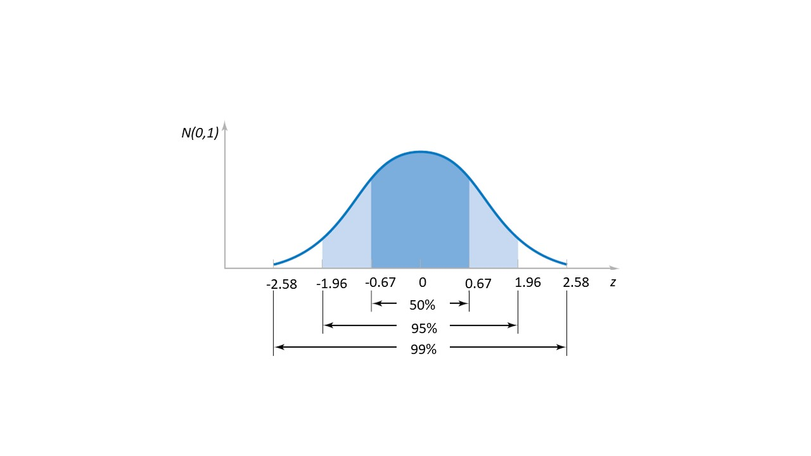

# Intervalos de confianza

## Objetivo


En este capítulo, presentaremos el concepto de **intervalos de confianza** para medias, proporciones y varianzas.

Derivaremos las fórmulas para los intervalos de confianza bajo diferentes condiciones, como normalidad con varianza conocida y desconocida, y $n$ grande.


## Estimación de la media

Hemos visto que siempre que tomamos una muestra aleatoria $(X_1, X_2, ... X_n)$, la media muestral
$$\bar{X}=\frac{1}{n}\sum_{i=1}^n X_i$$

es un estimador de la media $\mu$ de la variable aleatoria $X$. El estimador es **insesgado**

- $E(\bar{X})=\mu$

y **consistente**

- $V(\bar{X})=\frac{\sigma^2}{n}$

donde $\sigma^2$ es la varianza de $X$. Llamamos a $se=\frac{\sigma}{\sqrt{n}}$ el **error estándar**.

cuando tomamos los valores de la muestra aleatoria, tomamos el valor de $\bar{x}$ como el valor de la media. Eso es

$$\bar{x}=\hat{\mu}$$

Como $\bar{X}$ es una variable aleatoria, la estimación de la media **cambia** cuando tomamos **otra muestra**.


## Margen de error

Al decidir si el **error** en la estimación $$\bar{X}-\mu$$ es grande o no, generalmente lo comparamos con una tolerancia predefinida. **Si sabemos** que la distribución de $X$ es normal $X \rightarrow N(\mu, \sigma^2)$ y el valor de $\mu$, podemos calcular qué tan lejos cae la estimación de $\bar{x}$ de $\mu$.

Definimos el **margen de error** al nivel de $5\%$ como la distancia $m$ tal que la distribución de $\bar{X}$ captura $95\%$ de las estimaciones:

$$P(-m \leq \bar{X}-\mu \leq m)=P(\mu-m \leq \bar{X} \leq\mu + m)=0.95$$

Si $\bar{X}$ se distribuye normalmente, entonces el margen de error es

$$m=z_{0.025} \frac{\sigma}{\sqrt{n}}=1.96\times se$$
donde $z_{0.025}=\phi^{-1}(0.975)=$ <code>qnorm(0.975)</code>

**Ejemplo (cables):**

Tomamos una muestra aleatoria de tamaño $8$: Cargamos un cable hasta que se rompan y registramos la carga de rotura.

**Si sabemos** que la rotura de los cables  realmente se distribuyen normalmente $$X \rightarrow N(\mu=13, \sigma^2=0.35^2)$$ entonces la media muestral es normal

$$\bar{X} \rightarrow N(13, \frac{0.35^2}{8})$$

Con media $E(\bar{X})=13$ y error estándar $se=\frac{0.35}{\sqrt{8}}=0.1237$

Por lo tanto, el margen de error en $95\%$ es

$$m=z_{0.025} \frac{\sigma}{\sqrt{n}}=1.96\times se=1.96\frac{0.35}{\sqrt{8}}=0.24$$
Ahora, tomamos la muestra aleatoria y encontramos los resultados.


```{r, echo=FALSE}
load <- c(13.34642, 13.32620, 13.01459, 13.10811, 12.96999, 13.55309, 13.75557, 12.62747)
load
```

El promedio observado es $\bar{x}=13.21$, y el error que cometeríamos si reemplazamos $\mu$ por $\bar{x}$, sería

$$\bar{x}-\mu=13.21-13=0.21$$
El **error observado** está dentro del margen de error

$$\bar{x}-\mu <m$$


```{r, echo=FALSE,}

set.seed(123)
x <- seq(12,14, 0.01)
observaciones <- load

plot(x, dnorm(x, 13, 0.35), type="l", col="blue",ylim=c(0,3.5),xlab="Braking load", lty=2, ylab="N(13,0.35^2)", main="Measurements")

lines(c(0.35+13, 13),c(0.7, 0.7), col="red", lwd=2)


points(observaciones,rep(0.5, length(observaciones)),col="blue",pch="+",cex=2 )

abline(v=13)

legend("topleft",legend = c("Observations"),pch="+", col="blue", cex=0.6)


legend("topright",legend = c("True f(x)", "mu", "sigma"),lty=c(2,1,1), lwd=c(1,1,2),col=c("black", "black", "red"), cex=0.6)


```


```{r, echo=FALSE}
x <- seq(12,14, 0.01)
observaciones <- load

plot(x, dnorm(x, 13, 0.35/sqrt(8)), type="l", col="black",ylim=c(0,3.5),xlab="Braking load", lty=2, ylab="N(13,0.1237^2)", main="Average")

points(mean(observaciones),0.5,col="black",pch=16,cex=2 )

legend("topright",legend = c("True f(x_bar)", "mu-m, mu+m", "se"),lty=c(2,1,1), lwd=c(1,1,2),col=c("black", "black", "orange"), cex=0.6)

legend("topleft",legend = c("Average"),pch=16, cex=0.6)


abline(v=13)

lines(c(mean(observaciones), 13),c(0.5, 0.5))

lines(c(13-0.24,13-0.24), c(0,dnorm(13-0.24,13, 0.35/sqrt(8))), lwd=2, col="orange") 

lines(c(13+0.24,13+0.24), c(0,dnorm(13+0.24,13, 0.35/sqrt(8))), lwd=2, col="orange") 

```


## Estimación de intervalo para la media

El problema es que en la vida real **no sabemos** los valores reales de $\mu$ o $\sigma$ para

$$X \rightarrow N(\mu, \sigma^2)$$
Empezamos tomando la muestra


```{r, echo=FALSE,}

set.seed(123)
x <- seq(12,14, 0.01)
observaciones <- load

plot(x, dnorm(x, 13, 0.35),  col="blue",ylim=c(0,3.5),xlab="Braking load", lty=2, ylab="?", main="Measurements", pch="")


points(observaciones,rep(0.5, length(observaciones)),col="blue",pch="+",cex=2 )


legend("topleft",legend = c("Observations"),pch="+", col="blue", cex=0.6)

```

y luego calcular la media

```{r, echo=FALSE}
x <- seq(12,14, 0.01)
observaciones <- load

plot(x, dnorm(x, 13, 0.35/sqrt(8)), type="p", col="black",ylim=c(0,3.5),xlab="Braking load", lty=2, ylab="?", main="Average", pch="")

points(mean(observaciones),0.5,col="black",pch=16,cex=2 )

legend("topleft",legend = c("Average"),pch=16, cex=0.6)

```


¿Cuál es el valor de $\mu$?

Nuestros datos sugieren que es $\bar{x}=13.21$. Reemplazar $\mu$ por $\bar{x}$ se denomina **estimación puntual** del parámetro. Pero ¿qué tan **seguros** estamos al hacer este remplazo? después de todo, sabemos que estamos cometiendo un error, pero no sabemos qué tan grande es. 

Definimos el intervalo de confianza para $\mu$. De la ecuación del margen de error

$$P(-m \leq \bar{X} - \mu \leq m)=0.95$$
resolvamos para $\mu$ que es **la verdadera incógnita**

$$P(\bar{X} - m \leq \mu \leq \bar{X} + m)=0.95$$

Los límites izquierdo y derecho de la desigualdad son variables aleatorias que motivan la definición del **intervalo de confianza aleatorio en $95\%$:**

$$(L,U)=(\bar{X} - m,\bar{X} + m)$$

Este intervalo es una nueva **variable aleatoria** y tiene por definición una probabilidad de $0.95$ de contener $\mu$.


El **intervalo observado** que obtenemos del experimento es (en minúsculas)

$$(l,u)=(\bar{x} - m,\bar{x} + m)$$

Este intervalo contiene o no el parámetro $\mu$: ¡**nunca lo sabremos**!

Decimos que tenemos una confianza de $95\%$ en que el intervalo $(l,u)$ capturará el verdadero parámetro desconocido $\mu$. Piensa en comprar un billete de lotería del raspa y gana pero que no podemos raspar para ver el premio. El billete tiene o no el premio sólo que no lo sabemos. 

### Caso 1 (varianza conocida)

Los intervalos de confianza se pueden estimar en diferentes casos. El primer caso es cuando

1. $X$ es una variable normal
2. y conocemos el valor de $\sigma$

el intervalo de confianza en $95\%$ es

$$(l,u)=(\bar{x} - m, \bar{x} + m)$$
donde $$m=z_{0.025} \frac{\sigma}{\sqrt{n}}$$

Eso es:

$$(l,u)=(\bar{x} - z_{0.025} \frac{\sigma}{\sqrt{n}}, \bar{x} + z_{0.025} \frac{\sigma}{ \sqrt{n}})$$


**Ejemplo (cables):**

En nuestro ejemplo, asumimos que $X$ se distribuye normalmente y que sabemos $\sigma^2=0.35^2$.

1. Dado que $\bar{X}$ es normal, el margen de error es

$$m=z_{0.025} \frac{\sigma}{\sqrt{n}}$$
2. Como sabemos $\sigma^2=0.35^2$, entonces el intervalo de confianza de $95\%$ es

$(l,u)=(\bar{x} - m, \bar{x} + m)=$ $$(\bar{x}-z_{0.025} \frac{\sigma}{\sqrt{n }}, \bar{x}+z_{0.025} \frac{\sigma}{\sqrt{n}})= (12.97,13.45)$$

o también podemos escribirlo como

$$\hat{\mu}=\bar{x} \pm m = 13.21 \pm 0.24$$
Esto significa que, al estimar la media por el promedio, confiamos en las unidades pero no tanto en los lugares decimales.


```{r, echo=FALSE}
observaciones <- rnorm(8,13,0.35)

plot(observaciones,rep(0, length(observaciones)),col="blue",pch="+",cex=1.5 ,ylim=c(-0.2,0.2),xlab="Braking load",ylab="",yaxt="n",xlim=c(12,14))

for(i in 2)
{
 points(mean(observaciones),-0.2+0.1*i,pch=19,col="black",cex=1.5)

 points(mean(observaciones)-1.96*0.35/sqrt(8),-0.2+0.1*i,pch=19,cex=1.5, col="orange")

points(mean(observaciones)+1.96*0.35/sqrt(8),-0.2+0.1*i,pch=19,cex=1.5, col="orange")

legend("bottomright", legend=c("sample average","Confidence interval"),col=c("black", "orange"),pch=19)

observaciones <- rnorm(8,13,0.35)

}

```

Recuerda que el intervalo de confianza $(l,u)$ es una observación del intervalo de confianza aleatorio $(L,U)$. Por lo tanto, cada vez que obtenemos una nueva muestra entonces $(l,u)$ cambia. Si realizamos muestras de $100$ de tamaño $n$ entonces $95%$ de los intervalos de confianza contendrán $\mu$, ¡pero no sabemos cuál!


```{r, echo=FALSE}
set.seed(1234)
observaciones <- rnorm(8,13,0.35)

plot(observaciones,rep(0, length(observaciones)),col="blue",pch="",cex=1.5 ,ylim=c(-0.2,0.2),xlab="Braking load",ylab="",yaxt="n",xlim=c(12,14))

for(i in 1:4)
{
  
 points(observaciones,rep(-0.2+0.1*i, length(observaciones)),col="blue",cex=1.5, pch="+")  
  
 points(mean(observaciones),-0.2+0.1*i,pch=19,col="black",cex=1.5)

 points(mean(observaciones)-1.96*0.35/sqrt(8),-0.2+0.1*i,pch=19,cex=1.5, col="orange")

points(mean(observaciones)+1.96*0.35/sqrt(8),-0.2+0.1*i,pch=19,cex=1.5, col="orange")

legend("bottomright", legend=c("sample average","Confidence interval"),col=c("black", "orange"),pch=19)


observaciones <- rnorm(8,13,0.35)

}

```

### Nivel de confianza

Podemos cambiar nuestra confianza de $95\%$ a $99\%$. Cuando calculamos el margen de error en $95\%$, dejamos por fuera $\alpha=0.05$ de probabilidad, $0.025$ a cada lado.

Ahora, podemos dejar fuera $\alpha=0.01$ de probabilidad, $0.005$ a cada lado. Por lo tanto, el intervalo de confianza de $99\%$ es

$(l,u) = (\bar{x} - z_{0.005}\frac{\sigma}{\sqrt{n}},\bar{x} + z_{0.005}\frac{\sigma}{\sqrt{n}})$

$$= (\bar{x} - 2.58\frac{\sigma}{\sqrt{n}},\bar{x} + 2.58\frac{\sigma}{\sqrt{n}})$$





donde $z_{0.005}=\phi^{-1}(0.995)=$ <code>qnorm(0.995)</code>. También podemos escribirlo como

$$\hat{\mu}=\bar{x} \pm 2.58\frac{\sigma}{\sqrt{n}}$$
Para nuestros cables, el intervalo de confianza de $99\%$ es

$$\hat{\mu}= 13.21 \pm 0.31$$

Si queremos tener más confianza, ¡necesitamos intervalos de confianza más grandes!


**Ejemplo (Energía de impacto):**

Un material metálico se prueba por impacto para medir la energía requerida para cortarlo a una temperatura dada. Se cortaron diez probetas de acero A238 a 60ºC con las siguientes energías de impacto (J):

$64.1, 64.7, 64.5, 64.6, 64.5, 64.3, 64.6, 64.8, 64.2, 64.3$

Si **suponemos** que la energía del impacto se distribuye normalmente con $\sigma=1J$, ¿cuál es el intervalo de confianza de $95\%$ para la media de estos datos?

Sabemos

1. $X \rightarrow N(\mu, \sigma^2)$
2. $\sigma=1J$
3. $\alpha=0.05$ (el límite de confianza)


El intervalo de confianza de $95\%$ es entonces

$(l,u)=(\bar{x}-1.96 \frac{\sigma}{\sqrt{n}}, \bar{x}+1.96 \frac{\sigma}{\sqrt{n}})$
$$=(64.46-1.96 \frac{1}{\sqrt{10}}, 64.46+1.96 \frac{1}{\sqrt{10}})=(63.84,65.08)$$

o

$$\hat{\mu}=64.46 \pm 0.61$$

esto nos dice que podemos estar seguros del primer dígito (6), algo seguros del segundo (4) e inseguros de los decimales (46).


En R: 
```{r}
library(BSDA) 
z.test(c(64.1, 64.7, 64.5, 64.6, 64.5, 64.3, 64.6, 64.8, 64.2, 64.3), 
       sigma.x=1)
```

¿Qué pasa si $\sigma^2$ es **desconocido**?


## Margen de error para varianza desconocida

Pudimos calcular el intervalo de confianza $(l,u)=(\bar{x} -m, \bar{x} -m)$ porque pudimos encontrar el margen de error

$$m=1.96 \frac{\sigma}{\sqrt{n}}$$
desde que **sabíamos** $\sigma$. $\sigma$ es un parámetro de la distribución que normalmente **no conocemos**, así cmo $\mu$. Para encontrar el margen de error con varianza **desconocida**, necesitamos el siguiente teorema, debido a Gosset

### Teorema (estadística T)

Cuando $X$ es normal, entonces la estadística estandarizada

$$T=\frac{\bar{X}-\mu}{\frac{S}{\sqrt{n}}}$$
Sigue una distribución $t$ con $n-1$ grados de libertad, donde $S^2=\frac{1}{n-1} \sum_{i=1}^n (X_i-\bar{X})^2$. Por lo tanto, podemos calcular probabilidades para $\bar{X}$, incluso si no conocemos $\sigma$.

Veamos algunas densidades de probabilidad en la familia de las distribuciones $T$.


```{r, echo=FALSE}
outcome <- seq(-4,4,0.01)
probability <- dt(outcome,3)
plot(outcome, probability, pch=16,col="red",type="l", xlab="t", ylab="Probability density", ylim=c(0,0.4))
probability <- dt(outcome,7)
lines(outcome, probability, pch=16,col="blue")
probability <- dt(outcome,15)
lines(outcome, probability, pch=16,col="orange")
legend("topright", legend=c("t(n=3)","t(n=7)","t(n=15)"), col=c("red", "blue", "orange"), lty=1, bty="n")


zi <- qt(0.975, 3)
qi <- 0.975

lines(c(-zi,-zi), c(0,dt(-zi, 3)), lwd=1.5, col="red" )
lines(c(zi,zi), c(0,dt(-zi, 3)), lwd=1.5, col="red" )


zi <- qt(0.975, 7)
qi <- 0.975

lines(c(-zi,-zi), c(0,dt(-zi, 7)), lwd=1.5, col="blue" )
lines(c(zi,zi), c(0,dt(-zi, 7)), lwd=1.5, col="blue" )


zi <- qt(0.975, 15)
qi <- 0.975

lines(c(-zi,-zi), c(0,dt(-zi, 15)), lwd=1.5, col="orange" )
lines(c(zi,zi), c(0,dt(-zi, 15)), lwd=1.5, col="orange" )

```


Ahora necesitamos volver a calcular el margen de error $m$ al nivel de $5\%$ cuando usamos la distribución $t$

$P(\mu-m \leq \bar{X} \leq\mu + m)$
$$=P(-\frac{m}{s/\sqrt{n}} \leq T \leq\frac{m}{s/\sqrt{n}})=0.95$$


$$m=t_{0.025, n-1} \frac{s}{\sqrt{n}}$$
donde $t_{0.025, n-1}$ es el valor $T$ que deja $2.5\%$ de probabilidad en el lado derecho de la distribución $t$ con $n-1$ grados de libertad.

### Caso 2 (varianza desconocida)

El segundo caso para calcular los intervalos de confianza es más realista. Si

1. $X$ es una variable normal

el intervalo de confianza en $95\%$ es

$$(l,u)=(\bar{x} - m, \bar{x} + m)$$
donde $$m=t_{0.025, n-1} \frac{s}{\sqrt{n}}$$

Eso es:

$$(l,u)=(\bar{x} - t_{0.025, n-1} \frac{s}{\sqrt{n}}, \bar{x} + t_{0.025, n-1} \frac{s}{\sqrt{n}})$$
donde $t_{0.025, n-1}=F^{-1}(0.975)$<code>=qt(0.975, n-1)</code>


**Ejemplo (Energía de impacto):**


Un material metálico se prueba por impacto para medir la energía requerida para cortarlo a una temperatura dada. Se cortaron diez probetas de acero A238 a 60ºC con las siguientes energías de impacto (J):

$64.1, 64.7, 64.5, 64.6, 64.5, 64.3, 64.6, 64.8, 64.2, 64.3$

Si **suponemos** que la energía del impacto se distribuye normalmente pero **no conocemos** la varianza, ¿cuál es el intervalo de confianza de $95\%$ para la media de estos datos?

Sabemos

- $\bar{x}=64.46$
- $s=0.227$
- $\alpha=0.05$
- $t_{0.025,9}=2.26$ obtenido de $t_{0.025,9}=$ <code>qt(0.975, 9)</code>

El intervalo de confianza es entonces

$(l,u)=(\bar{x}- t_{0.025,9}\frac{s}{\sqrt{n}},\bar{x}+t_{0.025,9} \frac{s} {\sqrt{n}})$

$$=(64.46-2.26 \frac{0.227}{\sqrt{10}},64.46+2.26 \frac{0.227}{\sqrt{10}})$$ $$=(64.29,64.62)$$


Tenga en cuenta que cuando asumimos $\sigma=1$ el intervalo de confianza $(63.84,65.08)$ era mayor. Por lo tanto, los datos sugieren que $\sigma<1$.

En R, podemos calcular el intervalo de confianza con: 

```{r}
t.test(c(64.1,64.7,64.5,64.6,64.5,64.3,64.6,64.8,64.2,64.3))
```


## Estimación de proporciones

**Ejemplo (vacuna):**

Se seleccionó una muestra aleatoria de $400$ pacientes para probar una nueva vacuna contra el virus de la influenza, después de $6$ meses de vacunación, $134$ estaban enfermos. ¿Cuál es la eficacia esperada de la vacuna?

Dado que cada vacunación $X_i$ es un ensayo de Bernoulli

$$X \rightarrow Bernoulli(p)$$
Con media $\mu=p$ y varianza $\sigma^2=p(1-p)$.

La muestra es algo como
$$(x_1,x_2, x_3, ...x_n)=(0,1,0,.. 1, 0)_{400}$$ con $134$ unos y en un total de $400$ repeticiones. La muestra tiene un promedio de $\bar{x}=\frac{1}{400}\sum_i^{400} x_i=134/400=0.34$. Dado que la media muestral es un estimador insesgado de $\mu$, entonces podemos tener una estimación puntual para $p$

$$\hat{p}=\bar{x}=134/400=0.34$$

Esto tiene sentido porque $\bar{x}$ es la frecuencia relativa observada para el número de **unos** en la muestra ($f_1$). Y como tal, es un estimador de la probabilidad de observar un uno en un ensayo de Bernoulli.

$$f_1 =\hat{P}(X=1)$$
Esto es consistente con la definición frecuentista de probabilidad que vimos en el capítulo 2. Pero, ¿qué confianza tenemos en esta estimación? Queremos un intervalo de confianza para $p$

### Caso 3 (proporciones)

1. Cuando $\hat{p}n>5$ y $(\hat{p}-1)n>5$, la **estadística estandarizada** de $\bar{X}$ se puede aproximar mediante un estándar distribución (TCL)

$$Z=\frac{\bar{X}-\mu}{\sigma/\sqrt{n}}= \frac{\bar{X}-p}{\big[\frac{p(1-p)}{n} \big]^{1/2}}\rightarrow N(0,1)$$
y el intervalo de CI al $95\%$ de $p$ es:

$$CI=(l,u)=(\bar{x}-z_{0.025}\big[\frac{\bar{x}(1-\bar{x})}{n} \big]^{ 1/2}, \bar{x}+z_{0.025}\big[\frac{\bar{x}(1-\bar{x})}{n} \big]^{1/2})$$
Donde estimamos la varianza de Bernoulli $\sigma^2=p(1-p)$ por $\hat{\sigma}^2=\bar{x}(1-\bar{x})$. Es decir $\hat{\sigma}=\sqrt{\bar{x}(1-\bar{x})}$.


**Ejemplo (vacuna):**

En nuestro caso, estamos contando $134$ fallos de inmunización de $400$ inoculaciones.

sabemos

- $\bar{x}=134/400=0.34$
- $z_{0.025}=1.96$

Por lo tanto, el intervalo de confianza de $95\%$ para $p$ es

$(l,u)=(\bar{x}-1.96 \big[\frac{\bar{x}(1-\bar{x})}{n} \big]^{1/2}, \bar{x}+1.96 \big[\frac{\bar{x}(1-\bar{x})}{n} \big]^{1/2})$

$$=(0.29,0.38)$$

La probabilidad de fracaso de la vacuna es

$$\hat{p}=0.34 \pm 0.05$$

en R

```{r}
prop.test(134, 400, correct=FALSE)
```


Nota: Las encuestas de intención de voto (ensayo de Bernoulli) en una muestra de $n$ individuos reportan este tipo de estimación con su **margen de error**. No significa que el **valor verdadero** de $p$ esté dentro de este intervalo con una probabilidad de $95\%$. Significa que tenemos una confianza del $95\%$ de haber atrapado al $p$ que representa esta muestra en particular. 


## Estimación de la varianza

Hemos visto que siempre que tomamos una muestra aleatoria $(X_1, X_2, ... X_n)$, la varianza muestral
$$S^2=\frac{1}{n-1}\sum_{i=1}^n (X_i-\bar{X})^2$$
es un estimador de la media $\sigma^2$ de la variable aleatoria $X$. El estimador es **insesgado**

- $E(S^2)=\sigma^2$

y también es **consistente**. Cuando tomamos los valores de la muestra aleatoria, tomamos el valor de $S^2$ como el valor de la varianza; eso es

$$s^2=\hat{\sigma}^2$$

Dado que $S^2$ es una variable aleatoria, la estimación de la varianza cambia cuando tomamos otra muestra.


**Ejemplo (energía de impacto)**


Un material metálico se prueba por impacto para medir la energía requerida para cortarlo a una temperatura dada. Se cortaron diez probetas de acero A238 a 60ºC con las siguientes energías de impacto (J):

$64.1, 64.7, 64.5, 64.6, 64.5, 64.3, 64.6, 64.8, 64.2, 64.3$

¿Cuál es la estimación de la varianza de estos datos?

$$s^2=0.05155556$$
En R: <code>sd(c(64.1, 64.7, 64.5, 64.6, 64.5, 64.3, 64.6, 64.8, 64.2, 64.3))^2 </code>

¿Cuánta confianza tenemos en los decimales de la estimación?

## Intervalo de confianza para la varianza

Para calcular un intervalo de confianza para la varianza, necesitamos una estadística que sea una función de $S^2$ y nos permita calcular probabilidades. Usaremos el siguiente teorema

### Teorema ($\chi^2$):


Cuando $X$ es normal, entonces la estadística estandarizada


$$W=\frac{S^2(n-1)}{\sigma^2}$$
sigue una distribución $\chi^2$ con $n-1$ grados de libertad

$$\frac{S^2}{\sigma^2}(n-1)\rightarrow \chi^2_{n-1}$$

Por lo tanto, podemos calcular probabilidades para $W$.

Veamos algunas densidades de probabilidad en la familia de las distribuciones $\chi^2$.


```{r, echo=FALSE}
outcome <- seq(0,25,0.01)
probability <- dchisq(outcome,4)
plot(outcome, probability, pch=16,col="red",type="l", xlab="W" ,ylab="Probability density")
probability <- dchisq(outcome,7)
lines(outcome, probability, pch=16,col="blue")
probability <- dchisq(outcome,14)
lines(outcome, probability, pch=16,col="orange")
legend("topright", legend=c("Chisquared (n=4)","Chisquared (n=8)","Chisquared (n=16)"), col=c("red", "blue", "orange"), lty=1, bty="n")
```


### Intervalo de confianza para la varianza

Buscamos el intervalo de confianza de $\sigma^2$ con confianza $95\%$ $(L,U)$ tal que $$P(L \leq \sigma^2 \leq U)=0.95$$

Entonces podemos usar el $\chi^2$ para determinar el $95\%$ de la distribución alrededor de $W$. Comencemos definiendo los valores que capturan los $95\%$ de la distribución

$$P(\chi^2_{0.975,n-1} \leq W \leq \chi^2_{0.025,n-1})=0.95$$
Reemplazando el valor de $W$

$$P(\chi^2_{0.975,n-1} \leq \frac{S^2}{\sigma^2}(n-1) \leq \chi^2_{0.025,n-1})= 0.95$$

y resolviendo para $\sigma^2$

$$P(\frac{S^2 (n-1)}{\chi^2_{0.025,n-1}}\leq \sigma^2 \leq \frac{S^2(n-1)}{ \chi^2_{0.975,n-1}})=0.95$$

Encontramos un intervalo aleatorio que captura $\sigma^2$
con $95\%$ de confianza

$$(L,U) = (\frac{S^2 (n-1)}{\chi^2_{0.025,n-1}},\frac{S^2(n-1)}{\chi ^2_{0.975,n-1}})$$

### Caso 4 (varianza)

1. Cuando $X$ es una variable normal

El intervalo de confianza al $95\%$  **observado**   (minúsculas) es

$$(l,u) = (\frac{s^2 (n-1)}{\chi^2_{0.025,n-1}},\frac{s^2(n-1)}{\chi ^2_{0.975,n-1}})$$

dónde

- $\chi^2_{0.975,n-1}=F^{-1}(0.025)=$ <code>qchisq(0.025, df=n-1)</code>

- $\chi^2_{0.025, n-1}=F^{-1}(0,975)=$<code>qchisq(0,975, df=n-1)</code>
</br>para $n=10$ o $df=n-1=9$


**Ejemplo (energía de impacto)**

Un material metálico se prueba por impacto para medir la energía requerida para cortarlo a una temperatura dada. Se cortaron diez probetas de acero A238 a 60ºC con las siguientes energías de impacto (J):

$64.1, 64.7, 64.5, 64.6, 64.5, 64.3, 64.6, 64.8, 64.2, 64.3$

¿Cuál es el intervalo de confianza para la varianza de estos datos?

$$(l,u) = (\frac{s^2 (n-1)}{\chi^2_{0.025,n-1}},\frac{s^2(n-1)}{\chi ^2_{0.975,n-1}})$$

1. La desviación estándar de los datos es $s^2=0.05155556$

2. $n=10$

3. Luego calculamos $\chi^2_{0.025,n-1}$ y $\chi^2_{0.975,n-1}$


```r
chi0.975 <- qchisq(0.025, df=9)
chi0.975
```

```
[1] 2.700389
```

```r
chi0.025 <- qchisq(0.975, df=9)
chi0.025
```

```
[1] 19.02277
```


```{r, echo=FALSE}
outcome <- seq(0,25,0.01)
probability <- dchisq(outcome,9)
plot(outcome, probability, pch=16,col="red",type="l", xlab="w" ,ylab="Probability density for W")

lines(c(qchisq(0.025,9) , qchisq(0.025,9)), c(0,dchisq( qchisq(0.025,9), 9)))  

lines(c(qchisq(0.975,9) , qchisq(0.975,9)), c(0,dchisq( qchisq(0.975,9), 9)))  


```


Por lo tanto

$$(l,u)= (\frac{0.227^2 (10-1)}{19.02277},\frac{0.227^2(10-1)}{2.700389})=(0.02,0.17)$$

Recuerda que cuando habíamos calculado el intervalo de confianza para la media, asumimos $\sigma^2=1$ (caso 1). Ahora podemos decir que esta elección no fue consistente con los datos porque vemos que el intervalo de confianza no contiene el valor $\sigma^2=1$ .

Según los datos, $\sigma^2 \neq 1$ con una confianza de $95\%$.

en R: 


```{r, warning=FALSE, message=FALSE}
library(Ecfun)
confint.var(0.05155556, 9)
```


El intervalo para la varianza **no es simétrico** y no podemos formularlo como un margen de error con $\pm$.


```{r, echo=FALSE}

plot(c(0, 0.05), c(0,0), col="blue",pch="",cex=1.5 ,ylim=c(-0.2,0.2),xlab="s^2",ylab="",yaxt="n",xlim=c(0,0.3))

lines(c(0, 0.02), c(0.15,0.15), col="orange", lwd=2)
lines(c(0, 0.05), c(0,0), col="black", lwd=1)
lines(c(0, 0.17), -c(0.15,0.15), col="orange", lwd=2)

legend("topright", legend = c("estimate of sigma^2", "CI for sigma^2"), col=c("black", "orange"), pch=16)

points(c(0.02, 0.17), c(0,0), col="orange", lwd=2, pch=16)
points(c(0.05), c(0), col="black", lwd=2, pch=16)

points(c(0.02), c(0.15), col="orange", lwd=2, pch=16)
points(c(0.17), -c(0.15), col="orange", lwd=2, pch=16)
```

## Preguntas

**1)** El margen de error a $95\%$ de confianza de una variable normal es

**$\qquad$a:** $\frac{s}{\sqrt{n}}$;
**$\qquad$b:** $1.96\times se$;
**$\qquad$c:** $\frac{\sigma}{\sqrt{n}}$;
**$\qquad$d:** $\sigma$

**2)** cuando hablamos de $z_{0.025}$ queremos encontrar:

**$\qquad$a:** El valor de una variable normal estándar que acumula hasta $99.75\%$ de probabilidad;
**$\qquad$b:** El valor de una variable normal estándar  que acumula hasta $0.25\%$ de probabilidad;
**$\qquad$c:** La probabilidad de una variable estándar hasta $99.75\%$;
**$\qquad$d:** La probabilidad de una variable estándar hasta $0.25\%$


**3)** El intervalo de confianza aleatorio $(L,U)$ para la media al $95\%$

**$\qquad$a:** es un parámetro bidimensional de la distribución de la muestra;
**$\qquad$b:** da los límites donde $\mu$ tiene una probabilidad de ocurrir el $95\%$ de las veces;
**$\qquad$c:** es una estimación del promedio;
**$\qquad$d:** captura $\mu$ $95\%$ de las veces

**4)** Un intervalo de confianza para la media escrito como $\hat{\mu}=56.99 \pm 0.01$

**$\qquad$a:** indica que estamos $\%99$ seguros de que la media es $56.99$;
**$\qquad$b:** indica que no podemos confiar en el último decimal en la estimación de la media;
**$\qquad$c:** indica que la media de la población es en $56.99$ con un error de $0.01$;
**$\qquad$d:** indica que podemos confiar en la cifra unitaria ($6$) en la estimación de la media

**5)**Si conocemos el valor de $\mu$ y encontramos que el intervalo de confianza no lo atrapó, entonces

**$\qquad$a:** el intervalo de confianza no está bien calculado;
**$\qquad$b:** tenemos una observación rara del intervalo de confianza;
**$\qquad$c:** el intervalo de confianza no estima la media;
**$\qquad$f:** hay poca probabilidad de encontrar la media en el intervalo de confianza

## Ejercicios

#### Ejercicio 1

En un artículo científico, los autores reportan un intervalo de confianza de $95\%$ de $(228, 232)$ para la frecuencia natural (Hz) de un haz metálico. Utilizaron una muestra de tamaño $25$ y consideraron que las medidas estaban distribuidas normalmente.

- ¿Cuál es la media y la desviación estándar de las medidas?

- Calcule el intervalo de confianza de $99\%$.

consejos:

- en R $t_{0.025, 24}=$ <code>qt(0.975, 24)</code>$\sim 2$

- en R $t_{0.005, 24}=$<code>qt(0.995, 24)</code>$\sim 2.8$

#### Ejercicio 2

calcular $95\%$ CI la media de una variable normal con varianza conocida $\sigma^2=9$ y $\bar{x}=22$, usando una muestra de tamaño $36$.

#### Ejercicio 3

Este año, $17$ de $1000$ de pacientes con influenza desarrollaron complicaciones.

- Calcular el intervalo de confianza de $99\%$ para la proporción de complicaciones.

- El año anterior $2\%$ presentó complicaciones. ¿Podemos decir con $99\%$ de confianza que este año hay una caída significativa en las complicaciones de la influenza?

#### Ejercicio 4

¿Cuál es el intervalo de confianza para la varianza poblacional de una variable normal si tomamos una muestra aleatoria de tamaño $n=10$ y observamos una varianza muestral de $0.5$?