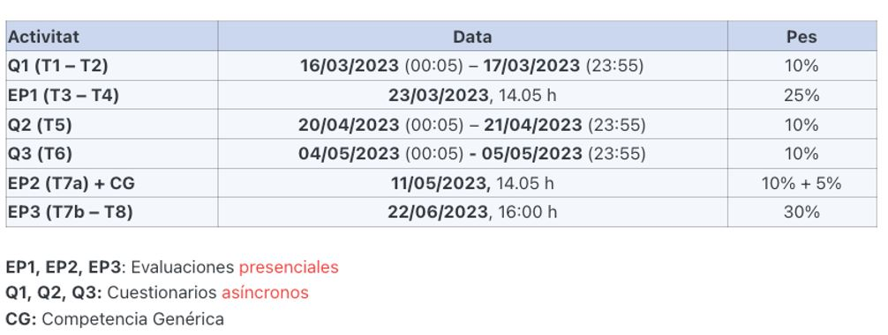

--- 
title: "EEBE Estadística"
author: "Alejandro Cáceres (alejandro.caceres.dominguez@upc.edu)"
date: "`r Sys.Date()`"
site: bookdown::bookdown_site
documentclass: book
bibliography:
- book.bib
- packages.bib
description: |
  EEBE
link-citations: yes
github-repo: alejandro-isglobal/master
---

# Objetivo

Este es el curso de introducción a la estadística de la EEBE (UPC).

La estadística es un **lenguaje** que permite afrontar problemas nuevos, sobre los que no tenemos solución, y en donde interviene la **aleatoridad**.

En este curso trataremos los **conceptos fundamentales** de estadística. 

- 3 horas de **teoría** por semana: Explicaremos los conceptos, haremos ejercicios. 

- 6 horas de **estudio individual** por semana: Notas notas de curso y los recursos en ATENEA. 

- 2 horas de Solución de problemas con **R**: Sesiones presenciales con ordenador (Prácticas).

Las fechas de exámenes y material de estudio adicional se pueden encontrar en **ATENEA metacurso**:

Objetivos de evaluación:

**Q1** (10%): Prueba en ordenador duración 2h en las fechas indicadas.

 a. Dominio de comandos básicos en R (Prácticas)
 b. Capacidad de calcular estadísticos descriptivos y gráficos, en situaciones concretas (Teoría/Práctica)
 c. Conocimiento sobre la regresión lineal (Prácticas)

**EP1** (25%): Prueba escrita (2-3 problemas)

 a. Capacidad de interpretación de enunciados en fórmulas de probabilidad (Teoría).
 b. Conocimiento de las herramientas básicas para solucionar problemas de probabilidad conjunta y probabilidad condicional (Teoría). 
 c. Dominio matemático de funciones de probabilidad para calcular sus propiedades básicas (Teoría). 

**Q2** (20%): Prueba en ordenador duración 2h en horario de clase en las fechas indicadas

 a. Capacidad de identificación de modelos de probabilidad en problemas concretos (Teoría/Práctica). 
 b. Uso de funciones de R para calcular probabilidades de modelos probabilísticos (Práctica/Teoría)
 c. Capacidad de identificación de un estadístico de muestreo y sus propiedades (Teoría/Práctica)
 d. Conocimiento de cómo calcular la probabilidad de los estadísticos de muestreo (Teoría/Práctica)
 e. Uso de comandos en R para calcular probabilidades y hacer simulaciones de muestras aleatorias (Prácticas)
 
**EP2** (40%): Prueba escrita (2-3 problemas)

 a. Capacidad matemática para determinar estimadores puntuales de modelos de probabilidad.
 b. Conociemiento de las propiedades de los estimadores puntuales.
 c. Conocimiento de los intervalos de confianza y sus propiedades (Teoría).
 d. Capacidad de identificar el tipo de intervalo de confianza en un problema concreto (Teoría).
 e. Capacidad de interpretación del tipo 
 de hipótesis a usar en un problema concreto (Teoría).
 f. Uso de comandos en R para resolver problemas de intervalos de confianza y prueabas de hipótesis (Práctica).
 

**CG** (5%): Prueba escrita (2 preguntas sobre un texto)

 a. Capacidad de expresión escrita sobre un tema relacionado a la estadística. 

 
 
coordinadores: 

- Luis Mujica (luis.eduardo.mujica@upc.edu)
- Pablo Buenestado (pablo.buenestado@upc.edu)

## Lectura recomendada

- Los apuntes de clase se nuestra sección estarán accesibles en ATENEA en pdf y en html.

- Douglas C. Montgomery and George C. Runger. “Applied Statistics and Probability for Engineers” 4th Edition. Wiley 2007.

