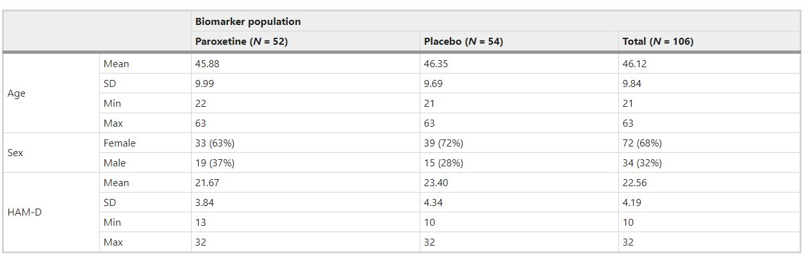
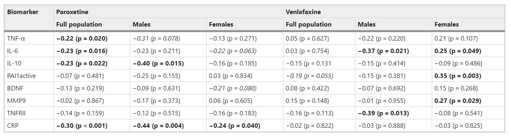
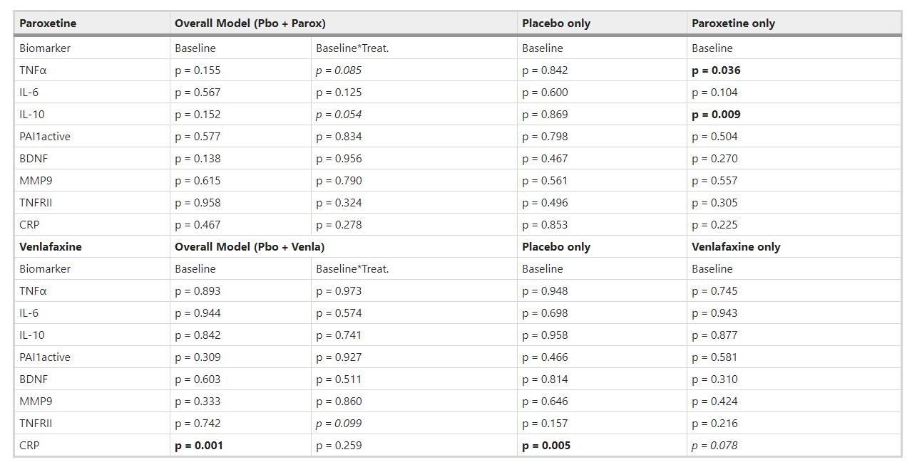
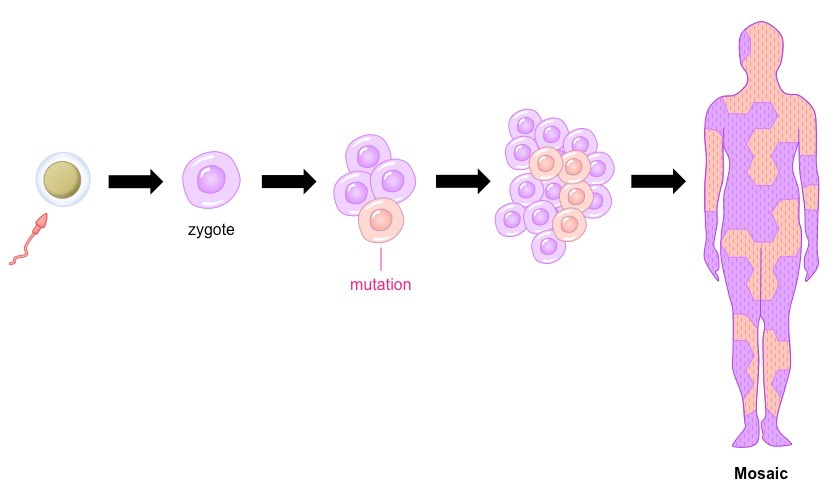
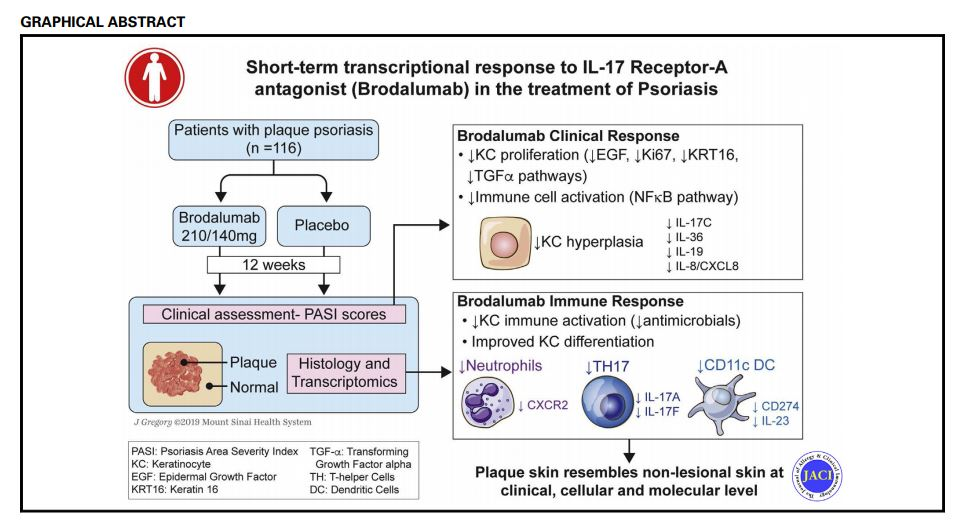
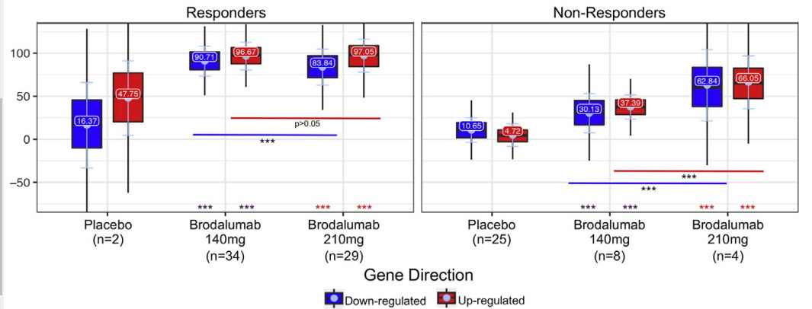

```{r setup, include=FALSE}
options(htmltools.dir.version = FALSE)
```


class: middle, center

## Who am I?

---

class: middle

##Experience

- <b>Senior statistician</b> in the Bioinformatics group at Barcelona Institute of Global Health <https://www.isglobal.org/>
  
- Adjunct <b>lecturer</b> in statustics at the Universitat Politectica de Catalunya <https://eebe.upc.edu/es>
  
- Over 13 years of experience analyzing biomedical data

- Develop novel analysis methods for <b>biomarker discovery</b>

- High dimensional data including imaging and omic data: genomic, transcriptomic, exposomic, etc.

- I write scientific articles and implement methods in software packages (R/Matlab).

---

class: middle

##You can find me at 
  
- [linkedin](https://es.linkedin.com/in/alejandro-caceres-dominguez-7449aa176)

- [google scholar](https://scholar.google.es/citations?user=s1D-6WAAAAAJ&hl=es)

- [gitHub](https://github.com/alejandro-isglobal)

- [my blog](https://alejandro-isglobal.github.io/)


---

class: middle, center

##Some examples of my work 

Analytical validation of a biomarker: Functional magnetic resonance imaging


---

class: middle, center

##Some examples of my work 

Discovery of risk Biomarker: Chromosome Y function and risk of disease in men 


---

class: middle, center

##Aim of the talk 


- What is the utility of surveying thousand/million biomarkers in drug development?
  
- How is biomarker utility assessed in terms of statistical evidence?


---

class: middle

##Content  

- Introduction:
  - Biomarker definition
  - Types of biomarkers (context of use)
  - Guidance for qualification and reporting (FDA)
- Statistical evidence of biomarker utility in assessing treatment efficacy:
  - Biomarker's sensitivity and specificity
  - Regression analyses of biomarker levels on efficacy (stratified and with interactions by treatment)
   - Multiple/Composite Biomarkers
- Examples:
   - Assessment of HIV antiviral resistance with a composite genomic biomarker (ROC curve, pubmed: https://pubmed.ncbi.nlm.nih.gov/12060770/)
   - Prediction of Brodalumab treatment on psoriasis area severity index using gene expression data. (https://pubmed.ncbi.nlm.nih.gov/31883845/)

---

class: middle

## Introduction: Biomarker definition
</br>
</br>
**Definition**:
  - A biomarker is a <b>biological measurement</b> that has the potential to inform **decision-making** in relation to a clinical treatment or intervention. 

</br>
**Properties**:
  - Source material or matrix 
  - Method of measurement
  - Purpose


---

class: middle

## Biomarker's source

- Source material or matrix:
  - specific analyte (e.g., cholesterol)
  - anatomic feature (e.g., joint angle)
  - physiological characteristic (e.g., blood pressure) 

- when they are composite
  - how the compoenents are interrelated (e.g. genomic data)
  - how is the process of obtaining the biomarker (e.g. algorithm, score)


---

class: middle


## Biomarker's Method of measurement

  - molecular
  
  - histologic
  
  - radiographic
  
  - physiologic characteristic
  
  - composite (algorithmic)


---

class: middle

## Biomarkers are continuously created

- New methods of measurements  

- New analyses are constantly developed 

</br>

*The aim is to address outstanding <b>needs</b>!*


---

class: middle, center


## How do biomarkers inform decision-making during drug development?


---

class: middle


## Context of use (COU) 


COU is a description of the biomarker's specific use in drug development:
  
**1. Category**

- Disease-related: (Who should be studied?)
  - Diagnostic (selection)
  - Prognostic (stratification)
  - Susceptibility/risk (enrich)

- Treatment-related: 
  - Predictive (Who should be treated?)
  - Safety (Should we stop treatment?)
  - Monitoring (Should we continue with treatment?)
  - Pharmacodynamic/response biomarker (What is the outcome of treatment? surrogate endpoint)


---

class: middle

## Types of biomarkers 

  | Role        | Description   | 
  | ----------  | ------------- | 
  | Diagnosis of a disease | To make a diagnosis more reliably, more rapidly, or more inexpensively than available methods |
  | Severity assessment | To identify a subgroup of patients with a severe form of a disease associated with an increased probability of death or severe outcome
| Risk assessment | To identify a subgroup of patients who may experience better (or worse) outcome when exposed to an intervention
| Prediction of drug effects | To identify the pharmacological response of a patient exposed to a drug (efficacy, toxicity, and pharmacokinetics) 
| Monitoring | To assess the response to a therapeutic intervention


---

class: middle


## Types of biomarkers


**2. Use**

  - Purpose of use in drug development (safety biomarker to evaluate drug-induced injury)
  
  - Stage of use (phase 1 clinical trial)
  
  - Population (healthy adults, psoriasis patients)
  
  - Therapeutic mechanisms of action for which the biomarkers offer information.

---

class: middle

## Guidance for qualification (FDA)


- **Qualification** of a biomarker is a determination the biomarker can be relied on to have a specific interpretation and application in drug development and regulatory review. 

- Biomarker Qualification: Evidentiary Framework [doc](https://alejandro-isglobal.github.io/teaching/docs/fdabiomarker.pdf)

- When using a biomarker:
  - what has a biomarker been qualified for?  

- when developing a biomarker:
  - What are the evidentiary requirements for demonstrating the utility of the biomarker?


---

class: middle

## Guidance for qualification (FDA)


FDA Guidance for biomarker qualification (2018) for section 507 of the Federal Food, and Cosmetic Act (FD&C Act):

**A**. Define the **need**
  - i.e disease needs and added value of the biomarker to drug development

**B**. Define the context of use **COU**

  - i.e Prediction: identify patients that respond to treatment

**C**. Assess **benefits** and **risks** 

  - i.e. Benefit: Don't treat a patient who won't benefit (specificity), treat a patient who will benefit (sensitivity). 
  - i.e. Risk: not treat a patient who could benefit, treat a patient who won't benefit. 


**D**. Determine evidence that is **statistically** sufficient to support COU.


---

class: middle

## Statistical evidence 

**D**. Determining evidence that is **statistically** sufficient to support COU

  - Analytical considerations: Is the test reliable?
  
    - validation of the Biomarkers test’s technical performance
    
    - cost-effectiveness, feasibility
    
    - assessment of measurement error 


---

class: middle

## Statistical evidence 


Examples:

- Gene expression biomarkers:
  - RNAseq experiments have been experimentally validated, ready to include in a clinical trial 

- Composite biomarkers derived from gene expression data through algorithms need to be validated


---

class: middle

## Statistical evidence 

  
Establish the relationship between a biomarker and an outcome of interest from:

  - Randomized controlled trial
  - Single-arm/historical control trial
  - Cohort study
  - Case-control study (including nested)
  - Cross-sectional study
  - Case series or case reports
  - Registry information
  - Meta-analysis

Strongest evidence comes from <b>prospective studies</b> that are specifically designed but data from studies conducted for <b>other purposes</b> can be used to support biomarker utility.


---

class: middle

## Statistical evidence 

 
- The aim is to provide statistical evidence for the **correlation** between the biomarker and the outcome according to the COU:
    - i.e. Predictive biomarker: correlation between the biomarker and efficacy of treatment.  

---

class: middle, center

## Types of statistical analysis 

---

class: middle

## Sensitivity and specificity 


- Suppose we have a collection of **treated** individuals with measurements of  
  - efficacy as a **response** variable
  - a test to detect the presence of a **biomarker**

- The **Response** measurement is dichotomous and has the events:
  - yes (the patient responded to treatment)
  - no (the patient did not respond to treatment)

- The **Biomarker** measurement is dichotomous (dichotomized by a cut-off) and has the events:
  - positive (the biomarker was detected)
  - negative (the biomarker was not detection detected)


---

class: middle

## Sensitivity and specificity 


|  Subject  |  Response  |  Biomarker  |
| ------------- | ------------- | ---------- |
| $s_1$         |   yes        | positive |
| $s_2$         |   no         | negative |
| $s_3$         |   yes        | positive |
|...            |   ...        | ...      |
| $s_i$         |   no         | positive* |
|...            |   ...        | ...      |
|...            |   ...        | ...      |
| $s_3$         |   yes        | negative* |
|...            |   ...        | ...      |
  
- Each individual has two measurements: (Response, Biomarker)
  
  

---

class: middle

## Sensitivity and specificity 
  
Let's think first in terms of the response

</br>

Within those who responded to treatment (yes), how many 
were detected with the biomarker (positive)?

</br>


<b>Sensitivity</b> (true positive rate)
$$fr(positive|yes)=\frac{n_{positive|yes}}{n_{negative|yes}+n_{negative|yes}}$$


---

class: middle

## Sensitivity and specificity 

Let's think first in terms of the response

</br>

Among those who did not respond to treatment (no), how many were not detected with the biomarker (negative)?

</br>

<b>specificity</b> (True negative rate)

$$fr(negative|no)=\frac{n_{negative|no}}{n_{positive|no}+n_{negative|no}}$$
  
  

---

class: middle

## Sensitivity and specificity 
  
|  | Response: Yes |  Response: No |
| --------- | --------- | -------- |
| <b>Biomarker: positive</b> | fr(positive<span>&#124;</span>yes) | fr(positive<span>&#124;</span>no) | 
| <b>Biomarker: negative</b> | fr(negative<span>&#124;</span>yes) | fr(negative<span>&#124;</span>no) | 
| <b>sum</b>      | 1                | 1               |
  
</br>  

|  | Response: Yes | Response: No |
| --------- | --------- | -------- |
| <b>Biomarker: positive</b> |True positive rate (<b>sensitivity</b>) | False positive rate| 
| <b>Biomarker: negative</b> | False negative rate| True negative rate (<b>specificity</b>)| 
| <b>sum</b>      | 1                | 1               |

</br>

  
- The trade-off between sensitivity and specificity needs to be evaluated in the Context of Use and usefulness of the biomarker's test 


---

class: middle

## Sensitivity and specificity 

Let's think in terms of the biomarker test

</br>

Within those whose biomarker was detected (positive), how many responded to treatment (yes)?

</br>

<b>Positive predictive value</b>:

$$fr(yes|positive)=\frac{n_{yes|positive}}{n_{yes|positive}+n_{no|positive}}$$
  

---

class: middle

## Sensitivity and specificity 
  
Let's think in terms of the biomarker test

</br>

Within those whose biomarker was not detected (negative), how many did not respond to treatment (no)?

</br>

<b>Negative predictive value</b> 

$$fr(no|negative)=\frac{n_{no|negative}}{n_{yes|negative}+n_{no|negative}}$$


---

class: middle

## Sensitivity and specificity 

|  | Response: Yes  |  Response: No |  sum  |
| --------- | --------- | -------- | ------ |
| <b>Biomarker: positive</b> | PPV: fr(yes<span>&#124;</span>positive) | fr(no<span>&#124;</span>positive) | 1 |
| <b>Biomarker: negative</b> | fr(yes<span>&#124;</span>negative) | NPV: fr(no<span>&#124;</span>negative) | 1 |


- PPV: positive predicted value
- NPV: negative predicted value

- These are really the values that we want to know. They depend on the probability of response to treatment. 


---

class: middle

## Sensitivity and specificity 

There is a way to convert from **sensitivity** to **positive predicted value** (Baye's rule)

$$fr(yes|possitive)=\frac{fr(positive|yes)}{fr(possitive)}fr(yes)$$
  
which can be rewritten 

$$\frac{fr(yes|possitive)}{1-fr(yes|possitive)}=\frac{fr(positive|yes)}{fr(negative|yes)} \frac{fr(yes)}{1-fr(yes)}$$
Odds pre-test $\rightarrow$ odds post-test  

---

class: middle

## Sensitivity and specificity 

$$ODD_{posttest}=LHR*ODD_{pretest}$$
</br>
</br>
    
$$LHR+=\frac{sensitivity}{1-specificity}$$

</br>
</br>
      
|  | LHR+ |
| --- | --- |
| Excellent Efficacy Value | >10 |
| Good Efficacy Value | 5-10 |
| Poor Efficacy Value | 1-5 |
| No Efficacy Value | 1 |
  
 
 
---

class: middle
      
## Regression analyses

      
- When the levels of the biomarker are continuous then a regression analysis can be used to determine the association with the outcome (response to treatment).
    
- The type of correlation depends on the COU.
    
    
          
---

class: middle
      
## Regression analyses

- Let´s consider the following [study](https://www.nature.com/articles/s41398-019-0521-7):

- **Biomarkers for response in major depression: comparing paroxetine and venlafaxine from two randomized placebo-controlled clinical studies.** Carboni et al. *Translational psychiatry*. 2019
    
    
---

class: middle
      
## Regression analyses
      
- Features of the study 
    
  - Two placebo-controlled studies evaluating the efficacy and tolerability of novel drug candidates.
    
  - Two drug treatments: paroxetine or venlafaxine as active comparators
    
  - panel of peripheral biomarkers (including IL-6, IL-10, TNF-α, TNFRII, BDNF, CRP, MMP9 and PAI1) in depressed patients receiving paroxetine, venlafaxine, or placebo
    
- Aim: assess the correlation between **biomarker levels** and response outcome: 17 item scale of depression symptoms; responders >50% in reduction from baseline (reduction from 2 to 1 = reduction from 10 to 5)
    
---

class: middle
      
## Regression analyses
     
- Demographics:
      

      
---

class: middle
      
## Regression analyses
      
**Analysis 1.**
    
Associations between biomarker levels and depression severity at **base-line**: 

*Which are state biomarkers?* (CUO: diagnosis) 
      
$$D_{base} \rightarrow B_{base}$$
      
- paroxetine sutudy: IL-6 (r=0.23, p=0.018), IL-10 (r=0.19, p=0.045), stratifying by sex no significant associations were found for females. 
    
- veroxine study: No significant correlations were found. 
The biomarkers do not show diagnostic capacity.
    
    
    
---

class: middle
      
## Regression analyses
     
**Analysis 2.**
    
Associations between biomarkers' changes and changes in depression symptoms: 

*Which are biomarkers of treatment efficacy?* (CUO: surrogate endpoints) 

$$\Delta D=D_{w10}-  D_{base} \rightarrow \Delta B= B_{w10} - B_{base}$$

- Adjusting for sex and $B_{base}$ and $D_{base}$ in **full** population


---

class: middle
      
## Regression analyses



- TNF-α, IL-6, IL-10 and CRP significantly reduced with $\Delta D$ in the paroxetine study, none in the venlafaxine.


---

class: middle
      
## Regression analyses

**Analysis 3.**

Associations between changes in symptoms and biomarkers' levels at baseline: 

*Which biomarkers predict improvement in symptoms when treated?* (CUO: prognostic under treatment biomarker)
      
- Similar to the sensibility and specificity analysis we can condition (stratify) on treated only
    
$$B_{base|treated} \rightarrow \Delta D$$
      
- Adjusting by $D_{base|treated}$ and sex
    
---

class: middle
      
## Regression analyses

**Analysis 3.** 




- For those treated with paroxetine: IL-10 and TNF-α are at baseline were significantly associated changes in depression symptoms at week 10. 
    
- IL-10 and TNF-α showed predictive capacity under paroxetine treatment
    
    
---

class: middle
      
## Regression analyses
      
**Analysis 3.**
    
Associations between changes in symptoms and biomarkers' levels at baseline: 

*Which biomarkers predict response when not treated?*
(CUO: Prognosis biomarkers)

$$B_{base|placebo} \rightarrow \Delta D$$

- Adjusting by $D_{base|treated}$ and sex

---

class: middle
      
## Regression analyses

**Analysis 3.** 


- CPR was associated with improvement of symptoms in the veroxine study.

- This indicates that improvement of symptoms, when treated with paroxetine, may not be due to placebo effects. 


---

class: middle
      
## Regression analyses

**Analysis 3.**

Associations of symptoms changes and the interaction between baseline biomarkers' levels and treatment (CUO: Predictive biomarkers for treatment) 
    
$$B_{base}\times T \rightarrow \Delta D$$
      
- Adjusting by $D_{base}$ and sex

---

class: middle
      
## Regression analyses

**Analysis 3.** 


    
- For those treated with paroxetine: treatment interactions with IL-10 and TNF-α showed a trend to significance (P=0.054, P=0.085).
    
- While testing for interactions requires more power, this suggests that individuals with low values of IL-10 will respond better to treatment than those with high values.
    
- Where to set the threshold?

---

class: middle
      
## Multiple/Composite Biomarkers

- One of the main problems when analyzing multiple biomarkers independently is **multiplicity**
      
  - Take a biomarker with no correlation with efficacy and test the correlation in 100 clinical trials: 5% of studies with finding significant results. 
    
  - Take 100 biomarkers with no correlation with efficacy in one clinical trial: 5% of biomarkers will be declared significant. 
    
- In any such clinical trial is almost sure that will have at least one significant biomarker. 
    
- You want that only 5% of null trials report a significant biomarker. 
    
    
    
---

class: middle
      
## Multiple/Composite Biomarkers
    
      
- A correct threshold of significance (correction for multiple comparisons):
      
  - **Bonferroni**: divide the P-value by the number of biomarkers. In the Depression study then $P < 0.05/8 = 0.0062$: None of the results are significant!
      
  - **False discovery rate**: Order the 8 Pvalues from lower to higher: $P_i$ for $i=1...8$ and select $i$ such that $P_i \leq i/8*0.05$. All P values between 0 and i are declared significant.      
    
- Both methods are widely implemented in statistical software. Bonferroni is more conservative than FDR, and FDR is most commonly used in omic studies.  
    
---

class: middle
      
## Multiple/Composite Biomarkers
      
      
- Another alternative is to **construct** a composite Biomarker. 
  - Computational processed and/or algorithms using machine learning and AI to discover a subset of individuals where treatment effect is maximum. 
    
  - Use the biomarkers to measure a new biological quantity that could be in the disease pathway. 
    
    
---

class: middle
      

## Genetic mosaicisms 
    

      
- One most common somatic mutation in man is the loss of chromosome Y.
    
- In a sample, we can measure the loss of RNA transcription from genes in chromosome Y from cells that do not produce RNA from chromosome Y because they lost it.
    
- We convert 1000 biomarkers into 1 with biological sense. 
    
- We have shown that the lost of transcription of chromosome Y is associates with cancer, BMI, lower immune cell count in the blood.          

---

class: middle, center
      

## Examples 
  

---

class: middle
      

## Examples 
  

To run the examples in R.

- Install R (https://cran.r-project.org/)

- In the command line install the following packages (copy-paste the following code)

```{r, eval=FALSE}

if (!requireNamespace("BiocManager", quietly = TRUE))
    install.packages("BiocManager")

BiocManager::install(c("RCurl", "clusterProfiler", "cvAUC","pROC", "drc", "org.Hs.eg.db", "AnnotationDbi", "BiocGenerics", "Biobase", "sva", "limma", "repmis", ))

```


- just copy-paste in the command line all the code that I show! 


---

class: middle
      

## Examples 
  
load all the libraries

```{r, warning = FALSE, message=FALSE}
library(cvAUC)
library(RCurl)
library(clusterProfiler)
library(cvAUC)
library(pROC)
library(drc)
library(sva)
library(limma)
library(repmis)
```

---

class: middle, center
      

## Example 1

---

class: middle
      

## Example 1 
  
  
  If we have detected one biomarker with continuous levels that is associated with efficacy, how do we select the threshold for clinical applications?
  
  [Diversity and complexity of HIV-1 drug resistance: a bioinformatics approach to predicting phenotype from genotype](https://pubmed.ncbi.nlm.nih.gov/12060770)

- Response:  Antiretroviral drug resistance

- Biomarker: Score that stratifies patients with genomic data using a machine learning method


---

class: middle
      

## Example 1: ROC curve 

  
```{r}
hiv <- read.delim("https://github.com/alejandro-isglobal/Biomarkers/raw/master/data/hiv.txt")
head(hiv)
```


---

class: middle
      

## Example 1: ROC curve 
  
```{r}
table(hiv$response)
```

- resistance: <b>no</b>, no resistance to drug treatment: <b>-1</b>
  
- resistance: <b>yes</b>, resistance to drug treatment: <b>1</b>

---

class: middle

## Example 1: ROC curve 
  
```{r, out.width = '50%'}
hist(hiv$test)
```

- Biomarkers test: ranges from $-2$ to $2$

---

class: middle
      

## Example 1: ROC curve 

cut-off at $-1$
  
- Biomarker: <b>negative</b>: $test < -1$ 
- Biomarker: <b>positive</b>: $test > -1$ 

```{r}
Biomarker <- hiv$test > -1 
Resistance <- factor(hiv$response, labels = c("No", "Yes"))
table(Resistance, Biomarker)
```

---

class: middle
      

## Example 1: ROC curve 

  
```{r, eval=FALSE}
br <- seq(-2,2,0.25)

hist(hiv$test[hiv$response==-1], 
     br=br, freq=F,xlab="RF", main="")

hist(hiv$test[hiv$response==1], 
     br=br, freq=F, add=T, col="blue")

legend("toprigh",
       legend=c("no resis.", "yes resis."),          
       col=c(1,2), lty=1)
```


---

class: middle
      

## Example 1: ROC curve 

cut-off at $-1$
  
- Biomarker: <b>negative</b>: $test < -1$ 
- Biomarker: <b>positive</b>: $test > -1$ 
  
```{r, echo=FALSE, out.width = '50%'}
br <- seq(-2,2,0.25)

hist(hiv$test[hiv$response==-1], 
     br=br, freq=F,xlab="RF", main="")

hist(hiv$test[hiv$response==1], 
     br=br, freq=F, add=T, col=2)

legend("toprigh", 
       legend=c("no res.", "yes res."), 
       col=c(1,2), lty=1)
```

  
  
  
---

class: middle
      

## Example 1: ROC curve 

  
Biomarker was *positive* ( $> -1$ ) when there was  resistance (yes)
  
**Sensitivity**: $fr_{[cut-off=-1]}(positive|yes)$
  
```{r}
mean(hiv$test[hiv$response==1] > -1 )
```

```{r, echo=FALSE, out.width = '50%'}
h <- hist(hiv$test[hiv$response==1], col=2,
          br=br, freq=F,xlab="RF", main="",
          ylim=c(0,2))

lines(c(-1, -1), c(-1,5),col="blue")
```

---

class: middle
      

## Example 1: ROC curve 

  
Biomarker was *positive* ( $> -1$ ) when there was no resistance (no)

**False positive rate** ( $1 - specificity$ ): $fr_{[cut-off=-1]}(positive|no)$
  
```{r}
mean(hiv$test[hiv$response==-1] > -1 )
```


```{r, echo=FALSE, out.width = '50%'}
hist(hiv$test[hiv$response==-1], 
     br=h$breaks, freq=F,xlab="RF", main="",
     ylim=c(0,2))

lines(c(-1, -1), c(-1,5),col="blue")
```


---

class: middle
      

## Example 1: ROC curve 

$(1 - specificity, sensitivity)_{[cut-off]}= (FPR, TPR)_{[cut-off]}$

for each cutt-off we get one point, i.e: $(0.280, 0.884)_{[-1]}$
  
```{r, message=FALSE, out.width = '40%'}
out <- cvAUC(hiv$test, hiv$response) #compute ROC
plot(out$perf, col="blue", main="ROC") #plot
lines(c(0,1),c(0,1)); points(0.28, 0.88, pch=16) #cutoff=-1
```

---

class: middle
      

## Example 1: ROC curve 

Area under the curve

$AUC=Pr(X2 < X1)$
  
  Where $X1$ is the outcome of a positive test  and $X2$ the outcome of a negative test 

```{r}
ci.cvAUC(hiv$test, hiv$response)
```

---

class: middle
      

## Example 1: ROC curve 

  
```{r}
rocobj <- roc(hiv$response, hiv$test)
coords(rocobj, "best", best.method="youden")
```

It optimizes $sensitivity-(1-specificity)$
  
---

class: middle
      

## Example 1: ROC curve 

  
  
```{r, out.width = '50%'}
out <- cvAUC(hiv$test, hiv$response) #calcular ROC
plot(out$perf, col="blue", main="ROC") #plot
lines(c(0,1),c(0,1)); 
points(0.280, 0.884, pch=16)#cutoff=-1
points(1-0.9138, 0.7948, pch=16, col="red")  #optimal
```

---

class: middle, center
      

## Example 2

   
---

class: middle
      

## Example2. Prediction of response to treatment
  
  [Short-term transcriptional response to IL-17 receptor-A antagonism in the treatment of psoriasis](https://pubmed.ncbi.nlm.nih.gov/31883845/]). JACI. 2020


  
  
---

class: middle
      

## Example2. Prediction of response to treatment

- They used transcription data from a panel of genes associated with psoriasis. 

- They show that the improvement in  of psoriasis transcriptome with Brodalumbad treatment by responders. 

COU: supprogate end point. Improvement of psoriasis transcriptome showing causal action of the drug in a biological pathway. 



  
  
---

class: middle
      

## Example2. Prediction of response to treatment

  
  The question of whether the biomarkers can be used to predict Brodalumbad remains. 

I downloaded the data from [GEO](https://www.ncbi.nlm.nih.gov/geo/query/acc.cgi?acc=GSE117468) to find predictors of the efficacy. 

```{r, message=FALSE}
source_data("https://github.com/alejandro-isglobal/Biomarkers/raw/master/data/GSE117468.Rdata")
```

  
---

class: middle
      

## Example2. Prediction of response to treatment

```{r, message=FALSE}
dim(expr)
expr[1:5,1:5]
```

- These are gene transcription data of nonlesional tissue of psoriasis patients at baseline.
  
---

class: middle
      

## Example2. Prediction of response to treatment

```{r}
dim(phenodat)
head(phenodat)
```

- <code>t=1,2</code>: placebo, Brodalumab 210mg or 140 mg. 
- <code>effdif</code>: percentage of improvement in PASI (psoriasis area-and-severity-index) between baseline and w12 (PASI (W0-W12)/W0).
- <code>eff=1,0</code>: PASI improvement  W12 < W0

  
---

class: middle
      

## Example2. Prediction of response to treatment

**Analysis 1.** 

I aimed to test for which biomarkers significantly correlated with improvement in PASI (predictors of efficacy)

$$\Delta PASI \times T \rightarrow B_{base}$$
  
  
```{r}
table(phenodat$eff, phenodat$t)
```

- Only one individual under treatment did not improve PASI but 16 placebos improved PASI. Conditioning on the treated individuals is not suitable. 

- Placebos still have information.    

  
---

class: middle
      

## Example2. Prediction of response to treatment

  
```{r, eval=FALSE}
mod0 <- model.matrix( ~  t + eff  + age + bmi, data = phenodat)
mod <- model.matrix( ~ t:eff + t + eff  + age + bmi, data = phenodat)
ns <- num.sv(expr, mod, method="be")
ss <- sva(expr, mod, mod0, n.sv=ns)$sv
modss <- cbind(mod, ss)

#estimate associations
fit <- lmFit(expr, modss)
fit <- eBayes(fit)

tt <- topTable(fit, number=Inf, coef="tbrodalumab:effTRUE")
```


  
---

class: middle
      

## Example2. Prediction of response to treatment

  
```{r, message=FALSE}
source_data("https://github.com/alejandro-isglobal/Biomarkers/raw/master/data/tt.RData")
```


  
---

class: middle
      

## Example2. Prediction of response to treatment


```{r}
head(tt)
```


  
---

class: middle
      

## Example2. Prediction of response to treatment

**Volcano plot**
  
```{r, eval=FALSE}
volcanoplot(fit, highlight=11, coef="tbrodalumab:effTRUE", 
            names=genesid[rownames(fit$coefficients)],cex=0.1)

```


  
---

class: middle
      

## Example2. Prediction of response to treatment

**Volcano plot**
 
```{r, echo=FALSE}
volcanoplot(fit, highlight=11, coef="tbrodalumab:effTRUE", 
            names=genesid[rownames(fit$coefficients)],cex=0.1)

```


  
---

class: middle
      

## Example2. Prediction of response to treatment

We identified 87 tranctripts from 48 genes significantly (adjsuted $P <0.05$) associated with efficacy when treated with brodalumab. 


```{r}
trascriptname <- rownames(tt)
sigGenespso <- trascriptname[tt$adj.P.Val<0.05]
length(sigGenespso)
```

  
---

class: middle
      

## Example2. Prediction of response to treatment

  
We select significant genes and asked which metabolic **pathways** are enriched with those genes


```{r, message=FALSE, warning=FALSE, eval=FALSE}
#select genes in the format of ENTREZ
mappedgenesIds <- genesentrez[sigGenespso]
mappedgenesIds <- unique(unlist(strsplit(mappedgenesIds, " /// ")))


#run enrichment in GO
GO <- enrichGO(gene = mappedgenesIds, 'org.Hs.eg.db', ont="MF", pvalueCutoff=0.05, pAdjustMethod="BH")

dotplot(GO)
```

  
---

class: middle
      

## Example2. Prediction of response to treatment

**pathways**

```{r, message=FALSE, warning=FALSE, echo=FALSE}
#select genes in the format of ENTREZ
mappedgenesIds <- genesentrez[sigGenespso]
mappedgenesIds <- unique(unlist(strsplit(mappedgenesIds, " /// ")))


#run enrichment in GO
GO <- enrichGO(gene = mappedgenesIds, 'org.Hs.eg.db', ont="MF", pvalueCutoff=0.05, pAdjustMethod="BH")

dotplot(GO)
```


  
---

class: middle
      

## Example2. Prediction of response to treatment

  
**Analysis 2.** 

I used new causal inference methods (random causal forest) that I have recently implemented for transcriptomic data. 

The method 

- builds a predictor from the transcription data of the relevant genes
- estimates the probability at baseline of the response to a potential brodalumab treatment
- predict probabilities on 19 randomly selected individuals not used to build the predictor.       


  
---

class: middle
      

## Example2. Prediction of response to treatment


```{r, message=FALSE}
source_data("https://github.com/alejandro-isglobal/Biomarkers/raw/master/data/pred.Rdata")
```

  
---

class: middle
      

## Example2. Prediction of response to treatment


- <code>pasi_imp</code> is PASI improvement: 

$\Delta PASI = \frac{PASI_{W0}-PASI_{W12}}{PASI_{W0}}$

- <code>prob</code> probability of brodalumab response at baseline 
- <code>t</code>: 1=Placebo, 2=Brodalumab


```{r}
head(pred)
```


  
---

class: middle
      

## Example2. Prediction of response to treatment

  
We can test the dose-response relationship between the brodalumab response at baseline (dose) and PASI improvement (response).

```{r, out.width = '50%'}
met <- drm(pasi_imp ~ prob, t, fct=LL.4(), data=pred)
plot(met, legendPos=c(0.36,-0.25))    
```

---

class: middle
      
## Example2. Prediction of response to treatment

We can test if the dose-response model is significant


```{r}
noEffect(met)
```
---

class: middle
      
## Example2. Prediction of response to treatment

- Gene expression data at baseline in nonelesional skin can strongly predict the level of response to brodalumab 12-week treatment.

- The top gene *NR4A2* is mechanistically involved in the  IL-23/Th17 axis. Blockage of *NR4A2* prevents Th17 from producing IL-17 and IL-21 in vitro.  

- *NR4A2* offers additional treatment targeting or biomarker testing for response. 


---
class: middle
name: Alejandro-Caceres

.left-col-50[

### Alejandro Cáceres
<i class="fas fa-flask"></i>&nbsp;ISGlobal Bioinformatics<br />
<i class="fas fa-envelope"></i>&nbsp;alejandro.caceres@isglobal.org<br />
]

.rigth-col-50[

## Thank you for your attention

### Find the slides [online](https://alejandro-isglobal.github.io/teaching/Biomarkdown.html).
]

