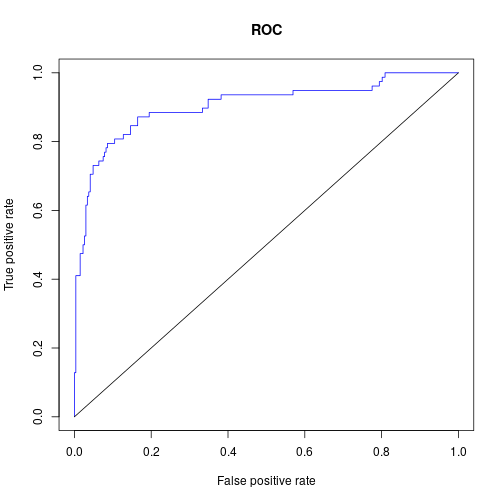

Statistical Analysis of Biomarkers
========================================================
author: Alejandro Cáceres, PhD
date: 10th of June 2020
autosize: true


Presentation
========================================================

Barcelona Institute of Global Health <https://www.isglobal.org/>:


- Research institution/think tank on global health
- Parc de Recera Biomedica de Barcelona (PRBB) and Hospital Clinic


Presentation
========================================================
<br />
- Senior statistician in the Bioinformatics group 
- Over 13 years of experience analysing biomedical data
- Develop novel analysis methods for biomarker discovery
- High dimensional data including imaging and omic data: genomic, transcriptomic, exposomic, etc.
- I write scientific articles and implement methods in software packages (R/Matlab).

Presentation
========================================================


```r
summary(cars)
```

```
     speed           dist       
 Min.   : 4.0   Min.   :  2.00  
 1st Qu.:12.0   1st Qu.: 26.00  
 Median :15.0   Median : 36.00  
 Mean   :15.4   Mean   : 42.98  
 3rd Qu.:19.0   3rd Qu.: 56.00  
 Max.   :25.0   Max.   :120.00  
```

Slide With Plot
========================================================


