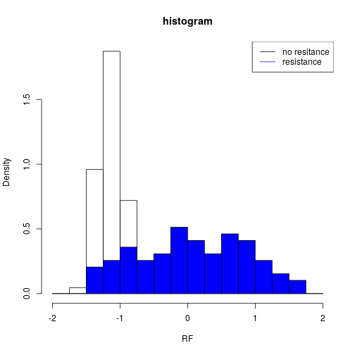
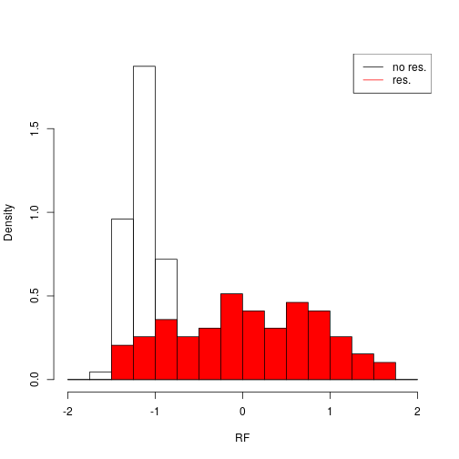

Statistical Analysis of Biomarkers
========================================================
author: Alejandro Cáceres, PhD
date: Almirall, 10th of June 2020
autosize: true


Presentation
========================================================
- <b>Senior statistician</b> in the Bioinformatics group at Barcelona Institute of Global Health <https://www.isglobal.org/>

- Adjunct <b>lecturer</b> in statustics at the Universitat Politectica de Catalunya <https://eebe.upc.edu/es>

- Over 13 years of experience analysing biomedical data
- Develop novel analysis methods for <b>biomarker discovery</b>
- High dimensional data including imaging and omic data: genomic, transcriptomic, exposomic, etc.
- I write scientific articles and implement methods in software packages (R/Matlab).


Presentation
========================================================
<br />
You can find me at: 

- [linkedin](https://es.linkedin.com/in/alejandro-caceres-dominguez-7449aa176)

- [google scholar](https://scholar.google.es/citations?user=s1D-6WAAAAAJ&hl=es)

- [gitHub](https://github.com/alejandro-isglobal)

- [my blog](https://alejandro-isglobal.github.io/)


Presentation
========================================================
<br />

Analytical validation of a biomarker: Functional magnetic resonance imaging


Presentation
========================================================
<br />

Discovery of severity Biomarker: Chromsome Y function and risk of disease in men 


Summary
========================================================
- Introduction: 
  - Biomarkers definition
  - Guidance for qualification and reporting
- Analysis methods for biomarkers:
  - Diagnostic matrix and ROC curve
  - Regression analyeses (stratified and with interactions)
  - Statistical power
  - Multiple Biomarkers
- Examples:   
  - Prediction of drug effects (depresion)
  - Response to a therapeutic intervention (psoriasis)


Introduction
========================================================
<br />
Definition:
<br />
- A biomarker is a <b>biological measurement</b>.

Properties:
<br />

- Source material or matrix 
- Method of measurement

Introduction
========================================================

Source material or matrix:

- specific analyte (e.g., cholesterol)
- anatomic feature (e.g., joint angle)
- physiological characteristic (e.g., blood pressure) 

when they are composite
- how the compoenents are interrelated (e.g. genomic data)
- how is the process of obtaining the biomarker (e.g. algorithm, score)


Introduction
========================================================

Method of measurement:

- molecular
- histologic
- radiographic
- physiologic characteristic

New biomarkers are continously created as novel methods of measurements and their analysis are constantly developed for adressing outstanding disease-related or treatment-related <b>needs</b>.


Introduction
========================================================

Context of use (COU):
- diagnostic biomarker
- monitoring biomarker
- pharmacodynamic/response biomarker (e.g., clinical trial endpoints, including surrogate endpoints)
- predictive biomarker
- prognostic biomarker
- safety biomarker
-susceptibility/risk biomarker

See FDA's Biomarker Qualification 2018 [doc](https://alejandro-isglobal.github.io/teaching/docs/fdabiomarker.pdf)

Introduction
========================================================
| Role        | Description   | 
| ----------  | ------------- | 
| Diagnosis of a disease | To make a diagnosis more reliably, more rapidly, or more inexpensively than available methods |
| Severity assessment | To identify subgroup of patients with a severe form of a disease associated with an increased probability of death or severe outcome
| Risk assessment | To identify subgroup of patients who may experience better (or worse) outcome when expose to an intervention
| Prediction of drug effects | To identify the pharmacological response of a patient exposed to a drug (efficacy, toxicity, and pharmacokinetics) 
| Monitoring | To assess the response to a therapeutic intervention

Analysis methods for Biomarker development
========================================================
<br />
<b>Is the test reliable?</b>

Analytical considerations: 
<br />
- validation of the Biomarkers test’s technical performance
- cost-effectives, feasability
- assessment of measurement error 

To which extent individuals obtain the same measurement, if we were to repeat it?

<b>test-retest reliability studies </b>

Statistics:
- intra-class correlation coefficients
- Cohen's kappa
- correlation coefficients

Analysis methods for Biomarker usefullness
========================================================

<b>Is the test a clinically useful biomarker?</b>

<br />
Establish the relationship between a biomarker and an outcome of interest:

- Randomized controlled trial
- Single-arm/historical control trial
- Cohort study
- Case-control study (including nested)
- Cross-sectional study
- Case series or case reports
- Registry information
- Meta-analysis

Strongest evidence comes from <b>prospective studies</b> that are specifically designed but data from studies conducted for <b>other purposes</b> can be used to support biomarker qualification.


Diagnostic Matrix
========================================================

Supose we have gathered data for reponse/no-reponse (case/control) subjects and positive/negative test for each subject

The Respose measurement has to events:
- yes 
- no

The Test measurement has to events:
- positive
- negative

Diagnostic Matrix
========================================================

Each individual has two measurements: (Response, Test)

| -- Subject -- | -- Reponse -- | -- Test -- |
| ------------- | ------------- | ---------- |
| $s_1$         |   yes        | positive |
| $s_2$         |   no         | negative |
| $s_3$         |   yes        | positive |
|...            |   ...        | ...      |
| $s_i$         |   no         | positive* |
|...            |   ...        | ...      |
|...            |   ...        | ...      |
| $s_3$         |   yes        | negative* |
|...            |   ...        | ...      |


Diagnostic Matrix
========================================================

Let's think first in terms of the response

<br />
Within those who responded (yes), how many tested positive?

- <b>Sensitivity</b> (true positive rate)

$$fr(positive|yes)=\frac{n_{positive|yes}}{n_{negative|yes}+n_{negative|yes}}$$


Diagnostic Matrix
========================================================

Let's think first in terms of the response

<br />
Within those who did not respond (no), how many tested negative?

- <b>Especificity</b> (True negative rate)

$$fr(negative|no)=\frac{n_{negative|no}}{n_{positive|no}+n_{negative|no}}$$


Diagnostic Matrix
========================================================

|  | -Response: Yes -- | -- Response: No -- |
| --------- | --------- | -------- |
| -<b>Test: positive</b>- | $fr(positive|yes)$ | $fr(positive|no)$ | 
| -<b>Test: negative</b>- | $fr(negative|yes)$ | $fr(negative|no)$ | 
| -<b>sum</b>-      | 1                | 1               |


|  | -Response: Yes -- | -- Response: No -- |
| --------- | --------- | -------- |
| -<b>Test: positive</b>- |True positive rate (sensitivity) | False positive rate| 
| -<b>Test: negative</b>- | False positive rate| True negative rate (especificity)| 

Trade-off between sensitivity and especificity need to be evaluated in the context of use and usefullness of the test 

Diagnostic Matrix
========================================================

Let's think first in terms of the test

<br />
Within those whose test was positive, how many responded (yes)?

- <b>Positive predictive value</b> 

$$fr(yes|positive)=\frac{n_{yes|positive}}{n_{yes|positive}+n_{no|positive}}$$

Diagnostic Matrix
========================================================

Let's think first in terms of the test

<br />
Within those whose test was negative, how many did not respond (no)?

- <b>Negative predictive value</b> 

$$fr(yes|negative)=\frac{n_{yes|negative}}{n_{yes|negative}+n_{no|negative}}$$


Diagnostic Matrix
========================================================

|  | -Response: Yes -- | -- Response: No -- | -- sum -- |
| --------- | --------- | -------- | ------ |
| -<b>Test: positive</b>- | $PPV: fr(yes|positive)$ | $fr(no|positive)$ | 1 |
| -<b>Test: negative</b>- | $fr(yes|negative)$ | $NPV: fr(no|negative)$ | 1 |


PPV: positive predicted value
NPV: negative predicted value

These are really the values that we want to know but they depend on the prevalence of the disease


Diagnostic Matrix
========================================================

There is a way to convert from sentitivity to positive predicted value (Baye's rule)

$$fr(yes|possitive)=\frac{fr(positive|yes)}{fr(possitive)}fr(yes)$$

which can be rewritten 

$$\frac{fr(yes|possitive)}{fr(no|possitive)}=\frac{fr(positive|yes)}{1-fr(negative|no)} \frac{fr(yes)}{1-fr(yes)}$$

Diagnostic Matrix
========================================================

$$ODD_{posttest}=LHR*ODD_{pretest}$$

$LHR+=\frac{Sensitivity}{1-Especificity}$

|  | LHR+ |
| --- | --- |
| Excellent diagnostic value | >10 |
| Good diagnostic value | 5-10 |
| Poor diagnostic value | 1-5 |
| No diagnostic value | 1 |


ROC curve
========================================================
Let's look at some data:

[HIV resistance](https://pubmed.ncbi.nlm.nih.gov/12060770)

- Biomarker: Resistance factor derived drom genomic data using a machine learning method

- Reponse:  Antiretroviral drug resistance

ROC curve
========================================================


```r
library(RCurl)
hiv <- read.delim("https://alejandro-isglobal.github.io/data/hiv.txt")
head(hiv)
```

```
  response      test
1        1 -0.438185
2        1 -0.766791
3        1  0.695282
4        1 -0.689079
5        1  0.325977
6        1  0.704040
```


ROC curve
========================================================


```r
table(hiv$response)
```

```

 -1   1 
267  78 
```


ROC curve
========================================================


```r
br <- seq(-2,2,0.25)
hist(hiv$test[hiv$response==-1], br=br, freq=F,xlab="RF", main="")
hist(hiv$test[hiv$response==1], br=br, freq=F, add=T, col="blue")
legend("toprigh", legend=c("no res.", "res."), col=c(1,2), lty=1)
```




ROC curve
========================================================

```r
library(cvAUC)
out <- cvAUC(hiv$test, hiv$response) #calcular ROC
plot(out$perf, col="blue", main="ROC") #plot
lines(c(0,1),c(0,1)) #identidad
```




