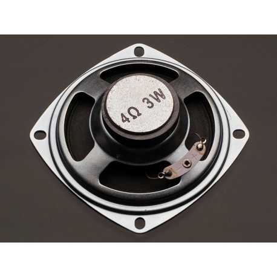

*Los intervalos de confiaza son herramientas básicas de la inferencia estadística y como tal se calculan fácilmente en R. Sin embargo, a pesar de su ultidad y de su uso extendido, muchas veces son malinterpretados. Esto tal vez se deba a que rara vez nos adentramos en las razones del por qué y el cómo de su definición, prefiriendo saltar rápidamente a su aplicación. Usando R y un ejemplo como guía, en este tutotial explico conceptos teóricos que ayudan a ententender e interpretar un intervalo de confianza.  Por último describo las funciones para calcularlos directamente en R.*



Imaginemos que sabemos producir altavoces de $4\Omega$ y que queremos  producirlos en serie y comercializarlos. Para etiquetarlos correctamente, tenemos que garantizar que los altavoces se producen con una media de $4\Omega$. Por lo tanto, para conocer la impedancia media de los altavoces de nuestra fabricación, hemos producido con esfuerzo 10 prototipos. De estos diez prototipos, pretendemos saber en qué medida su impedancia promedio estima la impedancia de los altavoces de una futura producción en serie. Podemos usar los **intervalos de confianza** para esto. Cuando queramos averiguar si la impedancia del proceso es consistente con un etiquetado de $4\Omega$, el valor al que los queremos comercializar, entonces tendremos que hacer una **prueba de hipótesis**. 


Claramente este tipo de situación es generalizable a muchos contextos, pensemos por ejemplo en un conjunto de pacientes sobre el que ensayamos un nuevo medicamento para el colesterol. En este caso queremos averigüar el nivel de colesterol medio en sangre para una futura población bajo tratamiento. La diferencia en este caso es que el proceso bajo investigación es un proceso natural sobre el que intervenimos. Sin embargo, ambos ejemplos ilustran que aquello que deseamos conocer, el proceso sea natural o artificial, es una abstracción: tanto la población bajo tratamiento como el proceso de producción de altavoces pueden no ser todavía entidades concretas. Aún así podemos intentar conocerlos parcialmente por medio de unos casos específicos. La abstracción requiere menos imaginación cuando la planta de producción en serie existe y queremos averiguar el valor medio de una propiedad de los especímenes que produce, usando una muestra de ellos. Y haciendo tal vez un abuso de lenguaje, cuando un proceso natural genera especímenes o fenómenos identificables y no muy variables entre ellos, asumimos un mecanismo, o fabrica natural en serie, detras de su producción. La dirección en abstracción es importante para entender e interpretar mejor las herramientas estadísticas.

Volvamos a nuestro ejemplo de producción de altavoces. Supongamos que el resultado de medir la impedancia de los 10 prototipos de altavoces es:


| Medición      | Impedancia    |  
| ------------- |-------------- | 
| $x_1$ | 3.5 |  
| $x_2$ | 5.0 |  
| $x_3$ | 3.7 | 
| $x_4$ | 2.2 |
| $x_5$ | 5.8 |
| $x_6$ | 6.9 | 
| $x_7$ | 3.8 | 
| $x_8$ | 6.3 |
| $x_9$ | 5.0 | 
| $x_{10}$ | 0.7 | 

Desde el inicio vemos una variación considerable en las mediciones de la impedancia. Codificamos estas mediciones en el vector **impedancia**


```{r}
impedancia <- c(3.5, 5.0, 3.7, 2.2, 5.8, 6.9, 3.8, 6.3, 5.0, 0.7)
```
y calculamos el promedio de la mediciones defido como 
$$\bar{x}=\frac{1}{n}\sum_{i=1,...n} x_i$$

usando la función **mean**
```{r}
barx <- mean(impedancia)
barx
```

Al permitirnos calcular el promedio de estos diez valores hemos asumido que estos resultados son sumables, o sea que pertenecen a una misma categoría y que en últimas son producidos por un mismo proceso. Ahora, el proceso fabrica especímenes variables en su impedancia y esto tiene una consecuencia importante. Si bien el promedio de las mediciones está se cerca del objetivo de $4\Omega$, si tomásemos otras 10 mediciones este valor cambiaría y podría alejarse del valor deseado. La variación en producción del proceso nos impide tener absoluta confianza de que el promedio de las impedancias de 10 epecímenes coincide con el valor medio de los altavoces del mismo proceso cuando este se serifique. 

Pero no nos rindamos y preguntémosnos ¿Qué tan confiados estamos de que el valor 4.29 es representativo del proceso de producción? para tal vez mejorar nuestro proceso y estar mas cerca de $4\Omega$.  

Consideraremos que:

- A pesar de que todas las mediciones son diferentes, cada una representa igualmente una impedancia posible del proceso de producción. Por tanto, cada medición es el resultado de una variable aleatoria, aunque en el caso de altavoces esté ligada a un espécimen concreto. Lo que varía en estas mediciones no es la impedancia sobre el espécimen sino los especímenes entre sí. Tenemos pues *n* valores como resulatado de *n* mediciones $(x_1,...,x_n)$ en minúsculas, que provienen de las variables aleatorias $(X_i,...X_n)$, en mayúsculas, que son *n* mediciones repetidas sobre la misma varibale aleatoria $X=X_i=...=Xn$. Recordemos que una variable aleatoria es una para la cual el resultado de su medición es diferente cada vez que la medimos. De tal forma que entendemos $X_i$ como la $i$-ésima medición en algún experimento de $n$ mediciones, cualquiera que resulte ser el espécimen concreto con impedancia $x_i$. 

- El **único** valor para la media muestral 
$\bar{x}= 4.29$ proviene de **otra** variable aleatoria 
$$\bar{X}= \frac{1}{n} \sum X_i$$ que es función de las variables aleatorias $X_i$.

Por lo tanto debemos tener en cuenta dos distribuciones de probabilidad. Recordemos que estas son funciones que asignan una probabilidad a cada uno de los posibles resultados que pueden tomar las variable aleatorias. La primera distribución es para la impedancia del proceso $X$. Asumimos que existe, la llamamos la **distribución poblacional**, y le asignamos algún modelo de probabilidad de acuerdo a su naturaleza. Si $X$ es una variable aleatoria discreta podemos pensar en modelos binomial o de Poisson, entre muchos otros. Si $X$ toma valores continuos, entonces consideramos modelos como por ejemplo los modelos normal o exponencial. Los modelos probabilísticos son toda una legión y son la base sobre la cuál las teorías, algunas ilustres como la mecánica cuántica o la evolución Darwiniana, se construyen. 

La segunda distribución es la de $\bar{X}$, y la llamamos **distribución de muestreo**. En este caso es la distribución de muestreo para la media, que intentamos averiguar desde los modelos para $X$, aplicando en teorema central del límite o derivándola analíticamente, como es el caso de la distribucion t-student. Tanto la distribución para $X$ como para $\bar{X}$ son abstracciones. 


En términos matemáticos, queremos conocer el valor esperado $E(X)=\mu$ de la disricución poblacional. En nuestro ejemplo este valor corresponde al valor medio de la impedacia para el proceso de fabricación de los altavoces en serie. $\mu$ es un parámetro, una propiedad de la distribución de $X$; su centro de gravedad que nunca observamos directamente pero que, si asumimos un modelo para la distribución, podemos estimarlo de los datos. El número $\bar{x}$ es un buen ejemplo de un número derivado de los datos que podemos usar para estimar $\mu$, ya que en particular $E(\bar{X})=E(X)$ y por lo tanto es un estimador insesgado.

Al hacer la estimación tomamos $\mu \sim \bar{x}$ ($\hat{\mu} = \bar{x}$). Sin embargo, no sabemos **qué tan cerca** estamos de $\mu$. Esta es la motivación para los intervalos de confianza, para tener una idea de en dónde se podría encontrar $\mu$.


Para saber qué tan lejos $\bar{x}$ puede caer de $\mu$, buscaremos los números $f_{inf}$ y $f_{sup}$ tal contengan una probabilidad del 95\% de contener la distancia entre $\bar{X}$ y $\mu$

$$P(f_{inf} \leq \bar{X} - \mu \leq  f_{sup} )=0.95.$$

O sea, intentaremos identificar el rango de valores que contienen al 95\% de las diferencias entre $\bar{X}$ y $\mu$. Escribamos esta proabilididad como
$$P(\bar{X} - f_{sup} \leq \mu \leq \bar{X} - f_{inf} )=0.95$$

y definamos el **intervalo aleatorio** 
$$(L,U) = (\bar{X} - f_{sup},\bar{X} - f_{inf})$$ 

Este intervalo es en sí es una variable aleatoria y tiene por definición una probailidad del  95\% de contener a $\mu$. Cada vez que hagamos un experimento de *n* mediciones y tomemos su promedio obtendremos un intervalo, si sabemos $f_{inf}$ y $f_{sup}$. El intervalo asociado a un experimento $(l,u)=(\bar{x} - f_{sup},\bar{x} - f_{inf})$, en minúsculas, o contiene o no contiene a $\mu$ aunque esto **nunca lo sabremos**. Pensemos en el juego de lotería rasca y gana. Una tarjeta del rasca y gana, o tiene un premio o no lo tiene. La probabilidad de ganar no depende de esa tarjeta, sino de todos las tarjetas que se venden; es una propiedad del juego. La diferencia fundamental es que no podemos rascar el intervalo y ver a $\mu$. 

Para el intervalo aleatorio definido arriba nos queda el consuelo de que los intervalos concretos, productos de mediciones en experimentos específicos, atrapan a $\mu$  el 95\% de las veces. Tenemos un gran oportunidad de ganar y decimos, mas tecnicamente, que tenemos una  **confianza** del 95\% de que un intervalo concreto $(l,u)$ atrapará a $\mu$. La probabilidad la reservamos para el intervalo aleatorio, diciendo que tiene una probabilidad del 95\% de contener a $\mu$. Objetivizamos la confianza al nombrarla propiedad de una medición, o de una tarjeta del rasca y gana, mientras que la probabilidad es una propiedad de la variable aleatoria del proceso, o del juego del rasca y gana. 


Volvamos a la probabilidad incial  
$$P(f_{inf} \leq \bar{X} - \mu \leq  f_{sup} )=0.95$$
y dividamos por $\sigma_{\bar{X}}$
$$P( \frac{f_{inf}}{\sigma_{\bar{X}}} \leq \frac{\bar{X}-\mu}{\sigma_{\bar{X}}} \leq  \frac{f_{sup}}{\sigma_{\bar{X}}} )=0.95$$

remplazemos $\sigma_{\bar{X}}=\sigma_{X}/\sqrt{n}$; la equación general para $\sigma_{\bar{X}}$ que nos dice que mientras más medidas tomemos ($n\rightarrow \infty$) el cambio que esperamos entre valores $\bar{x}$ para diferentes expriementos es cada vez mas pequeño. Así pues, necesitamos resolver  

$$P( \frac{f_{inf}}{\sigma_{X}/\sqrt{n}} \leq \frac{\bar{X}-\mu}{\sigma_{X}/\sqrt{n}} \leq  \frac{f_{sup}}{\sigma_{X}/\sqrt{n}} )=0.95$$
para $f_{inf}$ y $f_{sup}$. 

Para realizar un cálculo sencillo, vamos a asumir 2 condiciones:

1. Que $X$ se distribye normalmente $N(\mu, \sigma_X)$. 

2. Que sabemos (o nos dan) $\sigma_{X}$ como información adicional. Una condición poco realista porque generalmente $\sigma_{X}$ es tan desconocida como $\mu$ pero que nos vale por ahora y que corregiremos después. Imaginemos que el fabricante omnisciente sabe que la desviación estándard de los altavoces que produce es $\sigma_X=1.4 \Omega$.  


Si 1 y 2 se cumplen **entonces** se puede demostrar que  $Z=\frac{\bar{X}-\mu}{\sigma_{X}/\sqrt{n}}$ es una variable aleatoria estandard $N(\mu=0, \sigma^2=1)$ y por lo tanto podemos calcular  $f_{inf}$ y $f_{sup}$ de los cuantiles de $Z$ al 2.5\% y 97.5\%. O sea

$$P( z_{0.025} \leq Z \leq  z_{0.975} )=0.95$$
definidos como $P(Z \leq  z_{0.025})=\Phi(z_{0.025}) = 0.025$ y  $P( Z \leq  z_{0.925}) =\Phi(z_{0.925})= 0.925$, donde $\Phi(z)$ es la función de acumulación de probabilidad para la distribución estándard. Por lo tanto, tenemos que 

$$f_{inf}=z_{0.025}*\sigma_{X}/\sqrt{n}$$
$$f_{sup}=z_{0.925}*\sigma_{X}/\sqrt{n}$$

que podemos calcular en R con la función de los cuantiles para la distribución estándard (en R: $\Phi^{⁻1}$=*qnorm*)
```{r}
z0.025 <- qnorm(0.025)
z0.025 
z0.925 <- qnorm(0.925)
z0.925 
```


Para nuestro experimento, tenemos $n=10$ y $\sigma_{X}=1.4cm$ y $f_{inf}=-f_{sup}$, porque la distribución estandard es simétrica 
```{r}
fsup <- 1.959964*1.4/sqrt(10)
fsup
```

Entonces para el intervalo aleatorio 

$$(L,U) = (\bar{X} - f_{sup},\bar{X} - f_{inf})$$

hemos hecho la observación 

$$(l,u) = (\bar{x} - f_{sup},\bar{x} + f_{sup})$$

```{r}
CI <- c(barx-fsup,barx+fsup)
CI
```


El intervalo $(l,u)=c(3.424287, 5.159713)$ es una observación de $(L,U)$ y para la cual tenemos una confianza del 95\% de haber atrapado a $\mu$.

Esto también lo escribimos como:

$$\bar{x}=4.2 \pm 0.8$$

Por lo tanto, al estimar $\mu$ con $\bar{x}$, no podemos estar muy seguros de la precisión dada por el decimal $.2$. Los decimales siguientes carecen de sentido práctico y los podemos descartar. Como conclusión tenemos que la media $\mu$ para el proceso de altavoces está cerca de los $4\Omega$ pero que también el proceso es claramente variable, pudiendo producir altavoces con impedancias menores 3.4 o mayores de 5 en 5\% de los casos. Se debe valorar si esta variación es aceptable para etiquetar todos los altavoces producidos como altavoces $4\Omega$.  

Ilustremos el intervalo de confianza $(l,u)$ en términos de las distribuciones de probabilidad que estiman pata $L$ y $U$. Para las 10 mediciones de impedancia, que son mostradas en el histograma abajo, corresponden un único intervalo de confianza para $\mu$. Los límites de este intervalo estiman la media de las distribuciones para $L$ y $M$ respectivamente ($\mu_L \sim l$, $\mu_U \sim u$), dibujadas en rojo y azul. Estas distribuciones atrapan con una confianza de 95\% la distribución de $X$. 
```{r}
#rango de valores observables
x <- seq(-0.5,8.5,0.05)

#histograma de mediciones
hist(impedancia, br=seq(-0.5,8.5), freq=FALSE, col="lightgrey", ylim=c(0, 0.3))

#distribucion estimada para L
lines(x,dnorm(x, mean=CI[1], sd=1.4), col="red")

#distribucion estimada para U
lines(x,dnorm(x, mean=CI[2], sd=1.4), col="blue")

legend("topleft",c("distribucion estimada para L", "distribucion estimada para U"), col=c("red","blue"), lty=1, cex=0.7 )

#xbar
points(barx, 0, pch=16)
text(barx, 0.02, "barx")

#l
points(CI[1], 0, pch=16,col="red")
text(CI[1], 0.02, "l")

#u
points(CI[2], 0, pch=16,col="blue")
text(CI[2], 0.02, "u")
```


Notemos que el intervalo de confianza $(l,u)=c(3.424287 5.159713)$ no es una cantidad puramente empírica; es decir, el resultado exclusivo de una medición, como sí lo son $x_i$ o $\bar{x}$. El intervalo es definido de acuerdo a un modelo para $X$, con lo cual, si cambimos el modelo, cambiamos el intervalo. Como los efectos pueden ser considerables y las conclusiones dispares, requerimos de argumentos teóricos, empíricos o semi-empíricos para preferir un modelo sobre otro. En nuestro caso podemos ver que las impedancias de los 10 altavoces son consistentes con una distribución normal usando el test de Shapiro y el criterio *p-value>0.05* 

```{r}
shapiro.test(impedancia)
```

Si bien nos exigimos ignorancia sobre los parametros de la distribución $X$, como $\mu$, nos permitimos suponer una forma o modelo para la distribución. Por lo que tenemos que aprender a tener una posición crítica frente a esa decisión. 

----
##Intervalos de confianza en R

Veamos como calcular rápidamente los intervalos de confianza en R. Los intervalos de confianza para 

- un experimento de n muestras.
- de una distribución normal para $X$.
- del que sabemos la desviación estándard para $X$: $\sigma_X$.
\end{itemize}

se pueden calcular con la función **z.test** del paquete *TeachingDemos*

```{r}
library(TeachingDemos) 
z.test(impedancia, sd=1.4)
```
Con el interés exclusivo de determinar el intervalo de confianza, leemos los últimos dos resultados, en donde se reporta en intervalo $(l,u)$ con su nivel de confianza $\alpha=0.95$, junto con la media $\bar{x}$ para las observaciones en el vector *impedancia*. 


##Intervalos de confianza cuando $\sigma_X$ es desconocido
El caso más común es que no sepamos ni la media $E(X)=\mu$ ni la varianza $V(X)=\sigma^2_X$ de las mediciones, al fin y al cabo son paramétros de la distribución de $X$ que siempre debemos estimar en algún momento. 

Recordemos que queremos calcular $f_{inf}$ y $f_{sup}$ de

$$P( \frac{f_{inf}}{\sigma_{X}/\sqrt{n}} \leq \frac{\bar{X}-\mu}{\sigma_{X}/\sqrt{n}} \leq  \frac{f_{sup}}{\sigma_{X}/\sqrt{n}} )=0.95.$$

Para este caso más general asumimos:

1. Que $X$ se distribuye normamente según $N(\mu, \sigma_X^2)$.

2. Que podemos sustituir $\sigma_x$ por su estimador $s=\frac{1}{n-1} \Sigma_i(x_i -\bar{x})^2$, calculado de los datos. 

Si 1 y 2 se cumplen **entonces** se puede demostar que la variable $T=\frac{\bar{X}-\mu}{s/\sqrt{n}}$ es una variable aleatoria que sigue una distibucion t-student con n-1 grados de libertad $t(n-1)$.


$$P( \frac{f_{inf}}{s/\sqrt{n}} \leq \frac{\bar{X}-\mu}{s/\sqrt{n}} \leq  \frac{f_{sup}}{s/\sqrt{n}} )=0.95$$

$$P( t_{0.025,n-1} \leq T \leq  t_{0.975,n-1} )=0.95$$
siendo $T$ una variable aleatoria con una dostribución student-$t$ con n-1 grados de libertad, podemos calcular sus cuantiles al 2.5\% y 97.5\% usando la función **qt** (la función inversa de la acumulación de probabilidad para la distribución $t$ con $df$ grados de libertad)

```{r}
t0.025 <- qt(0.025,df=9)
t0.025
t0.975 <- qt(0.975,df=9)
t0.975
```
Por lo tanto $$f_{sup}=t_{0.975,n-1} \frac{s}{\sqrt{n}}=-f_{inf}$$
Para nuestro experimento de altavoces tenemos
```{r}
barx <- mean(impedancia)
barx
s <-sd(impedancia)
s
```
 y por lo tanto el intervalo de confianza al 95\% es 
```{r}
fsup <- 2.262157*s/sqrt(10)
fsup
CI <- c(barx-fsup,barx+fsup)
CI
```

Este intervalo se calcula con la función **t.test** de R

```{r}
 t.test(impedancia, conf.level = 0.95)
```

Donde vemos claramente el intervalo de confianza y el valor para $\bar{x}$. Notemos una propiedad imporatante para los dos tipos de intervalos de confianza que hemos calculado hasta aquí. En ambos casos la  estandarización de $\bar{X}$ nos lleva a las variables aleatorias $Z$ y $T$ cuyas distribuciones no dependen de los parámetros $\mu$ y $\sigma$ de la distribución de $X$. Esto nos permite usar estas variables repetidas veces como **pivotes estadísticos** para calcular $f_{inf}$ y $f_{sup}$ en muchos de los casos que podemos asumir las condiciones 1. 2. de cada caso.   
  
Por último, si necesitamos decidir si los experimentos ofrecen evidencia suficiente de que el proceso de producción de altavoces es consistente a un proceso de $4\Omega$, o sea si podemos asumir de que es razonablemente que $\mu = 4\Omega$ entonces debemos hacer una prueba de hipótesis. Esta prueba, en términos del intervalo de confianza, nos dice que *no podemos rechazar* la hipótesis de que $4\Omega$ sea $\mu$ debido a que $4\Omega$ esta **dentro** del intervalo $(2.928335, 5.651665)$ a 95\% de confianza. Así pues, los datos nos permiten etiquetar los altavoces a $4\Omega$ de acuerdo con su promedio, pero la variabilidad de su producción también debe ser evaluada para saber sí esta es acceptable.   


##Intervalos de confianza para $\sigma_X^2$
Veamos el intervalo de confianza para la varianza. Así como estimamos el parámetro $\mu$ para hubicar en dónde se encuentra el centro de gravadad de la distribución de $X$, también estimamos su varianza $\sigma^2_X$ para determinar su anchura. De hecho, hemos ultizado el valor $s$ para estimar $\sigma_X$ en el cálculo de los intervalos de confianza cuando $\sigma_X$ es desconocido.   

Recordemos que $s^2$
```{r}
s<-sd(impedancia)
s^2
```

es un valor de la variable aleatoria $$S^2= \frac{1}{n-1}\sum_i (X_i-\mu)^2$$ que estima  $\sigma^2_X$ insesgadamente porque $E(S^2)=\sigma^2_X$.

Si $X$ se distribye normalmente $N(\mu, \sigma_X)$ entonces se pude encontar una variable **pivote** $S^2(n-1)/\sigma^2$ que se distribuye como una $\chi^2$ con n-1 grados de libertad,  
$$\frac{S^2}{\sigma_X^2}(n-1)\rightarrow \chi^2_{n-1}$$
sin depender de $\sigma_X$. Para identificar el intervalo de confianza, buscamos $f_{inf}$ y $f_{sup}$ tal que
$$P(f_{inf}\leq \frac{S^2}{\sigma_X^2}(n-1) \leq f_{sup})=0.95$$
definidos por los cuantiles al 2.5\% y 97.5\% de esta variable aleatoria

$$P(\chi^2_{0.025,n-1} \leq \frac{S^2}{\sigma_X^2}(n-1) \leq \chi^2_{0.975,n-1})=0.95$$

```{r}
chi0.025 <- qchisq(0.025, df=9)
chi0.025
chi0.975 <- qchisq(0.975, df=9)
chi0.975
```


Al resolver la desigualdad para $\sigma^2_x$ 

$$P(\frac{S^2 (n-1)}{\chi^2_{0.975,n-1}}\leq \sigma_X^2 \leq \frac{S^2(n-1)}{\chi^2_{0.025,n-1}})=0.95$$

la escribimos en términos del intervalo aleaorio $(L,U)$ con proabilidad contener a  $\sigma_X^2$ el 95\% de las veces, de acuerdo con $P(L\leq\sigma_X^2\leq U)=0.95$. Por lo tanto tenemos

$$ L=\frac{S^2 (n-1)}{\chi^2_{0.975,n-1}}; U=\frac{S^2(n-1)}{\chi^2_{0.025,n-1}}$$

Para nuestros datos tenemos un valor concreto de este intervalo dado por el intervalo de confianza al 95\%
```{r}
n <- 10
CI<-c(s^2*(n-1)/chi0.975, s^2*(n-1)/chi0.025)
CI
```

Este se calcula en R con la función  **sigma.test** 
```{r}
sigma.test(impedancia)
```

Así para la medición de nuestros 10 prototipos (histograma) tenemos que el intervalo de confianza para la varianza define dos distribuciones límite (roja y azul) que atrapan con una confianza de 95\% la distribución de $X$ con varianza $\sigma_X$. 

```{r}
x <- seq(-0.5,8.5,0.05)

hist(impedancia, br=seq(-0.5,8.5), freq=FALSE, col="lightgrey", ylim=c(0, 0.3))

lines(x,dnorm(x, mean=barx, sd=sqrt(CI[1])), col="red")
lines(x,dnorm(x, mean=barx, sd=sqrt(CI[2])),col="blue")

legend("topleft",c("distribucion estimada para L", "distribucion estimada para U"), col=c("red","blue"), lty=1, cex=0.7 )
```

Toda nuestra discusión se ha basado en intervalos de confianza al 95% pero claramente la confianza se puede aumentar al 99\% definiendo 

$$P(f_{inf} \leq \bar{X} - \mu \leq  f_{sup} )=0.99$$
y los cuantiles de los pivotes al 0.005\%  y el 0.995\%. En las funciones de R simplemente se ajusta el parámetro **conf.level = 0.99**.

