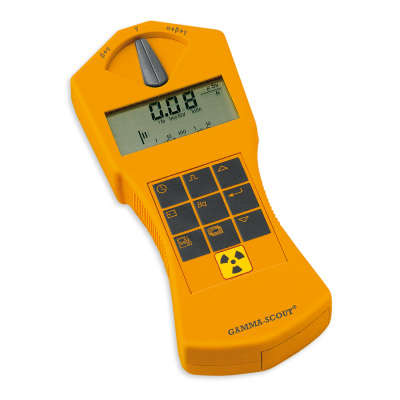

*Las distribuciones de muestreo son la puerta de entrada a la inferencia estadística y de salida a la predicción. Ellas son las intermediarias entre los datos y las distribuciones poblacionales. Los estadísticos son las variables aleatorias de las distribuciones de muestreo, y por lo tanto son fundamentales para entender cualquier razonamiento estadístico. Mediante un ejemplo de un contador Geiger ilustro el papel central de las distribuciones de muestreo para el razonamiento estadístico.*


 Un contador Geiger mide el número de partículas radioactivas por segundo. Es escencial para saber que tan expuesta está una persona en un lugar con alta radiación, como por ejemplo en una central nuclear o en lugares con alta contaminación radioactiva como en Fukushima o Chernóbil. Analizaremos los datos de un contador Geiger imaginando que son los datos que obtenemos al seguir a un trabajador que entra en una central nuclear a hacer una labor de limpieza. Nuestro trabajo es hacer una lectura remota de los datos, para alertar al trabajador cuando se encuentre en una zona de alto riesgo y pedirle que abandone el lugar. En [mightyohm.com](http://mightyohm.com/files/geiger/capture.txt) hay una muestra real de un contadorr Geiger, que también se puede encontar [aquí](https://alejandro-isglobal.github.io/data/capture.txt). Usaremos estos datos imaginando que son los obtenidos en la situación descrita, y suponeniendo que el promedio de partículas detectadas por segundo debe ser menor de 0.4 para la salud del trabajador. Nuestro objetivo es estimar el valor medio de partículas detectadas por segundo, a medida que el trabajador va pasando más tiempo en el reactor y nosotros vamos obteniendo mas datos. El propósito de plantear esta situación ficticia sobre datos reales es dramatizar cómo nuestro conocimiento y decisiones cambian en función de la cantidad de datos que disponemos. 

Empecemos cargando los datos    

```{r}
library(RCurl)
text <- getURL('https://alejandro-isglobal.github.io/data/capture.txt')
geiger <- read.table(text=text, sep = ",")
head(geiger)
```

En la columna 2 se encuentran los conteos de partículas en cada segundo (CPS, counts per second). Imaginemos que comenzamos observando las detecciones del contador Geiger en los primeros 10 segundos depués de que el trabajador entra al reactor.

```{r}
detecciones <- geiger[,2]
detecciones10 <- detecciones[1:10]
detecciones10
```

Podemos ver que en el primer segundo se detectó una partícula, así como en los segundos 4, 5, 7 y 8. Así pues el número de promedio de partículas detectadas por segundo es

```{r}
xbar <- mean(detecciones10)
xbar
```

el promedio *xbar* lo denotamos como $\bar{x}$, que definido sobre $n$ datos $x_1,..x_n$ tiene la forma

$$\bar{x}=\frac{1}{n}\sum_{i=1}^n x_i.$$

Esta es la suma ponderada de los datos, o su centro de gravedad cuando cada dato tiene el mismo peso, y nos da una idea de la centralidad de las mediciones. Observamos que el promedio de detección en número de partículas por segundo es mayor al recomendado 0.4. Según estos datos deberíamos sugerirle al trabajador que salga inmediatamente. 

Sin embargo ¿Qué tan confiados estamos de que el trabajador realmente esté en una zona de peligro? Al fin y al cabo, si esperamos las detecciones de los siguientes 10 segundos (11,...20) nos dará otro valor (*xbar=0.2*) que nos hará cambiar de opinión. Por lo tanto $\bar{x}=0.5$ (con x minúscula) es el resultado de un experimento aleatorio sobre una variable aleatoria $\bar{X}$ (con x mayúscula). De tal forma que nos interesa conocer la probabilidad de que $\bar{X}<0.4$. Si conocemos cómo se distribuye $\bar{X}$ entonces podremos **predecir**  qué tan probable es obtener promedios de $\bar{x}<0.4$ en muestreos de $n=10$ segundos. Es decir, podríamos calcular 

$$P(\bar{X} < 0.4)=F(0.4; n=10)=\int_0^{0.4} f(t; n=10) dt$$

donde $F_{\bar{X}}=F(0.4; n=10)$ es la función de distribución o acumulación de probabilidad de $\bar{X}$ para $\bar{X}=0.4$; y $f_{X}=f(t; n=10)$ es la densidad de probabilidad de $\bar{X}$ en $t$. La función de distribución para $\bar{X}$ se conoce como la **distribución se muestreo** para la media (en nuestro caso para una muestra de tamaño  $n=10$). La pregunta es entonces ¿Cómo podemos saber cómo es $F_{\bar{X}}$ o, equivalentemente, $f_{\bar{X}}$? Una pista nos la da la idea de que la variable aleatoria $\bar{X}$ es el resultado del promedio de $n$ variables aleatorias $X_1, .... X_n$ (en mayúsculas)
$$\bar{X}=\frac{1}{n}\sum_{i=1}^n X_i,$$
que da origen al valor observado $\bar{x}$ para un experimento de $n$ mediciones en particular. Por lo que si supiéramos las funciones de probabilidad para cada $X_i$, podríamos saber la función para $\bar{X}$.  

###Modelización de la probabilidad poblacional
Primero hagamos una gran consideracón. Nuestras mediciones $X_1,..X_n$, o conteos en cada segundo, son eventos independientes que provienen de un proceso común, que puede ser descrito por una única variable aleatoria $X$. Denotaremos como $f_X$ la función de probabilidad de $X$, que llamaremos función de probabilidad **poblacional**. Esto es por el hecho de que $f_X$ será la función que nos de las probabilidades de obtener cada uno de los valores de $X$. El término poblacional está inspirado en los censos, donde las mediciones no pueden ser separadas de los individuos que representan y por lo tanto $f_x$ da la probabilidad a todos y cada uno de los posibles valores que puede tomar $X$ en la población. $f_x$ es abstracta y tiene la libertad de representar individuos que todavía no existen o partículas radioctivas de átomos que todavía no han decaído. Aún así suponemos que el proceso de creación que representa existe y que lo podemos conocer, o como mínimo modelar. 

La suposición de que $X_1,..X_n$ son la mera repetición independiente de $X$, $n$ veces, no está siempre garantizada. El conteo de nuestras partículas en un momento podría depender de cuantas se detectan previamente, o los individuos en un censo podrían estar relacionados y no representar a la población. Sin embargo, como no tenemos razones para pensar que  nuestras partículas radioactivas dependen de una ley de oferta y demanda, nos vamos a permitir suponer un **modelo** de probabillidad para $X_1,..X_n$ independientes y provenientes de la misma $X$. 

Nuestro primer paso es derivar características generales del proceso que produce diferentes conteos en el detector segundo a segundo por diez segundos; ¿Cómo es que ahora se detecta una partícula, después ninguna y tal vez en 10 segundos dos?. Una vez tengamos una idea de cómo dar forma a $f_X$, el objetivo es deducir la forma posible de $f_{\bar{X}}$. Para modelar una función de probabilidad poblacional solemos empezar considerando los eventos para los cuales nuestra ignorancia es razonablemente total. De este punto de patida construimos la situación que queremos describir. Comencemos imaginándonos que tuviésemos un contador que pudiese detectar partículas en milésimas de segundo. Seguramente en un milisegundo detectaríamos o una o cero partículas: no se detectarían más de una. No es mucho pedir que a este nivel nuestro proceso radiactivo se comporte como el lanzamiento de una moneda, al menos trucada. Si este es el caso entonces detectaríamos una partícula con una probabilidad $p$ que sería igual al número promedio de detecciones por segundo, que llamamos $\lambda$, dividido por $m=1000$. $\lambda$ es ideal, una característica del proceso imaginado: de nuestra moneda trucada. Con esta perspectiva, volviendo al mundo de nuestro contador Geiger real, si contamos todas las partículas detectadas en un segundo, sería un total de $x$ partículas detectadas en $m=1000$ ensayos, uno por cada milisegundo. Este tipo de conteo probabilístico sigue una distribución binomial

$$P(X=x)=\binom m x p^x(1-p)^{m-x}$$
que describo en otro tutorial pero que se reduce a contar el número de caras en $m$ lanzamientos de una moneda trucada con probabilidad $p$, no $1/2$, de dar cara. Usando $p=\lambda/m$, podemos escribir

$$P(X=x)=\binom m x \big(\frac{\lambda}{m}\big)^x(1-\frac{\lambda}{m})^{m-x}$$
en términos de $\lambda$. El intervalo en milisegunodos es todavía una aproximación, útil para anclarnos en un proceso binomial, pero insuficente para destilar la idea de que las partículas son independientes entre sí. El nuestro no es un proceso que genere múltiples partículas a la vez, como la emisión de un par electrón-positrón. Es hora de acordarse de nuestro trabajador que se ha quedado esperándonos en una zona de posible riesgo. Las partículas que él detecta son de un átomo que decae aquí y otro que decae allá. El proceso que queremos describir no es otro que la densidad contaminación de partículas radioctivas de dónde él se encuentra, siendo $\lambda$ una medida de esa densidad. Recordemos que nuestro objetivo es describir la peligrocidad del lugar. Para tomar esto en cuenta, imaginamos ahora un contador infinitamente rápido con tiempo de detección de 0 segundos o, equivalentemente, que el número de ensayos en la distribución binomial crece a infinito ($m \rightarrow \infty$). En el límite de rapidez, nos acegurarnos que las partículas no se crean exactamente al mismo tiempo, es decir que la densidad de contaminación las crea de una a una, aqui y allá, con cierta cadencia $\lambda$.  Tomando límite $m \rightarrow \infty$ en la distribución binomial arriba llegamos a la distribución de Poisson       

$$f_{X}=f(x; \lambda)=P(X=x)= \frac{\lambda^x e^{-\lambda}}{x!}.$$

La distribución de Poisson sirve para modelar cualquier proceso con el cual podamos recorrer el mismo camino de supociciones: conteos independientes en un intervalo de tiempo o espacio que se generan uno a uno con un promedio $\lambda$ por unidad de intervalo. Nosotros la usaremos para modelar la probabilidad de contar $x$ partículas radioactivas con una media de detección por segundo dada por $\lambda$. 

Veamos qué forma tendría $f_{X}$ si consideramos los primeros 10 segundos de detección. Pero para esto, todavía necesitamos saber el valor de $\lambda$. Vamos a asumir que $\bar{X}$ es un estimador de $\lambda$, es decir que en últimas podemos remplazar $\lambda$ por el resulatdo de nuestro experimento $\bar{x}=0.5$ ¿Por qué podemos hacer esto? 

- *Primero*, porque la media de la distribución $f_x$ es

$$E(X)= \sum_{x=0}^\infty x f_{x}=\lambda$$
Es decir, el centro de gravedad de $f_x$, dado por la suma ponderada de cada valor de $x$ por su probabilidad, es exactamente $\lambda$ cuando  $f_x$ es la densidad de Poisson. Este resultado se demuestra usando la forma para $f_{x}$ y expandiendo el exponencial $e^{-\lambda}$ en series de potencia de $\lambda$. 

- *Segundo*, porque el promedio de los datos también se puede escribir como

$$\bar{x}=\frac{1}{n}\sum_{i=1}^n x_i=\sum_{x=0}^\infty x \frac{n_x}{n},$$
donde $n_x$ es el número veces en n=10 segundos que observamos x=1, 2, 3, .. partículas. Para nuestros datos esto es 


```{r}
nx <- table(detecciones10)
nx
x <- 0:1
n <- 10
sum(nx/n*x)
```

que es *xbar*. 

Al escribir el promedio en esta forma, nos damos cuenta con las dos ecuaciones arriba que cuando $n \rightarrow \infty$, $n_x \rightarrow \infty$ pero su ratio $\frac{n_x}{n} \rightarrow f_x$. Así recuperamos la noción de probabilidad como la fracción de veces que observamos un evento si hacemos infinitos experimentos. Por lo tanto $\bar{x}$ es un de las versiones aproximadas de $\lambda$, cuando sólo disponemos de 10 mediciones, esto lo denotamos $\bar{x}=\hat{\lambda}$ y decimos que $\hat{\lambda}$  es la **estimación** de $\lambda$ dada por $\bar{x}$. En términos de las variables aleatorias decimos que $\bar{X}$ es un **estadístico** estimador de $\lambda$, que además es insesgado por que
$$E(\bar{X})=E(X)=\lambda.$$

Dibujemos la función poblacional $f(x;n)$ para $n=10$, según la estimación dada por los primeros 10 segundos, o sea $\hat{\lambda}=0.5$. En R tenemos la función de probabilidad de Poisson dada por la instrucción *dpoiss(x, lambda)* de tal forma que $f(x; n=10, \lambda=\bar{x})$ es

```{r}
x <- 0:5
fx <- dpois(x, lambda=xbar)
names(fx) <- x

plot(x,fx, type="p", pch=16)
for(i in 1:11)
  lines(c(x[i], x[i]), c(0, fx[i])) 
```
Este es nuestro **modelo** para $f_X$ según los conteos de partículas radiactivas en los primeros diez segundos después de que el trabajador entra a la planta. Este es nuestro estado de conocimiento en los primeros diez segundos.   

###Densidad de probabilidad para el promedio de la muestra
Según nuestro estado de conocimiento, aunque limitado, queremos saber cómo se distribuye el promedio de detecciones $\bar{X}$ en 10 mediciones (una cada segundo). Un paréntesis para clarificar.  $\bar{X}$ es la variable aleatoria que da el promedio de la muestra, $X_1...X_n$, que también es llamada media muestral. Yo evito esta denomicación porque puede llevar a confundirla con la otra media que es el valor esperado de una variable aleatoria $E(Y)$. En esa notación tenemos la media de la variable $X$: $E(X)$ y la media de la media muestral $\bar{X}$: $E(\bar{X})$, que aunque coinciden numéricamente no representan lo mismo, después vizualisaremos por qué. Por ahora, queremos saber, **según** el modelo $f_{X}=Pois(x; n=10, \lambda=0.5)$, cuales son los valores de $\bar{x}$ que podemos esperar si pudiésemos hacer entrar al trabajador muchas veces, y cada vez calcular $\bar{x}$ sólo por 10 segundos. 

Para simular una de estas entradas en falso del trababjador, podemos generar $10$ valores aleatorios que siguen una Poisson usando la función *rpois(10, lambda=0.5)*

```{r}
conteos <-  rpois(n=10, lambda=0.5)
conteos
```

Cada vez que ejecutemos *rpois(10, lambda=0.5)* hacemos una nueva simulación. Hagamos el histograma de una de estas entradas en falso de 10 mediciones del contador en 10 segundos.

```{r}
conteos <- rpois(10, lambda=0.5)
hist(conteos, freq=FALSE, breaks=seq(-0.1, 5.5, 0.2))
```

Este es un experimento con 10 mediciones con un promedio 
```{r}
mean(conteos)
```

Cada nuevo experimento con 10 mediciones tendrá su propia $\bar{x}$. 
Ahora estudiemos *teóricamente* cómo se comportaría $\bar{X}$ bajo este modelo de Poissson de $f_X$. Más especificamente nos preguntamos ¿Cómo sería la distribución de valores de $\bar{x}$ cuando repetimos muchas veces la entrada del trabajador por 10 segundos? Hagamos muchas simulaciones, recojamos muchos valores de $\bar{x}$ y veamos su distribución.

Para esto hacemos una función general que computa $\bar{x}$ en un experimento de 10 mediciones. Creamos  la función **Xbar** tal que tome n=10 valores de una variable de Poisson con $\hat{\lambda}=0.5$ y compute su media    

```{r}
Xbar <- function(n)
{
  conteos <- rpois(n, lambda=0.5)   
  mean(conteos)
}

Xbar(10)
```
Veamos ahora el histograma que resulta de muchos valores de **Xbar** ($\bar{X}$) para ver su distribución de valores. Creemos 1000 valores para $\bar{X}$ recordando la función *sapply*  y dibujemos el histograma de estos 1000 promedios  $\bar{x_1}, \bar{x_2}...\bar{x}_{1000}$

```{r}
distXbar <- sapply(rep(10,1000), Xbar)
head(distXbar)
hist(distXbar, freq=FALSE, breaks=seq(0,3,0.025))
```

Ya tenemos una aproximación numérica de $f(\bar{X}; n=10, \hat{\lambda}=0.5)$ 

```{r}
fxbar <- prop.table(table(distXbar))
fxbar
```
y de $F_\bar{X}$
$$F_\bar{x}(0.4)\sim \sum_{\bar{x}=0}^{0.4} \hat{f}_\bar{x}=\frac{n_{\bar{x}<0.4}}{1000}$$ 
Que es simplemente, la proporción de veces que observamos $\bar{x}_i<0.4$ en las 1000 repeticiones. 
```{r}
sum(fxbar[1:4])
mean(distXbar<0.4)
```
Entonces, bajo el modelo *Pois(x; n=10, lambda=0.5)* y nuestros primeros 10 datos $\bar{x}=0.5$ no es improbable ${\bar X}<$ 0.4 
es decir que no podemos descartar que si efectivamente $\lambda=\bar{x}=0.5$ detectemos que el trabajador se encuentre en zona segura, si lo volviésemos dejar entrar. Sin embargo, si podríamos descartar que detectemos promedios correspondientes a muy alto riesgo, digamos $\lambda>1$
```{r}
mean(distXbar>1)
```

Hasta aquí, hemos **asumido** que $\lambda=0.5$. Es lo mejor que podemos hacer con los primeros 10 segundos. Somos concientes que esto es tan sólo la estimación $\hat{\lambda}=\bar{x}$. Pero, ¿Qué tan confiados podemos estar de esta aproximación? lo que nos interesa en el fondo no es tanto evaluar esta suposición como conocer qué tan cerca estamos del valor de $\lambda$. 

###Estimación de $\lambda$

Si bien hemos hecho una estimación de $\lambda$ con $\bar{x}=0.5$, no sabemos que tan lejos estamos de su valor real. De hecho $\lambda$ no es observable, sólo estimable. Sin embargo, habrán unas estimaciones mejores que otras. Hemos asumido que $\bar{x}=\hat{\lambda}$ como el caso más **verosímil** pero ¿Cuál sería $\hat{\lambda}$ en el mejor de los casos? Es decir, consideremos que hemos tenido mala suerte y que $\bar{x}=0.5$ fue un resultado que por azar resultó demasiado alto para una variable aleatoria con un $\lambda$ realmente bajo, correspondiente a nivel de contaminación por radiación bajo. Más precisamente, imaginemos que $\bar{x}=0.5$ fue un valor que por azar resulto muy alto, por encima del cual la variable aleatoia $\bar{X}$ sólo toma valores el 2.5% de las veces. Queremos encontrar cual es el $\lambda$ que corresponde a ese caso. Reconsideremos la simulación de conteos, pero ahora como función de $\lambda$ y fijemos $n=10$ 

```{r}
Xbar10 <- function(...,lambda)
{
  conteos <- rpois(10, lambda)   
  mean(conteos)
}
```

Hagamos otra función que nos de el cuantíl al 97.5\% de una distribución de los valores dados por *Xbar10*  

```{r}
xbar0.975 <- function(lambda) 
{
  quantile(sapply(rep(10,10000), Xbar10, lambda=lambda),0.975)
}
```

Este es el valor de $\bar{x}$, por *encima* del cuál se encuentra sólo el 2.5\% de los valores de $\bar{X}$ cuando $\lambda$ es por ejemplo 0.3 

```{r}
xbar0.975(lambda=0.3)
```

Miremos varios valores de $\lambda$ y calculemos cuando $xbar=0.975$ es precisamente $xbar$

```{r}
lambdaint <- seq(0,0.4,0.02)
Xbar0.975 <- sapply(lambdaint, xbar0.975)

lambdalow <- lambdaint[Xbar0.975==0.5]
lambdalow
```
Cuando asumumimos alguno de estos valores estimados para $\lambda$, que llamaremos $\hat{\lambda}_{low}$, creemos que hemos tenido mala suerte. Es decir que el trabajador realmente se encontraría en una zona bastante segura, sólo que $\bar{x}=0.5$ resultó en ser excepcionalmente alto. Obtengamos una versión computacional de la distribucion de valores de $\bar{X}$ para uno de estos estimadores de $\lambda$ por ejemplo el segundo

```{r}
distL <- sapply(rep(10,10000), Xbar10, lambda=lambdalow[2])
quantile(distL,0.975)
```
confirmando que sólo 2.5\% de valores de $\bar{X}$ para esta distribución son mayores que $\bar{x}=0.5$. Así mismo podemos suponer valores de $\lambda$ para los que hemos tenido mucha suerte (en la medición pero no para el trabajador!) y hemos detectado muy pocas partículas en una situación de extrema contaminación. Para esto calculamos el cuantíl al 2.5\% de una distribución de los valores dados por *Xbar10*, y vemos cuándo coincide con $\bar{x}=0.5$  

```{r}
xbar0.025 <- function(lambda) 
{
  quantile(sapply(rep(10,10000), Xbar10, lambda=lambda),0.025)
}

lambdaint <- seq(1,1.5,0.02)
xbar0.025 <- sapply(lambdaint, xbar0.025)

lambdahigh <- lambdaint[xbar0.025==xbar]
lambdahigh
```

De tal forma que usando uno de estos valores estimados de $\lambda$ reproducimos la distribución para $\bar{X}$ donde sólo el 2.5\% de los posibles resultados para esta variable aleatoria es *menor* al valor observado $\bar{x}=0.5$ 
```{r}
distU <- sapply(rep(10,10000), Xbar10, lambda=lambdahigh[6])
quantile(distU,0.025)
```

Estas dos situaciones extremas para la distribución de $\bar{X}$, estimadas por nuestros datos, las podemos visualizar 

```{r}
hist(distL, freq=FALSE, breaks=seq(0,3,0.025), main="", col="red")
hist(distU, freq=FALSE, breaks=seq(0,3,0.025), col="blue", add=TRUE)

legend("topright", c("lambdahigh", "lambdalow"), lty=1, col=c("blue", "red"))
```

los valores estimados $\hat{\lambda}_{low}$ y $\hat{\lambda}_{high}$ definen un intervalo, que se puede entender como el resultado de un intervalo aleatorio que captura a $\lambda$ el $95\%$ de las veces. Este es un [intervalo de confianza](https://alejandro-isglobal.github.io/teaching/intervalosdeconfianza.html) del 95\%. Recordemos que $\lambda$ o está o no está en ($\hat{\lambda}_{low}, \hat{\lambda}_{high}$). Aunque eso no lo podemos saber tenemos una confianza del 95\% que así sea o equivalentemente, que la función de probabilidad para $\bar{X}$ esté capturada entre las los illustradas arriba. 


###Teorema central del límite
Aunque la distribución para $\bar{X}$ la hemos calculado computacionalmente (*distXbar*), no conocemos su forma funcional. Es decir, no diponemos de una función de probabilidad conocida y con parámetros que se puedan calcular mediante una fórmula, decimos pues que no tenemos una función de distribución *parametrica*. Si bien tenemos un **algoritmo** para calcular la función, este depende de una generación aleatoria de miles de medias de distribuciones de Piosson. Para muchos casos, esto no es un problema. Los ordenadores actuales nos permiten esto. Pero si queremos analyzar simultaneamente no un contador de Geiger sino miles de ellos que se encuentren distribuidos por una zona contaminada entonces tendremos problemas de computar tantas números aleatorios. Afortunadamente, si decidimos esperar un por lo menos un minuto ($n=60$), en vez de 10 segundos, podremos conseguir suficientes datos que nos permite simplificar el cálculo de la estimación de de la función de probabilidad para $\bar{X}$, recobrando una forma paramétrica para ella. El teorema central del límite (TCL) nos dice que $\bar{X}$ se puede aproximar a una distribución normal

$$N(\mu_{\bar{X}}, \sigma_{\bar{X}})$$
cuando $n>30$. Donde la media y la varianza están dadas por

$$\mu_{\bar{X}}=E(X)=\mu=\lambda$$
$$\sigma^2_{\bar{X}}=Var(X)/n=\sigma^2_{X}/n=\lambda/n$$


Estos últimos valores son los que corresponden a una distribución de Poisson $\mu=\sigma^2=\lambda$ para nuestros datos. De tal forma que el TCL nos permite usar la distibución normal para calcular

$$P(\bar{X}<0.4)$$
Illustremos el teorema con nuestros datos. Para esto debemos esperar 30 segundos y por lo tanto hacer estimar de nuevo $\lambda$ con $\bar{x}$ para $n=60$. 

```{r}
detecciones60 <- detecciones[1:60]
xbar <- mean(detecciones60)
xbar
```
Vemos de paso que esperar 60 segundos nos permite ser mas prudentes. Ahora estaríamos por debajo del límite de seguridad (0.4). Para ilustrar el TCL calculamos computacionalmente la distribucion de $\bar{X}$ 
para $\hat{\lambda}=0.3$
```{r}
Xbar <- function(n)
{
  conteos <- rpois(n, lambda=xbar)   
  mean(conteos)
}
```
y le superponemos la distribución normal con media y varianza estimada $\hat{\lambda}$ y  $\hat{\lambda}/\sqrt{60}$ usando la función **dnrom(x,mu,sigma)** 

```{r}
n <- 60
lambda <- xbar
distXbar <- sapply(rep(n,1000), Xbar)
hist(distXbar, freq=FALSE)

xprom <- seq(0,1,0.005)
normvals <- dnorm(xprom, mean=lambda, sd=sqrt(lambda)/sqrt(n))
lines(xprom, normvals, col="red")
```

El TCL nos perminte usar la distribución de acumulación de probabilidad de la función normal para calcular  
$$P(\bar{X}<0.4)=\Phi(0.4; \hat{\lambda}, \hat{\lambda}/\sqrt{60})$$

```{r}
pnorm(0.4, xbar, sqrt(lambda)/sqrt(n))
```

Es decir, que ahora estamos mucho mas seguros de que el trabajador se encuentra en zona segura. El TCL permite tambien estimar $\lambda$ y su [intervalo de confianza](https://alejandro-isglobal.github.io/teaching/intervalosdeconfianza.html) usando las fórmulas para la distribución normal, y ahorarnos tiempo de computo sin perder precisión. Podemos también confirmar que la aproximación no es buena para $n=10$, requiriendo para estos casos usar las simulaciones

```{r}
n <- 10
lambda <- xbar
distXbar <- sapply(rep(n,1000), Xbar)
hist(distXbar, freq=FALSE)

xprom <- seq(0,1,0.005)
normvals <- dnorm(xprom, mean=lambda, sd=sqrt(lambda)/sqrt(n))
lines(xprom, normvals, col="red")
```

###Estimación de la varianza de $\bar{X}$

Tomemos más datos, ahora seamos mas pacientes, esperemos 2 minutos y registremos $n=120$ mediciones del contador.

```{r}
detecciones120 <- detecciones[1:120]
xbar <- mean(detecciones120)
xbar
```

La situación sigue mejorando $xbar < 0.4$ y el trabajador estaría claramente en zona segura, podemos calcular de nuevo la probabilidad $Pr(\bar{X}<0.4$) usando el TCL

```{r}
pnorm(0.4, mean=xbar, sd=sqrt(xbar/120))
```

y vemos que si asumimos que el valor medio de particulas emitidas por segundo es $0.275$ entonces tenemos una probabilidad de $0.0045$ de obtener un valor mas grande que $0.4$; o sea que **la hipótesis** de que  el trabajador se encuentra en zona peligrosa es poco probable según los datos; y la podríamos rechazar con un límite de significancia de puesto al $0.05$ o de confianza al $95\%$. 

Veamos como aumenta la precisión, o como disminuye la varianza de $\bar{X}$ con el número de mediciones.     
El modelo ha vueto a cambiar ahora para estos 120 datos el estimador de $\hat{\lambda}=\bar{x}=0.275$ 

```{r}
Xbar <- function(n)
{
  conteos <- rpois(n, lambda=0.275)   
  mean(conteos)
}
```
Hagamos los histogramas para la versión computacional de $\bar{X}$ con $n=5$, $n=30$ y $n=100$ 

```{r}
distXbar5 <- sapply(rep(5,1000), Xbar)
hist(distXbar5, freq=FALSE, ylim=c(0,15), breaks=seq(0,2.5,0.025))

distXbar60 <- sapply(rep(60,1000), Xbar)
hist(distXbar60, freq=FALSE, add=TRUE, breaks=seq(0,2.5,0.025), col="blue")

distXbar120 <- sapply(rep(120,1000), Xbar)
hist(distXbar120, freq=FALSE, add=TRUE, breaks=seq(0,2.5,0.025), col="orange")

legend("topright", legend=c("n=5", "n=60", "n=120"), col=c("black", "blue", "orange"), lty=1)
```

Vemos que a medida que las medidas aumentan ($n$), la varianza de $\bar{X}$, que llamamos $\sigma^2_{\bar{X}}$, es cada vez mas pequeña  ($\sqrt{\lambda/n}$) y cada vez tenemos mas confianza de que nuestro promedio dado por los datos $\hat{\lambda}=\bar{x}$ está cerca del verdadero valor de $\lambda$: $\lambda \sim \hat{\lambda} = 0.275$. 

Tomemos por último todas las 1238 mediciones del contador, que son aproximadamente 20 minutos. Podemos otra vez usar el TCL para calcular $Pr(\bar{X}<0.4$) con el nuevo valor estimado de $\lambda$ dado por $\bar{x}$


```{r}
length(detecciones)
xbar <- mean(detecciones)
xbar
pnorm(0.4, mean=xbar, sd=sqrt(xbar/1238))
```

Vemos que estos 20 minutos nos dan una probabilidad de 1 de que nuestro trabajador esta en zona segura. Por lo tanto nuestro conocimiento y recomendación sobre la seguridad del trabajador cambia dramáticamente de acuerdo con la cantidad de datos que disponemos.

Finalmente podemos comprobar que estos datos reales están muy bien descritos por una distribución de Poisson

```{r}
hist(detecciones, freq=FALSE, breaks=seq(-0.5,5.5))

x <- 0:5
fx <- dpois(x, lambda= xbar)

points(x,fx, type="p", pch=16)
for(i in 1:6)
lines(c(x[i], x[i]), c(0, fx[i]))
```

pues existe muy poca variación entre el histograma de los datos y la distribución de Poisson con $\lambda$, el valor medio de partículas detectadas por segundo en el reactor, estimado por $\bar{x}$ con datos correspondientes a 20 minutos de mediciones; una por cada segundo.
