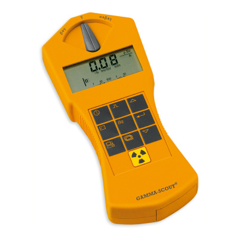

*Las distribuciones de muestreo son la puerta de entrada a la inferencia estadística y de salida a la predicción. Las distribuciones de muestreo son las intermediarias entre los datos y las distribuciones poblacionales; aquellas que queremos conocer. Los estadísticos son las variables aleatorias de las distribuciones de muestreo, y por lo tanto son fundamentales para entender cualquier razonamiento estadístico. Mediante un ejemplo de un contador Geiger ilustro el papel central de las distribuciones de muestreo para el razonamiento estadístico.*


 Un contador Geiger mide el número de partículas radioactivas por segundo. Es escencial para saber que tan expuesta está una persona en un lugar con alta radiación como por ejemplo en una central nuclear o en lugares con alta radiación como Fukushima o Chernovil. Analizaremos los datos de un contador Geiger imaginando que son los datos que obtenemos al seguir a un trabajador que entra en una central nuclear a hacer una labor de limpieza. Nuestro trabajo entonces es hacer una lectura remota de los datos, para alertar al trabajador si se encuentra en una zona de alto riesgo y lo mejor es que abandone el lugar. En [mightyohm.com](http://mightyohm.com/files/geiger/capture.txt) hay una muestra real de un contadorr Geiger, que también se puede encontar [aquí](https://alejandro-isglobal.github.io/data/capture.txt). Usaremos estos datos imaginando que son los obtenidos en la situación descrita, y suponeniendo que el promedio de partículas detectadas por segundo debe ser menor de 0.4 para la salud del trabajador. Nuestro objetivo es entonces estimar el valor medio de partículas detectadas por segundo, a medida que el trabajador va pasando mas tiempo en el reactor y nosotros vamos obteniendo mas datos. Esta situación ficticia sobre datos reales dramatiza como nuestro conocimiento y decisiones cambian en función de la cantidad de datos que disponemos. Empecemos cargando los datos    

```{r}
library(RCurl)
text <- getURL('https://alejandro-isglobal.github.io/data/capture.txt')
geiger <- read.table(text=text, sep = ",")
head(geiger)
```

En la columna 2 se encuentran los conteos de partículas en cada segundo (CPS, counts per second). Empezamos observando las detecciones del contados Geiger en los primeros 10 segundos depués de que el trabajador entra al reactor.

```{r}
detecciones <- geiger[,2]
detecciones10 <- detecciones[1:10]
detecciones10
```

Podemos ver que en el primer segundo se detectó una partícula, así como en los segundos 4,5, 7 7 y 8. Así pues el número de promedio de partículas detectadas por segundo es

```{r}
xbar <- mean(detecciones10)
xbar
```

Este promedio de detección es mayor al recomendado 0.4. Según estos datos deberíamos sugerirle al trabajador que salga inmediatamente. Sin embargo ¿Qué tan confiados estamos de que el trabajador realmente esté en una zona de peligro? Al fin y al cabo, si esperamos las detecciones de los siguientes 10 segundos (11,...20) nos dará otro valor (*xbar=0.2*) que nos hará cambiar de opinión. Por lo tanto $\bar{x}=0.5$ (con x minúscula) es el resultado de un experimento aleatorio sobre la variable aleatoria $\bar{X}$ (con x mayúscula). De tal forma que si conocemos cómo se distribuye $\bar{X}$ podremos **predecir**  qué tan probable es obtener $\bar{x}<0.4$ en un futuros muestreos de 10 segundos. Es decir, podríamos calcular la probabilidad

$$P(\bar{X} < 0.4)=F(0.4)=\int_0^{0.4} f(t) dt$$

donde $F(0.4)$ es la función de distribución de probabilidad de $\bar{X}$ en $\bar{X}=0.4$ y $f(t)$ la densidad de probabilidad de $\bar{X}$ en $t$.  La pregunta es entonces ¿Cómo podemos conocer $F_{\bar{X}}$ o equivalentemente $f_{\bar{X}}$? 

Recordemos que $\bar{x}$ es definida como el promedio de $n$ datos $x_1,..x_n$

$$\bar{x}=\frac{1}{n}\sum_{i=1}^n x_i$$

esto es la suma ponderada de los datos, o su centro de gravedad cuando cada dato tiene el mismo peso, que da una idea de la centralidad de las mediciones.  


la función de probabilidad para $\bar{X}$ se conoce como una función de **distribución se muestreo** para la media (en nuestro caso para una muestra de tamaño  $n=10$).  

Supongamos un **modelo** de probabillidad para estos datos y estudiemos *teóricamente* cómo se comporta $\bar{X}$ bajo el modelo. 

O sea: Cómo sería la distribución de valores de $\bar{x}$ cuando repetimos muchas veces el experimento de contar el número de partículas readioactivas por segundo durante 10 segundos y calculamos la media? Después volveremos a los datos...

Primero recordemos que de las funciones de distribución para el conteo de eventos en un intervalo determinado es la distribución de Poisson.
\[
    f(x; \lambda)=Pr(X=x)= \frac{\lambda^x e^{-\lambda}}{x!} 
\]
Donde $\lambda$, en nuestro caso, es el promedio en el n\'umero de detecciones de part\'iculas radioactivas (x) por segundo. En R: ** dpoiss(x, lambda)**

Vamos a asumir que $\bar{X}$ es un estimador de $\lambda$, es decir que en ùltimas podemos remplazar $\lambda$ por el resulatdo de nuestro experimento $\bar{x}=0.5$.

dibujemos la distribución: 

```{r}
x <- 0:5
fx <- dpois(x, lambda=0.5)
names(fx) <- x

plot(x,fx, type="p", pch=16)
for(i in 1:11)
lines(c(x[i], x[i]), c(0, fx[i])) 
```

Queremos saber cómo se distribuye el promedio de detecciones ($\bar{X}$) en 10 mediciones (una cada segundo), cuando cada detecci\'on (X) se distribuye $Pois(\lambda=0.5)$

La generación de $10$ valores aleatorios que siguen una Poisson se hace con **rpois(10, lambda=0.5)**

```{r}
conteos <-  rpois(10, lambda=0.5)
conteos
```

hagamos el histograma de un experimento (muestra) de $n=10$ mediciones.

```{r}
hist(rpois(10, lambda=0.5), freq=FALSE, breaks=seq(-0.5,5.5))
```

Este es un experimento con 10 mediciones con su media $\bar{x}=0.33$ 

Cada nuevo experimento con 10 mediciones tendrá su propia $\bar{x}$. 

Queremos generar muchos valores de $\bar{x}$ para ver su distribución.

Podemos empezar haciendo una función general que compute $\bar{x}$ en un experimento de 10 mediciones.

Creamos  la función **Xbar** tal que tome n=10 valores de una variable de Poisson con $\lambda=5$ y compute su media    

```{r}
Xbar <- function(n)
{
  conteos <- rpois(n, lambda=0.5)   
  mean(conteos)
}

Xbar(10)
```
Queremos ver un histograma de muchos valores de **Xbar** ($\bar{X}$) para ver como se distribuye.  Hagamos 600 valores para $\bar{X}$ recordando la función **sapply**  y dibujemos el histograma de estos 600 promedios  $(\bar{x_1}, \bar{x_2}...\bar{x}_{600})$?


```{r}
distXbar <- sapply(rep(10,600), Xbar)
head(distXbar)
hist(distXbar, freq=FALSE)
```


```{r}
distXbar <- sapply(rep(10,600), Xbar)

```

Bajo el modelo $Pois(x, lambda=0.5)$ no es improbable ${\bar X}<$ 0.4, pero si muy improbable obtener $\bar{X}>1$.

Cuál es la probabilidad $Pr(\bar{X}< 0.4)$?

Cuando n es grande ($>30$) sabemos que por el TCL

$$\bar{X}\sim N(\mu_{\bar{X}}, \sigma_{\bar{X}})$$
$$\mu_{\bar{X}}=E(X)=\mu=0.5$$
$$\sigma^2_{\bar{X}}=Var(X)/\sqrt{n}=\sigma^2_{X}/\sqrt{n}=0.5/\sqrt{n}$$


Recordemos que para una distribución de Poisson $\mu=\sigma^2=\lambda$ (=0.5 para nuestros datos).

Entonces:
Bajo el TCL podemos usar la distibución normal para calcular

$$P(\bar{X}<0.4)$$


Pero con n=10 no podemos usar este teorema: Veamos por qué.

Pinta la distribución normal; **dnrom(x,mu,sigma)** 
que le corresponde a la distribución de 
**Xbar(100)** en el intervalo: **xprom<-seq(0,1.5,0.01)}**

```{r}
sim <- sapply(rep(100,600), Xbar)
hist(sim, freq=FALSE)

xprom <- seq(0,1.5,0.01)
normvals <- dnorm(xprom, mean=0.5, sd=sqrt(0.5)/sqrt(100))
lines(xprom, normvals, col="red")
```

$\mu=0.5$, $\sigma=\frac{\sqrt{0.5}}{\sqrt{n}}$


Podemos confirmar que la aproximación no es buena para n=5

```{r}
sim <- sapply(rep(5,600), Xbar)
hist(sim, freq=FALSE)

xprom <- seq(0,1.5,0.01)
normvals <- dnorm(xprom, mean=0.5, sd=sqrt(0.5)/sqrt(5))
lines(xprom, normvals, col="red")
```

Tomemos más datos, ahora 50 mediciones (los primeros 50 segundos)


```{r}
detecciones50 <- detecciones[1:50]
xbar <- mean(detecciones50)
xbar
```

La situación cambia! ahora $xbar < 0.4$ y el trabajador estaría en zona segura. Pero con qué probabilidad $Pr(\bar{X}<0.4$)?


Ahora tenemos mas datos (50) y podemos calcular $Pr(\bar{X}<0.4)$ con el TCL

```{r}
pnorm(0.4, mean=0.36, sd=sqrt(0.36/50))
```

Según los 50 primeros datos el trabajador tiene una probabilidad de 0.68 de estar en zona segura.

Cuántos datos necesitamos para estar muy seguros?

El modelo ha cambiado ahora para estos 50 datos el estimador de $\hat{\lambda}=\bar{x}=0.36$ (le ponemos el gorro a $\lambda$ para remarcar que es un valor estimado)

```{r}
Xbar <- function(n)
{
  conteos <- rpois(n, lambda=0.36)   
  mean(conteos)
}
```
Hagamos los histogramas para muestras  de n=5, n=30 (blue), n=100(orange) 

```{r}
sim1 <- sapply(rep(5,600), Xbar)
hist(sim1, freq=FALSE, ylim=c(0,7))

sim2 <- sapply(rep(30,600), Xbar)
hist(sim2, freq=FALSE, add=TRUE, col="blue")

sim3 <- sapply(rep(100,600), Xbar)
hist(sim3, freq=FALSE, add=TRUE, col="orange")
```

A medida que las medidas aumentan (n) la varianza de $\bar{X}$, que llamamos $\sigma^2_{\bar{X}}$, es cada vez mas pequeña  ($\sqrt{0.5/n}$) y cada vez tenemos mas confianza de que nuestro promedio dado por los datos $\hat{\lambda}=\bar{x}$ está cerca del verdadero valor de $\lambda$: $\lambda \sim \hat{\lambda} = 0.36$


```{r}
mean(detecciones)
pnorm(0.4, mean=0.2899838, sd=sqrt(0.2899838/1238))
```

y muestran una probabilidad de 1 de que nuestro trabajador esta en zona segura.

También podemos comprobar que estos datos reales están muy bien descritos por una distribución de Poisson.

```{r}
hist(detecciones, freq=FALSE, breaks=seq(-0.5,5.5))

x <- 0:5
fx <- dpois(x, lambda= 0.2899838)

points(x,fx, type="p", pch=16)
for(i in 1:6)
lines(c(x[i], x[i]), c(0, fx[i]))
```{r}
