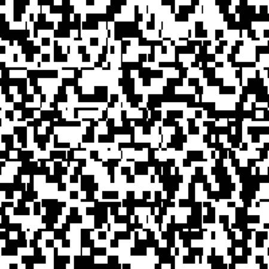

*Las funciones de probabilidad son los objetos matemáticos que usamos para entender experimentos aletorios. Cuando describimos un tipo de experimento aleatorio por una familia de funciones de probabilidad decimos que modelamos el proceso de medición del experimento. Cuando escogemos una función en particular para unos datos decimos que ajustamos el modelo. Usando R y como ejemplo el error aleatorio cometido al trasmitir los píxeles de de una foto, explico como las distribuciones binomial, binomial negativa y geométrica se obtienen de la distribución de Bernoulli.*

 Imaginemos un sistema de trasmisión de información binaria. Cualquier sistema digital sirve como ejemplo. En particular, imaginemos que el sistema consiste en trasmitir el valor de los pixeles (0:blanco, 1:negro) de una foto digital. El sistema puede consistir simplemente en tomar una foto en blanco y negro y enviarla por correo a una cuenta de email. El receptor de la foto al abrirla observará una perdida de calidad inicial, dada por la acumulación de errores en el almacenamiento, envío, procesamiento y visualización. Nuestro objetivo es analizar teóricamente esta situación para disponer de una herramienta matemática que nos permita describir este proceso aleatorio, es decir del error en la trasmisión que da origen a la pérdida en calidad de la foto. Insisto, lo que presentamos es un construcción analítica, lógica y abstracta de lo que queremos **derivar**; el comportamiento que podríamos esperar de este sistema bajo unas suposiciones razonables. El ejercicio es pues de carácter **deductivo**, sin apelar a datos ni observaciones de un experimento en concreto, sino a unos supuestos y a sus consequencias lógicas. Intentaremos construir un *modelo* de probabilidad para el error en transmisión de una foto en blanco y negro.       

##Función de probabilidad de Bernoulli

¿Qué es un modelo probabilístico? Supongamos la medición de un experimento $X$ que al repetirla bajo las mismas condiciones cada vez nos da un número diferente $\{x_1, x_2, ...\}$. Usamos $X$ mayúscula para la medición y nos referimos a ella como una variable aleatoria. Las letras en minúsculas son los valores que puede tomar $X$ depués de una medición en particular. Consideremos que $X$ sólo pueda tomar valores discretos entonces unos serán mas frecuentes que otros. Podemos calcular la frecuencia de $x_1$ como el número de experimentos que dieron como resultado $x_i$ dividido por el número total de experimentos $N$, o sea $fr(x_i)=N_{x_i}/N$. Si repitieramos infinitas veces el experimento entonces $fr(x_i)$ tiende a un número $P(X=x_i)$ que llamamos la probabilidad de que $X$ tome el valor $x_i$. O sea, $$lim_{N \rightarrow \infty} fr(x_i) =P(X=x_i).$$
La idea de concebir la probabilidad como el límite de una frecuencia ya nos indica su caracter abstracto y su naturaleza no observable, por lo menos de forma directa. Sin embargo, podemos ir a límite y desde allí definir las caracterésticas mas importantes que esperamos sobre la probabilidad y de forma lógica derivar sus consecuencias observables. Pansemos que la probabilidad para cada una de las posibles observaciones de $X$ está dada por una función $f(x_i)$ que llamaremos función de probabilidad y defnimos como 

$$f(x_i)=P(X=x_i).$$        
Lo más básico que le podemos pedir a esta función es que 

1. Sea siempre positiva para cualquier valor de $x_i$: $f(x_i)=P(X=x_i)$. No concebimos frequencias negativas ni que sus límites lo sean
2. Que la suma sobre todos sus valores sea 1: $\sum_{i=1}^{n}f(x_i)=1$. Es claro que las frecuecias relativas deben sumar 1 así como las suma de sus valores límites. 


Estas exigencias completan la definición de una función de probabilidad cualquiera. 

Veamos ahora casos particulares que nos ayuden a describir procesos de medición específicos. El caso mas sencillo de una función de distribución es para un ensayo de Bernoulli donde sólo hay dos posibles resultados $\{x_1=B, x_2=A\}$. Si el resultado A (k=1) tiene una probabilidad $p$, el evento B (k=0) por lo tanto tiene probabilidad $q=1-p$. La función de distribución de Bernoulli se puede escribir como 
$$f(k)=(1-p)^{1-k} p^k $$

El lanzamiendo de una moneda es un ensayo de Bernoulli con $p=1/2$. Dos características importantes de las funciones de probabilidad son su valor medio y su varianza. La media de la distribución es definida como 
$$E(X)=\mu=\sum_{i=1}^{n}f(x_i)x_{i}$$
y nos da su centro gravedad; como si cada $x_i$ fuese un punto con masa $f(x_i)$. La varianza es la distancia cuadrática media de cada uno de los valores de $x_i$ a la media 

$$V(X)=\sum_{i=1}^{n}(x_i-\mu)^2 f(x_i)$$
es decir su momento de inercia que indica cuanto de dispersos son los valores $x_i$.  Para la distribución de Bernulli la media y la varianza son $$E(x)=\mu=p$$ $$V(X)=\sigma^2=p(1-p)$$. La función de probabilidad de Bernoulli es un modelo de probabilidad que define realmente una familia de funciones. Cada función es totalmente definida por el número, o parámtro, $p$. Este número es sucifiente para calcular $f(x_i)$ y por lo tanto $E(X)$ y $V(X)$.  

Pensemos en un ejemplo en concreto. Imaginemos un sistema para transmitir el valor de un pixel que lo hace con un probabilidad $p=0.8$ de transmitirlo correctamente (correcto:k=0) y 0.2 de transmitirlo incorrectamente (error:k=1)  

$$
    f(k)= 
\begin{cases}
    0.8,& \text{si } k=0 \\
    0.2,& \text{si } k=1\\
\end{cases}
$$

Notemos que esta función da dos valores precisos para k=0,1. No hay nada aleatorio en está función. ¿Cómo reproducimos entonces el resultado de un experimento aleatorio?   Asignemmos $k$ el vector $(0,1)$ y a $fk$ el vector $(0.8,0.2)$ y trasmitamos un pixel. La función **sample** toma 1 valore aletorios entre (0,1) con probabilidad (0.8,0.2); es decir que hace un ensayo de Bernoulli
```{r}
k <- c(0,1)
fk <- c(0.8,0.2)
names(fk) <- k

sample(k, size=1, prob=fk, replace=TRUE)
```
Cada vez que ejecutemos la función R simulará el resultado de un experimento aleatorio, o ensayo de Bernoulli (20% de las veces data 1 o error). Hemos usado una función abstracta, la función de probabilidad de Bernoulli, para recrear lo que ocurriría si nuestro sistema de trasmisión estuviera dado por esta función en particular. Si imitamos la realidad de esta forma, nos podríamos preguntar si esta modelización es por lo menos consistente con la idea de que al repetir el experimento muchas veces nos acercamos al los valores de probabilidad. Recreemos una foto de 100 pixels blancos. Es decir trasmitamos 100 pixels cada uno con una probabilidad de 0.8 de ser transmitido. Para esto sólo tenemos que incrementar el numero de ensayos de Bernoulli un **sample** 
```{r}
foto <- sample(k, size=100, prob=fk, replace=TRUE)
image(matrix(foto, ncol=10), col=c("white", "black"), 
      main= "Recepción de foto en blanco con 20% de errores aleatorios")

```
En cada pixel tenemos un ensayo de Bernoulli, cuya función de probabilidad se puede representar por las frecuencias de cada resultado $fr(0)=N_0/100$, $fr(1)=N_1/100$, siendo $N=100$ un número suficientemente grande como para pensar que estas frecuencias están cerca de las probabilidades $f(0)$ y $f(1)$.

```{r}
hist(foto, freq=FALSE, breaks=seq(-0.5,1.5), ylim=c(0,1), 
     main="Función de probabilidad de Bernoulli")
points(k, fk, pch=16, col="red")

for(i in 1:2)
  lines(c(k[i],k[i]), c(0,fk[i]), col="red")

legend("topright", 
       c("función de probabiliad", 
         "frecuencia en 100 experimentos"), 
       col=c("red", "black"), lty=1, bty="n")

```

Es decir que computacionalmente vemos que  $$lim_{N \rightarrow \infty} fr(x_i)=f(x_i),$$ rocobrando la idea límite de probabilidad y confirmando que la definición de la función de probabilidad y su simulación son consistentes. Podemos ver sin embargo que todavía permanecen diferencias entre las frecuencias y la probabilidades definidas para el ensayo de Bernoulli $(p, 1-p)$. El promedio de 100 ensayos de Bernoulli $\bar{X}$ y su desviación estándard $S$ son funciones de [muestreo](https://alejandro-isglobal.github.io/teaching/muestreo.html) que se calculan con $mean$ and $sd$

```{r}
xbar <- mean(foto) 
xbar
s <- sd(foto)
s^2
```
y cuyos valores se acercan a $\mu=p=0.2$ y la varianza $\sigma^2=p*(1-p)=0.16$ de la distribución de Bernoulli. Cuando tenemos datos reales y no simulados no sabemos cuál es la función de probabilidad que genera esas mediciones pero creemos que si $N$ es grande entonces nos acercaremos a ella. En realidad $N$ no puede ser infinita pero si suficientemente grande para inferir las propiedades de la función de probabiliad que queremos conocer. Este es el objetivo de la inferencia estadística.

##Función de probabilidad Binomial

La función de probabilidad Binomial da la probabilidad de observar $x$ eventos de un tipo (A) con probabilidad $p$ en $n$ ensayos de Bernoulli. 

$$Bin(x; n,p)=\binom n x p^x(1-p)^{n-x}$$
x=0,1,...n

La media y la varianza de la función binomial son 
$$E(X)=\mu=np$$
$$V(X)=\sigma^2=np(1-p)$$
Notemos que estas son la media y la varianza de la distribución de Bernoulli multiplicada por $n$. Si en un ensayo esperamos observar la fracción $p$ de pixeles correctamente transmitidos, entonces en $n$ esayos esperamos $np$. Claramente el parámetro $p$ determina junto con $n$ la función binomial. 

Enviemos una foto de 100 pixels y contemos cuantas veces aparece el 1, es decir cuantos errores hay ($x$).

```{r}
foto <- sample(x=c(0,1),size=100, prob=fk, replace=TRUE)
foto
```

los pixels de una foto se envían de form sucesiva, por ejemplo enviando uno a uno los píxeles de la primer columna, después los de la segunda y así sucesivamente. Al final la los errores de la consisten en un vector de valores binarios que se pueden después reformatear en una matrix y visualizar. Para la foto enviada observamos  

```{r}
sum(foto)
```

errores que se cometieron al transmitir; pero, ¿Cuál es la probabilidad de observar fotos con 0, 1, 2, 3, 100,  errores, si casa pixel tiene una probabilidad de error del 20%. Es decir, nos preguntamos por los valores de: $Pr(x=2)$, $Pr(x=3)$, ... $Pr(x=100)$, cuando $p=0.8$. Para esto tenemos que enviar muchas fotos de 100 pixeles (por ejemplo 1000) y depués contar cuantas fotos tienen 0, 1, ... 100 errores y calcular $\{fr(x_i)\}_{i=0, ... 100}$


Hagamos una función para que simule los errores en eviar fotos de 100 pixels (cuando la probabilidad de error por pixel (k=1) es 0.2.

```{r}
enviar <- function(...)
{
   foto <- sample(c(0,1),size=100, 
                  replace=TRUE,prob=fk)
   sum(foto)
}
```


los tres puntos indican que no importa el argumento en la funci\'on, esta siempre hara lo mismo.

```{r}
enviar()
enviar(1)
enviar(1)
enviar("hola")
```


cada vez que llamamos a **enviar** con cualquier argumento simulamos la tranmisión de una foto de 100 pixels y contamos los errores. Podemos ahora simular los errores producidos en el envío de tres fotos de 100 pixeles  

```{r}
c(enviar(1), enviar(1), enviar(1))
```

en R esto se pueden hacer con la función **sapply**

```{r}
Tresfotos <- sapply(rep(1,3), enviar)
Tresfotos
```


Ahora simulamos los errores al enviar mil fotos y pintemos su histograma

```{r}
Milfotos <- sapply(rep(1,1000), enviar)
head(Milfotos)


hist(Milfotos, freq=FALSE, ylim=c(0,0.15), 
     xlim=c(0,40), breaks=seq(1.5, 100.5), 
     main="número de pixeles con errores en fotos de 100px")
```

El promedio y la desciación típica al cuadrado de los datos simulados es 

```{r}
mean(Milfotos)
sd(Milfotos)^2
```

que se acercan a los valores de la media y varianza de una distribución binomial
$E(X)=np=20$, $V(X)=np(1-p)=16$. Veamos qué se acerca el histograma de las frecuancias de los datos simulados a la distribución binomial. En R **dbinom** da los valores para la función binomial. $$Bin(x; n,p)=dbinom(x, size=n, prob=p)$$
Vamos los primeros valores toma para cuando $n=100$ y $p=0.2$

```{r}
x <- 0:100
binomial <- dbinom(x, size=100, prob=0.2)
names(binomial) <- x
head(binomial)
```

Es decir que para $x=0$ tenemos una probabilidad de $2.037036e-10$, para $x=1$ de $5.092590e-09$ y así sucesivamente. Comparemos el histograma $fr(x_i)$ con la función binomial $f(x_i)$
```{r}
hist(Milfotos,breaks=seq(1.5,100.5), 
     freq=FALSE, ylim=c(0,0.15), 
     xlim=c(0,40), 
     main="Función de probabilidad binomial")

points(x, binomial, pch= 16, col="red")

for(i in 1:101)
{lines(c(x[i], x[i]), c(0, binomial[i]), 
  col="red")}

legend("topright", 
       c("función de probabiliad", 
         "frecuencia errores en fotos de 100px"), 
       col=c("red", "black"), lty=1, bty="n")
```


Veamos como se acumula la probabilidad de la función binomial a medida de que vamos tomando valores sucesivos de $x$. La función de acumulación de probabilidad está dada por 
$$F(x)=P(X\leq x) $$
Es decir la probabilidad de bservar un valor de al menos $x$. En R tenemos la función **pbinom** que es la función de acumulación de probabilidad para una distribución binomial $F_{bin}(x; n, p)$

$$F_{bin}(x; n, p)=pbinom(x, size=n, prob=p)$$


```{r}
binCum <- pbinom(x, size=100, prob=0.2)
head(binCum)
plot(x, binCum, ylim=c(0,1), type="s",
       col="red", ylab="F(x)", xlab="x")
```


La función de acumulación de probabilidad es interesante para responder preguntas sobre la eficiencia del proceso de trasmición de pixeles, como por ejemplo ¿Cuál es la probabilidad de que **al menos** veamos tres errores en una foto de 3,1 mega pixels cuando el error en un pixel es de 1e-6? 


```{r}
pbinom(3, size=3.1e6, prob=1e-6)
```

## Función de probabilidad Geométrica

Supongamos que queremos un sistema de transmisión estricto que pare cuando el primer error en transmisión ocurra. La distribución geométrica da la probabilidad de observar el número de eventos (x) de un tipo (B) que hay que esperar hasta obtener un evento del otro tipo (A) de probabilidad $p$. 

$$P(X=x)=f(x)=(1-p)^{x}p,$$ $x=0,1,2,...$

Es decir, pordemos usar la función geométrica para  modelar el número de pixeles bien transmitidos (B; k=0) hasta encontrar el primer error (A; k=1). Al enviar una foto totalmente blanca, $x$ por lo tanto cuenta el número de pixels blancos hasta el primer pixel negro. La media y varianza de la función geométrica son  

$$E(X)= \mu =\frac{1-p}{p}$$ 
$$V(X)= \sigma^2 =\frac{1-p}{p^2}$$


Queremos pues enviar muchas fotos y estimar la probabilidad de observar fotos con 1 pixel correcto antes del primer error, 2 pixels correctos antes del primer error, ... 100 pixeles correctos (sin error). Es decir, queremos estimar los valores de $f(x_i)$ por medio de los valores computacionales $fr(x_i)$ para cada $x_i$ que surjan de una simulación. Enviaremos pues 1000 fotos de 100 pixeles y contemos cuantos ceros hay antes del primer 1.

La transmisión de una foto de 100 pixels, con error en transmisión de $p=0.2$ es 
```{r}
foto <- sample(c(0,1),100, replace=TRUE, prob=fk)
foto
```

Identifiquemos ahora cuantos ceros aparecieron antes del primer 1. Con la función **which** tenemos las posiciones de un vector que satisfacen una condición dada. Para nuestro caso, queremos conocer el primer elemento en la foto que es igual a 1.

```{r}
which(foto==1)
```

Asignamos la variable *firstone* al primer resultado de **which**. La posición del úlimo cero *lastzero* es una anterior a esta
```{r}
foto <- sample(c(0,1),100, replace=TRUE, prob=fk)
ones <- which(foto==1)
firstone <- ones[1]  
lastzero <- firstone-1
lastzero
```
Así pues tenemos que este valor es la posición del úlimo cero observado en la transmisión de una foto en particular. Para hacer muchas fotos hacemos la función **enviar**

```{r}
enviar <- function(x)
          {
             foto <- sample(c(0,1),100, 
                      replace=TRUE, prob=fk)
             ones <- which(foto==1)
             firstone <- ones[1]  
             lastzero <- firstone-1
             lastzero
          }   
          
enviar()
```

que simula el envío y conteo el número de pixels bien trasmitidos hasta el primer error. Enviemos 1000 fotos y obtengamos este número para cada una de las fotos.

```{r}
Milfotos <- sapply(rep(1,1000), enviar)
head(Milfotos)
```

Vemos que el promedio de estos números y su desviación típica al cuadrado 
```{r}
mean(Milfotos)
sd(Milfotos)^2
```

se acercan a los valores de la media y varianza de la distribución 
$E(X) =\frac{1-p}{p}=4$ y $V(X)= \frac{1-p}{p^2}=20$. También podemos ver que la frecuencia de observaciones $f(x_i)$ estima los valores de la distribución geométrica $f(x_i)$ definida en R como

$$Geom(x; p) = dgeom(x, prob)$$

```{r}
hist(Milfotos,breaks=seq(-0.5,100.5), 
freq=FALSE, ylim=c(0,0.25), xlim=c(0,40),
 main="Función de probabilidad geométrica")

geom <- dgeom(x, prob=0.2)

points(x, geom, pch= 16, col="red")

for(i in 1:101)
{lines(c(x[i], x[i]), c(0, geom[i]), 
  col="red")}
```

##Distribución Binomial Negativa 

Pensemos ahora en contar los errores en transmisión con algún tipo de tolerancia. Trasmitamos una foto y contemos en qué pixel aparece antes del cuarto error (r=4). Imaginemos que no queremos fotos con mas de 4 errores, pero somos tolerantes a menos errores. El número de pixels antes del cuarto error se distribuye bajo una binomial gegativa que en R esta dada por la función

$$NegBin(x; r,p)=dnbinom(x, size=r, prob=p)$$ 

La distribución binomial negativa tiene como parámetros $p$ y la toleracia $r$. Enviemos una foto y veamos que pixel tiene el cuarto error

```{r}
fotos <- sample(c(0,1),100, replace=TRUE,prob=fk)
ones <- which(fotos==1)
fourthone <- ones[4]  
lastzero <- fourthone-1
#le quitamos los primeros tres errores
goodpixels <- lastzero-3
```

Ahora hagamos como antes. Definamos la nueva función **enviar**, que simula el envío y el conteo de pixeles hasta el cuarto error. Enviemos mil fotos y comparemos las frecuencias $fr(x_i)$ de cada uno de los valores de $x_i$ con sus valores límites dados por la función de probabilidad $f(x_i)$ 
```{r}
enviar <- function(x)
 {
 foto <- sample(c(0,1),100,
 replace=TRUE, prob=fk)
 ones <- which(foto==1)
 firstone <- ones[4]
 lastzero <- firstone-1
 goodpixels <- lastzero-3
 goodpixels
 }

Milfotos <- sapply(rep(1,1000), enviar)

hist(Milfotos,breaks=seq(-0.5,100.5), 
     freq=FALSE, ylim=c(0,0.1), xlim=c(0,40),
     main="Función binomial negativa" )

nb <- dnbinom(x, size=4, prob=0.2)

points(x, nb, pch= 16, col="red")

for(i in 1:101)
 {lines(c(x[i], x[i]), c(0, nb[i]), 
   col="red")}
```

Vemos que la distribución binomial negativa se acerca al número de éxitos en sucesivos ensayos de Bernoulli hasta enconstrar el primer fallo.   


